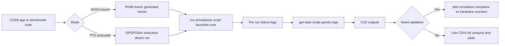
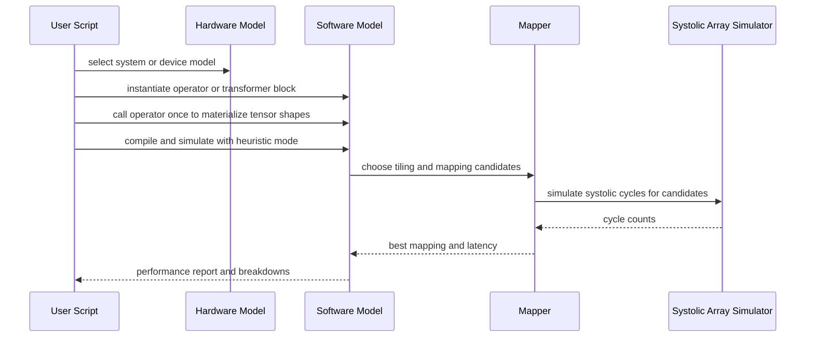
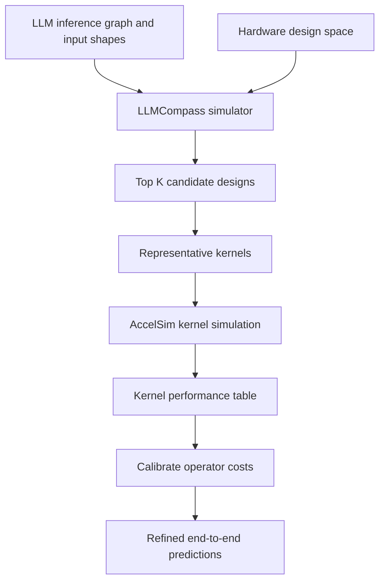

# About Accel-Sim vs LLMCompass (differences and similarities)

This hint compares Accel-Sim and LLMCompass based on their official repos and papers; I did not find a single “head-to-head” comparison article, so this is a synthesis from primary sources.

## TL;DR

- Accel-Sim: a validated, cycle-level GPU simulation framework (kernel-centric), supporting both PTX execution-driven and SASS trace-driven simulation.
- LLMCompass: a fast performance + area/cost evaluation framework for LLM inference hardware design, using higher-level tile-by-tile (“block-by-block”) operator simulation plus an automatic mapper/parameter search.

## Similarities

- Both are performance modeling tools meant to support architectural exploration without building full RTL.
- Both emphasize validation against real hardware (but at different abstraction levels and for different targets).
- Both ultimately care about memory hierarchy effects and scheduling/mapping decisions (explicitly in LLMCompass, implicitly via GPU microarchitecture modeling in Accel-Sim).

## Key differences (what you should not mix up)

| Dimension | Accel-Sim | LLMCompass |
|---|---|---|
| Primary goal | Accurate cycle-level GPU kernel timing/counters for architecture research and microarchitecture tuning | Fast evaluation of LLM inference hardware designs, including mapping/scheduling and cost-performance tradeoffs |
| Workload scope | CUDA kernels (including closed-source library kernels if traced) | LLM inference graphs/operators (matmul, attention-related ops, etc.) |
| Modeling granularity | Cycle-level GPU pipeline + caches/memory system (GPGPU-Sim 4.x based) | Higher-level tile-by-tile operator simulation; leverages regularity of dense LLM operators to avoid cycle-by-cycle simulation |
| “Software stack” input | PTX exec-driven mode, or SASS trace-driven mode via NVBit-generated traces | Computational graph of the LLM + a hardware description template; mapper searches mapping/scheduling parameters |
| Hardware dependence | Trace-driven accuracy needs real GPUs for tracing and for validation counters; PTX-only mode avoids traces but is still GPU-model specific | Designed to describe multiple ML hardware platforms (GPU/TPU-like) via a hardware template; validated on A100/MI210/TPUv3 in the paper |
| Outputs | Per-kernel/per-app simulated cycles and many GPU counters; supports correlation against hardware profilers; optional power (AccelWattch) | Performance report (latency breakdowns) plus area/cost report for design-space tradeoffs |
| Typical runtime | Slow relative to analytical models; designed for cycle-level fidelity | Designed to be fast enough for large design sweeps (paper reports minutes for large inference scenarios including many mapper search rounds) |
| What it’s best for | Microarchitectural questions: warp scheduling, cache behavior, memory coalescing, unit contention, etc. | Macro-architecture and mapping questions: buffer sizing, bandwidth, systolic tiling/dataflow, multi-device inference configurations, perf/cost sensitivity |

## How to choose (rule of thumb)

- Use Accel-Sim when your “unknowns” are GPU microarchitecture/timing details and you need cycle-level behavior and GPU counters per kernel.
- Use LLMCompass when your “unknowns” are LLM inference deployment/hardware design tradeoffs (compute vs memory vs interconnect vs buffers) and you want rapid exploration with an explicit mapper and cost model.

## When to choose which tool (practical decision guide)

Choose **Accel-Sim** when you want answers to questions like:

- “If I change the cache hierarchy / cache policy / MSHR behavior / memory scheduling policy, how do cycles and cache hit rates change per kernel?”
- “Why does kernel X stall: warp scheduling, instruction issue, unit contention, or memory pipeline?”
- “I need per-kernel counters and cycle-level behavior that can be correlated against hardware profilers.”
- “I care about CUDA kernel details (including closed-source library kernels), and I can obtain traces on real hardware (or accept PTX-only mode tradeoffs).”

Choose **LLMCompass** when you want answers to questions like:

- “Given an LLM inference graph, how do buffer sizes, bandwidth, systolic-array shape, and mapping decisions affect end-to-end latency?”
- “What is a cost-effective hardware design point for LLM inference (perf/cost, area constraints), and how sensitive is it to batch size / sequence length?”
- “I need to explore many architectural variants quickly and I’m OK with a higher-level operator/tile model rather than cycle-by-cycle GPU simulation.”
- “I want the tool to search mapping/scheduling parameters automatically (mapper + parameter search) for dense LLM operators.”

If you are unsure, use this shortcut:

- Start with **LLMCompass** to prune the high-level design space (buffers/bandwidth/compute balance, mapping strategy, perf/cost).
- Then use **Accel-Sim** only for the remaining candidates where you need cycle-level GPU microarchitecture fidelity (kernel counters, pipeline effects, cache details).

## Can they be used together?

Yes, but typically as a multi-fidelity workflow rather than a “compile-time” integration: LLMCompass is a high-level design-space exploration (DSE) tool for LLM inference, while Accel-Sim is a cycle-level GPU kernel simulator. There is no official out-of-the-box bridge between them; you usually connect them by exchanging per-operator/per-kernel performance models (tables) and using one tool to refine or calibrate the other.

## Likely integration patterns

### Pattern A: Two-stage DSE (coarse → fine)

1) Use **LLMCompass** to sweep high-level hardware parameters and mapping policies (buffers, bandwidth, systolic array shape, tensor-parallel sizing, etc.) and identify a small set of promising design points.
2) For the “GPU-like” candidates, use **Accel-Sim** to validate kernel-level behavior and quantify microarchitectural bottlenecks (caches/memory system/scheduling) on representative kernels (often CUTLASS/cuBLAS-like workloads).
3) If needed, adjust the high-level assumptions (e.g., effective bandwidth, overlap limits, compute utilization caps) and re-run LLMCompass with tightened constraints.

This pattern works well when your search space is huge and you want to reserve cycle-level simulation for only the finalists.

### Pattern B: Kernel-performance table (Accel-Sim) plugged into graph-level inference modeling (LLMCompass-like)

Use Accel-Sim to build a lookup table of kernel performance as a function of shape (e.g., GEMM M/N/K, attention projection sizes, batch/sequence length), then use that table as the operator-cost model inside a graph-level simulator/scheduler.

Concretely:

- Accel-Sim side: generate per-kernel (or per-kernel-instance) cycle counts and counters, then aggregate into a table keyed by (operator kind, shape, datatype, config).
- LLMCompass side: replace or calibrate parts of its operator latency model with the table so that end-to-end inference simulation uses empirically grounded kernel costs.

This is the most common “glue” pattern: one tool gives you a better per-op cost model; the other uses it to simulate end-to-end inference.

### Pattern C: Calibration loop (LLMCompass model parameters tuned by Accel-Sim)

LLMCompass has knobs such as effective bandwidth and buffer constraints (via the hardware description and mapping). Accel-Sim can provide “ground truth” for a subset of kernels on a target GPU configuration. You can then fit LLMCompass’s parameters so that its predicted per-op latencies match Accel-Sim for those cases, and trust LLMCompass to interpolate/extrapolate within that region.

Practical steps:

- Pick a small kernel set that spans the workload (GEMM-heavy, memory-bound, attention-like patterns).
- Run Accel-Sim for those kernels to get cycles and achieved bandwidth/utilization proxies.
- Tune LLMCompass parameters (or override operator cost functions) until the per-op predictions align for that kernel set.

### Pattern D: Multi-fidelity selection inside the mapper (expensive; usually not worth it)

In principle, you could call Accel-Sim as the inner-loop evaluator for LLMCompass’s mapper search (evaluate candidate tilings/mappings by cycle simulation). In practice this is usually too slow: LLMCompass’s speed comes from avoiding cycle-by-cycle simulation and from exploring many mapping candidates quickly. A more realistic variant is “evaluate a few top candidates” with Accel-Sim rather than all candidates.

## What to watch out for (integration gotchas)

- Mismatched abstraction: LLMCompass models “ML hardware template + explicit mapper”, while Accel-Sim models a GPU microarchitecture with its own scheduling/caching behavior. Don’t assume a 1:1 mapping between LLMCompass “core/lane/buffer” and an NVIDIA SM model.
- Workload representation mismatch: Accel-Sim operates on CUDA kernels (PTX/SASS traces), while LLMCompass starts from operator graphs and internal tiling. Bridging requires you to choose a concrete kernel implementation per operator (e.g., which GEMM kernel) or accept calibration-based approximations.
- Trace requirement: Accel-Sim SASS mode requires hardware traces (NVBit) and is tied to a real GPU ISA; PTX mode avoids traces but may reduce accuracy on modern GPUs.

## Usage patterns (pseudo-code + Mermaid UML)

This section is “pseudo-code alike” and grounded in the structure of the upstream repositories (`extern/accel-sim-framework` and `extern/LLMCompass`). It is meant to show the typical control flow and data artifacts, not provide a fully runnable program.

### Accel-Sim usage pattern (trace-driven SASS vs execution-driven PTX)

Pseudo-code sketch (mirrors `extern/accel-sim-framework/util/job_launching/run_simulations.py` + `get_stats.py`):

```python
# Decide simulation mode:
# - trace-driven SASS: provide -T/--trace_dir (needs NVBit traces)
# - execution-driven PTX: omit -T/--trace_dir

if mode == "sass_trace":
    traces_root = nvbit_trace(cuda_app, args, out_dir="hw_run/traces/...")  # produces kernelslist.g + *.traceg
    run_simulations(benchmark_suite, config="QV100-SASS", trace_dir=traces_root, name="myTest")
else:  # mode == "ptx_exec"
    run_simulations(benchmark_suite, config="QV100-PTX", name="myTest-PTX")

# Parse job stdout (*.oJOBID) into CSVs; regexes come from stats/example_stats.yml by default.
per_kernel_csv = get_stats(per_kernel=True, kernel_instance=True, configs_as_rows=True, benchmark_suite=benchmark_suite, configs=[...])

# Optional: correlate against profiled hardware counters (nvprof/nsight) to generate plots and error summaries.
plot_correlation(per_kernel_csv, hw_stats_dir="hw_run/<GPU_NAME>/device-<id>/<cuda_version>/")
```

Source pointers in `extern/accel-sim-framework`:

- Job launching: `util/job_launching/run_simulations.py`, `util/job_launching/common.py`
- Stat extraction: `util/job_launching/get_stats.py`, `util/job_launching/stats/example_stats.yml`
- Correlation: `util/plotting/plot-correlation.py`, `util/plotting/correl_mappings.py`

Mermaid flowchart (typical experiment loop):



### LLMCompass usage pattern (operator graph + mapper/heuristics + simulator)

Pseudo-code sketch (mirrors `extern/LLMCompass/software_model/*` and `extern/LLMCompass/hardware_model/*`):

```python
from hardware_model.system import system_dict
from hardware_model.device import device_dict
from software_model.utils import Tensor, data_type_dict
from software_model.matmul import Matmul
from software_model.transformer import TransformerBlockInitComputationTP

# Pick a hardware model:
system = system_dict["A100_4_fp16"]           # device + interconnect
device = device_dict["A100_80GB_fp16"]        # device-only model (single device)

# Build an operator graph by calling the model once with Tensor shapes:
model = TransformerBlockInitComputationTP(d_model=12288, n_heads=96, device_count=4, data_type=data_type_dict["fp16"])
_ = model(Tensor([batch_size, seq_len, 12288], data_type_dict["fp16"]))  # creates per-op shapes and sub-operators

# Evaluate (two common modes in this repo):
latency = model.compile_and_simulate(system, compile_mode="heuristic-GPU")  # uses per-op compile_and_simulate calls
# or: latency = model.roofline_model(system)

# For a single operator (e.g., GEMM), compile_and_simulate includes a mapping search + a systolic-array simulation (Scale-Sim is used in this repo).
gemm = Matmul(data_type_dict["fp16"])
_ = gemm(Tensor([M, K], data_type_dict["fp16"]), Tensor([K, N], data_type_dict["fp16"]))
gemm_latency = gemm.compile_and_simulate(device, compile_mode="heuristic-GPU")
```

Source pointers in `extern/LLMCompass`:

- Hardware descriptions: `hardware_model/device.py`, `hardware_model/system.py`, `configs/template.json`, `design_space_exploration/dse.py`
- Operator graphs: `software_model/transformer.py`, `software_model/operators.py`
- Mapper + systolic simulation hook: `software_model/matmul.py` (uses `scalesim`)

Mermaid sequence diagram (operator evaluation):



### Combined multi-fidelity pattern (LLMCompass drives DSE, Accel-Sim calibrates kernels)

Pseudo-code sketch (common in practice; glue is usually CSV/tables, not direct API calls):

```python
# 1) Coarse DSE: use LLMCompass to rank candidate designs (buffers/bw/compute/topology + mapping heuristics).
top_designs = llmcompass_sweep(arch_space, workload="transformer inference", objective="latency_per_cost")

# 2) Fine evaluation: for the top K designs, choose representative kernels (e.g., GEMM/attention primitives) and use Accel-Sim to simulate them.
kernel_table = {}
for design in top_designs[:K]:
    for kernel in representative_kernels:
        cycles, counters = accel_simulate(kernel, gpu_config=design.gpu_like_config, mode="sass_trace_or_ptx")
        kernel_table[(design.id, kernel.signature)] = (cycles, counters)

# 3) Feed back: calibrate LLMCompass operator cost parameters (or override per-op latency) using the Accel-Sim-derived table.
llmcompass_calibrated = fit_operator_costs(llmcompass_model, kernel_table)
```

Mermaid flowchart (data artifacts shown explicitly):



## Minimal usage snippets (illustrative)

Accel-Sim examples (from upstream README):

```bash
# SASS trace-driven mode (requires traces via -T)
./util/job_launching/run_simulations.py -B rodinia_2.0-ft -C QV100-SASS -T ./hw_run/traces/device-<device-num>/<cuda-version>/ -N myTest

# PTX execution-driven mode (no traces)
./util/job_launching/run_simulations.py -B rodinia_2.0-ft -C QV100-PTX -N myTest-PTX
```

LLMCompass examples (from upstream README; artifact scripts drive experiments):

```bash
git clone -b ISCA_AE https://github.com/PrincetonUniversity/LLMCompass
cd LLMCompass
cd ae/figure5 && bash run_figure5.sh
```

Conceptually, LLMCompass takes an LLM computational graph plus a hardware description, runs a mapper/parameter search with an architecture simulator, and produces performance + area/cost reports (see paper references below).

## Sources (official / primary)

- Accel-Sim repo: https://github.com/accel-sim/accel-sim-framework
- Accel-Sim front-end doc (PTX exec-driven vs SASS trace-driven): https://github.com/accel-sim/accel-sim-framework/blob/dev/gpu-simulator/README.md
- Accel-Sim paper (ISCA 2020): https://people.ece.ubc.ca/aamodt/publications/papers/accelsim.isca2020.pdf
- LLMCompass repo: https://github.com/PrincetonUniversity/LLMCompass
- LLMCompass paper (ISCA 2024 PDF): https://augustning.com/assets/papers/llmcompass-isca-2024.pdf
- LLMCompass arXiv HTML (preprint page): https://arxiv.org/html/2312.03134v1
- Related-work positioning that mentions both “Accel-Sim” and “LLMCompass” as different points in the LLM modeling/tool landscape: https://arxiv.org/html/2512.19606v1
