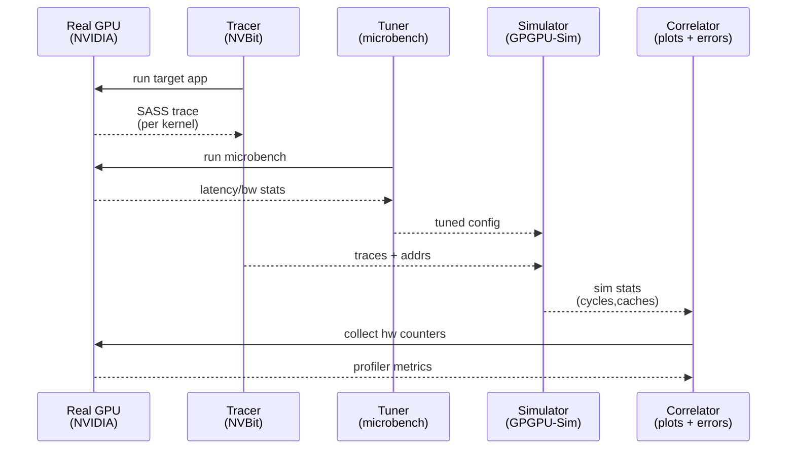
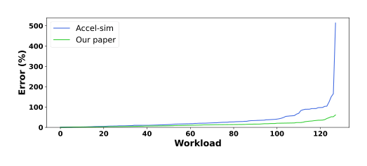
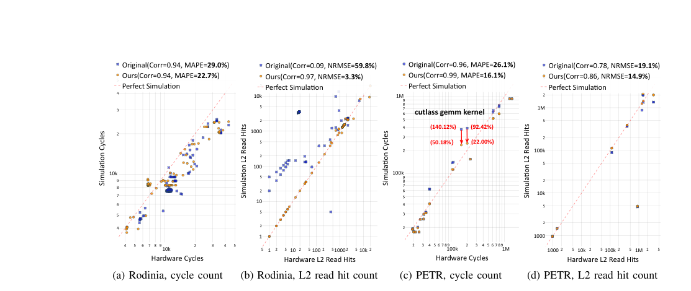

# Accel-Sim and Its Enhancements: Practical NVIDIA Kernel Simulation

This document introduces **Accel-Sim** and summarizes how later works extend it to make **NVIDIA GPU kernel simulation** (especially SASS-trace, kernel-by-kernel timing) more **accurate**, **faster**, and **portable** across platforms (desktop/server GPUs and Jetson integrated GPUs).

Sources: `notes/accel-sim/main-note.md`, `notes/modern-gpu-cores/main-note.md`, `notes/parallelizing-modern-gpu-simulator/main-note.md`, `notes/repurpose-accel-sim-jetson-gpu/main-note.md`.

---

## 1) What is Accel-Sim?

- **Definition**: Accel-Sim is an **open-source**, **validated** GPU simulation framework built around an updated GPGPU-Sim performance model plus a modern frontend and tooling for trace generation and correlation.
  > "Accel-Sim is composed of: (1) a flexible frontend that supports execution-driven simulation of NVIDIA’s virtual ISA and trace-driven simulation of contemporary machine ISAs, (2) a flexible and detailed performance model, (3) a correlation generation tool, and (4) a microbenchmarks-based configuration tuner." (Section II; `paper-source/accel-sim/Accel-Sim.md`)
- **Key capability for NVIDIA kernels**: It can simulate **NVIDIA SASS** via **trace-driven** execution, which makes it practical to study kernels produced by real toolchains and libraries.
  > "supporting SASS gives researchers the ability to simulate closed-source, optimized libraries, such as cuDNN" (Section II-A; `paper-source/accel-sim/Accel-Sim.md`)
- **Two modes**:
  - **Trace-driven SASS mode**: Uses an NVBit-based tracer to capture dynamic instruction traces (including active masks and memory addresses).
  - **Execution-driven PTX mode**: Emulates PTX to produce dynamic behavior without needing SASS traces, but can be less accurate than SASS traces for modern GPUs.
    > "On average, simulating SASS improves the mean absolute error by 2 ×, reducing the error from 34% to 15%." (Section V-A; `paper-source/accel-sim/Accel-Sim.md`)

## 2) Why Accel-Sim is “kernel-centric” (and why that matters)

Accel-Sim’s most common workflow is to trace and simulate **kernels**, then compare kernel-level metrics to hardware counters. This aligns well with the way real GPU applications are composed: many kernels, each with different compute/memory behavior.

- **Kernel selection to reduce runtime**: Accel-Sim supports kernel-based checkpointing to skip long “setup” kernels and focus on hot kernels.
  > "the user can set kernel-based checkpointing to select the desired hotspot kernels to simulate" (Section II-E; `paper-source/accel-sim/Accel-Sim.md`)
- **Why kernels are the right granularity**: Most “microarchitectural” questions (warp scheduling, cache hierarchy, memory coalescing, execution unit contention) show up as **per-kernel cycle** and **per-kernel counter** differences.

## 3) Accel-Sim workflow for NVIDIA kernel simulation (Trace → Tune → Simulate → Correlate)

At a high level, Accel-Sim’s workflow turns *real execution* into *repeatable simulation experiments*:

- **Trace (SASS mode)**:
  - **What you get**: The dynamic instruction stream, active masks, and memory addresses for each kernel.
    > "In execution-driven mode, the active mask and memory addresses are computed by emulating the PTX instructions, whereas these values are embedded in the trace when executing the machine ISA." (Section II-A; `paper-source/accel-sim/Accel-Sim.md`)
- **Tune**:
  - **What it does**: Runs microbenchmarks to infer latencies/bandwidths/topology parameters for a target GPU generation and produces a simulator config.
    > "Accel-Sim includes a microbenchmark suite to pinpoint latency, bandwidth and geometry changes..." (Section II-C; `paper-source/accel-sim/Accel-Sim.md`)
- **Simulate**:
  - **What it does**: Feeds the traces into the timing model and produces cycle counts and other performance statistics.
- **Correlate**:
  - **What it does**: Compares simulated statistics to hardware counters and helps pinpoint which components are mis-modeled.
    > "The tool generates graphs and data that serve as correlation guidance to pinpoint workloads and metrics where the simulator is not well correlated to hardware." (Section II-D; `paper-source/accel-sim/Accel-Sim.md`)

## 4) Why later enhancements are needed

Accel-Sim (ISCA’20) made NVIDIA kernel simulation practical and validated, but several pressures appear as GPUs and workloads evolve:

- **Microarchitecture drift**: Modern NVIDIA cores include mechanisms that weren’t fully modeled in older baselines (e.g., control bits, modern issue policies, RF caches).
  > "most microarchitectural research in academia relies on simulators that model GPU core architectures based on designs that are more than 15 years old" (Abstract; `paper-source/modern-gpu-cores/modern-gpu-cores.md`)
- **Runtime cost**: Cycle-level simulation can take **days** on some workloads, limiting the research iteration loop.
  > "simulating some GPGPU workloads in a single-threaded state-of-the-art simulator such as Accel-sim can take more than five days." (Abstract; `paper-source/parallelizing-modern-gpu-simulator/parallelizing-modern-gpu-simulator.pdf`)
- **Platform mismatch (Jetson)**: Integrated GPUs (Jetson) differ in memory system and profiling behavior; “desktop GPU” configs and correlators can be inaccurate.
  > "Existing cycle-accurate GPU simulators primarily target traditional discrete GPUs and exhibit significant inaccuracies when applied to Jetson integrated GPUs." (Abstract; `paper-source/repurpose-accel-sim-jetson-gpu/repurpose-accel-sim-jetson-gpu.pdf`)

---

## 5) How later works enhance Accel-Sim (and what that buys you for NVIDIA kernels)

### 5.1 Modern GPU cores (MICRO’25): make the core model match Turing/Ampere/Blackwell

**Reference**: Rodrigo Huerta; Mojtaba Abaie Shoushtary; José-Lorenzo Cruz; Antonio González. *Dissecting and Modeling the Architecture of Modern GPU Cores*. MICRO 2025. Links: [PDF](../../paper-source/modern-gpu-cores/modern-gpu-cores.pdf) | [DOI](https://doi.org/10.1145/3725843.3756041) | [Code](https://github.com/upc-arco/modern-gpu-simulator-micro-2025)

This line of work focuses on **accuracy**: reverse engineer modern NVIDIA core behavior and implement it in an Accel-Sim-based simulator.

- **What changed (high level)**:
  - **Control-bit dependence handling**: Model compiler-guided dependence (stall counter + dependence counters + yield) instead of assuming classic hardware scoreboards for everything.
    > "data dependencies are not managed by scoreboards, but the compiler is in charge of guiding the hardware" (Section 4; `paper-source/modern-gpu-cores/modern-gpu-cores.md`)
  - **Issue policy + staging**: Discover and model CGGTY issue scheduling and the Control/Allocate staging required for RF-port correctness under compiler-managed dependencies.
    > "We call this issue scheduler policy Compiler Guided Greedy Then Youngest (CGGTY)" (Section 5.1.2; `paper-source/modern-gpu-cores/modern-gpu-cores.md`)
  - **Register file + RFC**: Model a compiler-managed register file cache (reuse bits) and remove operand-collector assumptions inconsistent with compile-time fixed latencies.
    > "modern NVIDIA GPUs do not make use of it [operand collector]" (Section 5.3; `paper-source/modern-gpu-cores/modern-gpu-cores.md`)
  - **Front-end + instruction fetch**: Add per-sub-core L0 I-cache behavior (with a stream-buffer prefetcher) and updated instruction buffer assumptions.
  - **Memory pipeline details**: Add measured queue sizing/throughput/latencies and constant-cache nuances.

> "Figure 3: Modern NVIDIA GPU SM/Core design inferred by this work." (Figure 3 caption; `paper-source/modern-gpu-cores/modern-gpu-cores.md`)

- **Tooling updates for kernel traces**:
  - **Need control bits**: NVBit does not expose control bits, so they recover them from SASS at compile time; for some kernels without SASS they fall back to scoreboard-based dependency handling (hybrid mode).
    > "obtain the control bits ... since NVBit ... does not provide access to them." (Section 6; `paper-source/modern-gpu-cores/modern-gpu-cores.md`)
    > "we use a hybrid mode for dependencies where traditional scoreboards are employed in kernels that do not have the SASS code" (Section 6; `paper-source/modern-gpu-cores/modern-gpu-cores.md`)
- **What you gain for NVIDIA kernel simulation**:
  - **Better cycle fidelity on modern GPUs**: RTX A6000 MAPE improves to 13.45% vs 34.03% baseline Accel-Sim; Blackwell is modeled with reported 17.41% MAPE.
    > "The new model achieves ... MAPE ... 13.45%, whereas the previous simulator model has a MAPE of 34.03%." (Contributions list; `paper-source/modern-gpu-cores/modern-gpu-cores.md`)
    > "models the latest NVIDIA GPU architecture, Blackwell ... achieving a MAPE of 17.41%" (Introduction; `paper-source/modern-gpu-cores/modern-gpu-cores.md`)

> "Figure 5: Percentage absolute error of NVIDIA RTX A6000 model for each benchmark in ascending order." (Figure 5 caption; `paper-source/modern-gpu-cores/modern-gpu-cores.md`)

  - **Kernel-level insights that depend on compiler scheduling**: Many real kernels (CUTLASS/GEMM, ML workloads) are heavily shaped by control bits and reuse hints; modeling them reduces “mystery error” at kernel granularity.
- **Open source availability**:
  > "The code of this enhanced tracer and simulator based on Accelsim is available at [42]." (Section 6; `paper-source/modern-gpu-cores/modern-gpu-cores.md`)

### 5.2 Parallelizing Accel-Sim (arXiv’25): make cycle-level kernel simulation fast enough to iterate

**Reference**: Rodrigo Huerta; Antonio González. *Parallelizing a modern GPU simulator*. arXiv (cs.DC), 2025. Links: [PDF](../../paper-source/parallelizing-modern-gpu-simulator/parallelizing-modern-gpu-simulator.pdf) | [arXiv](https://arxiv.org/abs/2502.14691)

This work focuses on **runtime**: keep the same simulation semantics but make wall-clock simulation faster.

- **Core idea**: Parallelize the per-cycle loop over SMs with OpenMP, while keeping memory/interconnect phases deterministic and avoiding data races.
  > "we present a simple approach to parallelize this simulator with minimal code changes by using OpenMP." (Abstract; `paper-source/parallelizing-modern-gpu-simulator/parallelizing-modern-gpu-simulator.pdf`)
- **Determinism preservation**: Convert global counters into per-SM stats and perform deterministic reductions.
  > "we have isolated all these stats to be calculated by SM instead of globally for the whole GPU." (Section 3; `paper-source/parallelizing-modern-gpu-simulator/parallelizing-modern-gpu-simulator.pdf`)
  > "our parallelization technique is deterministic" (Abstract; `paper-source/parallelizing-modern-gpu-simulator/parallelizing-modern-gpu-simulator.pdf`)
- **Practical impact**:
  - **Average speed-up**: 5.83× with 16 threads; up to 14× on some workloads.
    > "averaging ... 5.83x ... with 16 threads" (Section 4.2; `paper-source/parallelizing-modern-gpu-simulator/parallelizing-modern-gpu-simulator.pdf`)
  - **Kernel-dependent scaling**: kernels with few CTAs may not benefit because few SMs are active.
    > "only two SMs are active during the simulation... parallelizing the rest of the SMs is useless." (Section 4.2; `paper-source/parallelizing-modern-gpu-simulator/parallelizing-modern-gpu-simulator.pdf`)

> "Figure 5: Speed-up with a different number of threads against the singlethreaded version." (Figure 5 caption; `paper-source/parallelizing-modern-gpu-simulator/parallelizing-modern-gpu-simulator.pdf` p.5)

- **What you gain for NVIDIA kernel simulation**:
  - **More kernels per day**: Makes it feasible to simulate larger suites, more input sets, and more design points.
  - **More detailed models become practical**: Complements “modern core” modeling work, which can increase simulator cost per simulated cycle.

### 5.3 Accel-Sim-J (ISLPED’25): make Accel-Sim accurate on Jetson integrated GPUs

**Reference**: Tianhao Huang; Lingyu Sun; Chao Li; Xiaofeng Hou; Yaqian Zhao; Jingwen Leng; Li Li; Minyi Guo. *Repurpose Accel-Sim for Next Generation NVIDIA Jetson GPU Architectural Design*. ISLPED 2025. Links: [PDF](../../paper-source/repurpose-accel-sim-jetson-gpu/repurpose-accel-sim-jetson-gpu.pdf) | [Code](https://github.com/sjtu-SAIL-lab/accel-sim-framework)

This work focuses on **portability + kernel counter parity**: Jetson has integrated LPDDR memory and some profiling quirks that break baseline assumptions.

> "Fig. 2: Accel-Sim-J framework." (Figure 2 caption; `paper-source/repurpose-accel-sim-jetson-gpu/repurpose-accel-sim-jetson-gpu.pdf` p.3)

- **What changed**:
  - **Tuner + config**: Add Jetson configs and an LPDDR5 memory model.
    > "The tuner integrated within the Accel-Sim framework lacks support for LPDDR memory modeling." (Section III-A; `paper-source/repurpose-accel-sim-jetson-gpu/repurpose-accel-sim-jetson-gpu.pdf`)
  - **Performance model**: Improve Ampere Tensor Core modeling (async copy + L2 prefetch behavior; HMMA variants get different cycle costs) and expand IPOLY hashing support for additional channel configs.
    > "extend Accel-Sim to assign different execution cycles to different HMMA instructions." (Section III-B; `paper-source/repurpose-accel-sim-jetson-gpu/repurpose-accel-sim-jetson-gpu.pdf`)
  - **Correlator**: Align to Nsight Compute behavior on Jetson (notably: L2 invalidation after each kernel during profiling in their setup).
    > "an important flag indicating whether the L2 cache is invalidated after each kernel during NCU profiling is non-functional, defaulting to always invalidating." (Section III-C; `paper-source/repurpose-accel-sim-jetson-gpu/repurpose-accel-sim-jetson-gpu.pdf`)
- **What you gain for NVIDIA kernel simulation**:
  - **Better Jetson kernel accuracy**: Rodinia cycle error improves 29.0%→22.7%; transformer block 26.1%→16.1%; L2 hit correlation improves dramatically.
    > "reducing simulation cycle errors from 29.0% to 22.7% ... and from 26.1% to 16.1%" (Abstract; `paper-source/repurpose-accel-sim-jetson-gpu/repurpose-accel-sim-jetson-gpu.pdf`)
    > "L2 read hit error reduces from 59.8% to 3.3%" (Section IV-B; `paper-source/repurpose-accel-sim-jetson-gpu/repurpose-accel-sim-jetson-gpu.pdf`)

> "Fig. 3: We use MAPE for correlation of GPU cycles and NPMSE for L2 read hits from original Accel-Sim versus ours." (Figure 3 caption; `paper-source/repurpose-accel-sim-jetson-gpu/repurpose-accel-sim-jetson-gpu.pdf` p.4)

  - **Edge-focused design exploration**: Enables studying SM/L2 trade-offs (C2C ratio) using a simulator that matches Jetson behavior.
- **Open source availability**:
  > "Software availability: The implementation of this work is available as open-source software at [GitHub repository: https://github.com/sjtu-SAIL-lab/accel-sim-framework]." (Conclusion; `paper-source/repurpose-accel-sim-jetson-gpu/repurpose-accel-sim-jetson-gpu.pdf`)

---

## 6) Putting it together: how these enhancements help simulate NVIDIA kernels

If your goal is to simulate **NVIDIA kernels** (including optimized library kernels), these threads of work stack well:

- **Baseline Accel-Sim** gets you:
  - **Kernel traces** (SASS) that preserve real instruction mixes and memory behavior.
  - A **validated performance-model scaffold** (tuner + correlator) for sustainable evolution.
- **Modern core modeling (MICRO’25)** reduces the “model gap” for modern NVIDIA architectures by capturing:
  - **Compiler-guided dependence** and **issue policies** that dominate kernel-level timing.
  - **RF/RFC behavior** that matters for 3-operand compute kernels.
  - Updated **front-end and memory pipeline** details that affect instruction supply and memory latency hiding.
- **Parallelization (arXiv’25)** makes the whole toolchain usable at scale by:
  - Shrinking turnaround time for “simulate this kernel suite again after I change one parameter”.
- **Jetson repurposing (ISLPED’25)** expands applicability to edge platforms by:
  - Fixing the memory/config/model/correlation stack so **Jetson kernel counters** align to real profiling behavior.

## 7) Practical caveats (kernel simulation reality checks)

- **You still need real hardware** for tracing and for collecting counters used in correlation.
- **Trace-driven limits**: Designs that depend on **data values** or **global sync semantics** may require execution-driven simulation or functional modeling.
  > "Evaluating new designs that rely on the data values stored in registers or memory ... are either not possible or very difficult to study without emulation-based execution-driven simulation." (Introduction; `paper-source/accel-sim/Accel-Sim.md`)
- **Trace size** can be huge (TB-scale uncompressed across suites), so storage/trace management matters.
  > "The total disk size required for all the traces we simulate is 6.2 TB uncompressed" (Section III; `paper-source/accel-sim/Accel-Sim.md`)
