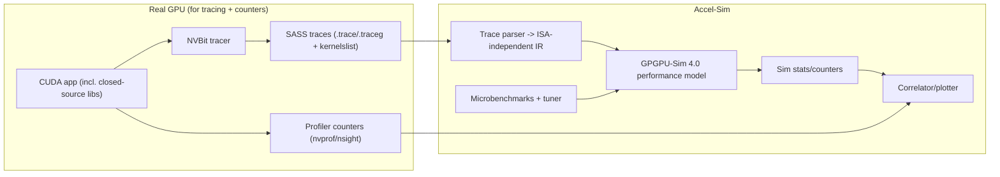
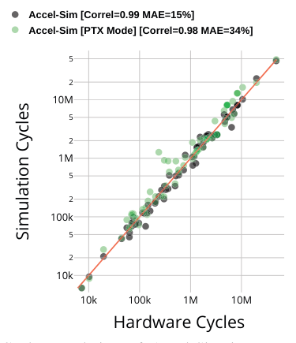
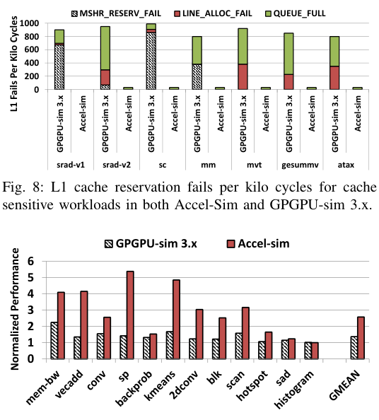

# Accel-Sim: An Extensible Simulation Framework for Validated GPU Modeling

## 0. Metadata
- **Full Title**: Accel-Sim: An Extensible Simulation Framework for Validated GPU Modeling
- **Authors**: Mahmoud Khairy; Zhesheng Shen; Tor M. Aamodt; Timothy G. Rogers
- **Venue / Year**: ISCA 2020
- **Links**: PDF: `paper-source/accel-sim/Accel-Sim.pdf` | Paper (md): `paper-source/accel-sim/Accel-Sim.md` | Project: https://accel-sim.github.io | Code: https://github.com/accel-sim/accel-sim-framework (local mirror: `extern/accel-sim-framework`)
- **Keywords**: GPU performance modeling; simulation; trace-driven; PTX; SASS; validation; microbenchmarks; correlation; GPGPU-Sim
- **Paper ID (short handle)**: accel-sim-isca20

## 1. TL;DR (3–5 bullets)
- **Problem**: Open GPU simulators lag fast-moving, proprietary industrial GPUs; wrong baselines can mislead research conclusions.
  > "Research cannot look ahead, if its baseline assumptions are too far behind." (Introduction; paper-source/accel-sim/Accel-Sim.md)
- **Idea**: Use an “ambidextrous” frontend that supports both PTX execution-driven simulation and SASS trace-driven simulation via an ISA-independent IR.
  > "We propose a novel, ambidextrous GPU frontend that translates both functionally executed virtual instructions and machine instruction traces into an ISA-independent format for simulation." (Conclusion; paper-source/accel-sim/Accel-Sim.md)
- **System**: Accel-Sim = tracer (NVBit) + SASS/PTX frontend + updated GPGPU-Sim 4.0 performance model + correlation tool + microbenchmark tuner.
  > "Accel-Sim is composed of: (1) a flexible frontend that supports execution-driven simulation of NVIDIA’s virtual ISA and trace-driven simulation of contemporary machine ISAs, (2) a flexible and detailed performance model, (3) a correlation generation tool, and (4) a microbenchmarks-based configuration tuner." (Section II; paper-source/accel-sim/Accel-Sim.md)
- **Efficiency**: Trace-driven mode avoids functional execution; “simulation-gating” reduces unnecessary ticking; overall speed improves.
  > "Accel-Sim in trace-driven mode is able to perform 12.5 kilo warp instructions per second, a 4.3 × simulation time improvement over GPGPU-Sim 3.x." (Section II-E; paper-source/accel-sim/Accel-Sim.md)
- **Result**: Validated accuracy improves substantially (e.g., Volta cycles MAE 94% → 15%) and enables workloads requiring closed-source SASS libraries.
  > "We demonstrate that Accel-Sim decreases cycle error from 94% in state-of-the-art simulation to 15%, on a comprehensive suite of workloads." (Conclusion; paper-source/accel-sim/Accel-Sim.md)

## 2. Problem & Motivation

### 2.1 Why GPU simulation baselines fall behind
- **Proprietary churn**: GPUs rapidly evolve (pipelines like Tensor Cores; undocumented microarchitectural + ISA changes).
  > "the rapid scaling of parallelism, introduction of new processing pipelines (i.e. Tensor Cores [10]) and undocumented changes to both the microarchitecture and Instruction Set Architecture (ISA) are commonplace in each new product generation." (Introduction; paper-source/accel-sim/Accel-Sim.md)
- **vISA vs mISA gap**: Vendors keep machine ISA private or change it drastically; open simulators struggle to keep up.
  > "GPU architectures have widely embraced the use of a virtual ISA (vISA), which provides hardware vendors with tremendous flexibility to make machine ISA (mISA) changes while still maintaining binary compatibility." (Introduction; paper-source/accel-sim/Accel-Sim.md)

### 2.2 The three concrete challenges the paper targets
- **Challenge (ISA modeling)**: Simulate a new/undocumented ISA frequently.
- **Challenge (modeling changes)**: Detect + model architectural changes after achieving functional correctness.
- **Challenge (validation)**: Sustain rigorous validation so “new baselines” still track hardware.
  > "This situation presents three separate, but related challenges: (1) How do academic researchers quickly simulate a new, often undocumented ISA every year and a half? (2) Once functionally correct, how are changes to the architecture detected and modeled? (3) What is a sustainable, rigorous validation mechanism to ensure that new baselines are still tracking industrial designs?" (Introduction; paper-source/accel-sim/Accel-Sim.md)

### 2.3 How Accel-Sim addresses them
- **Trace-driven mISA frontend**: Avoids implementing each new mISA functional model; supports closed-source libs via tracing.
- **Upgraded performance model**: GPGPU-Sim 4.0 adds detail/flexibility to track modern GPUs.
- **Validation infrastructure**: Microbenchmarks + automated tuning + automated correlation plots.
  > "To help bridge the gap between opaque industrial innovation and public research, we introduce three mechanisms that make it much easier for GPU simulators to keep up with industry." (Abstract; paper-source/accel-sim/Accel-Sim.md)

## 3. Key Ideas & Contributions (Condensed)
- **Ambidextrous frontend**: Run in trace-driven SASS mode or execution-driven PTX mode using a shared ISA-independent representation.
  > "Our new frontend supports both vISA (PTX) execution-driven and mISA (SASS) trace-driven simulation." (Section II-A; paper-source/accel-sim/Accel-Sim.md)
- **ISA-independent “contract”**: A 1:1 representation of SASS instructions carrying control-flow, datapath, and memory-address info.
  > "The format includes all the information necessary to perform timing simulation, in particular: (1) the instruction’s control flow (PC and active mask), (2) the instruction’s datapath information (registers accessed and execution unit) and (3) memory addresses for ld/st instructions." (Section II-A; paper-source/accel-sim/Accel-Sim.md)
- **Validated modeling loop**: Microbenchmarks discover hidden parameters; correlator pinpoints mismatches; iterate model fixes.
  > "Accel-Sim includes a microbenchmark suite to pinpoint latency, bandwidth and geometry changes to known hardware structures from one generation to another." (Section II-C; paper-source/accel-sim/Accel-Sim.md)
  > "Accel-Sim’s correlation tool automates the process of generating counter-by-counter correlation data for different architectures." (Section II-D; paper-source/accel-sim/Accel-Sim.md)
- **Extensibility for new units**: Specialized execution units can be added via config + opcode mapping.
  > "Accel-Sim supports adding simple execution units from the configuration file, without the need to update the codebase." (Section II-B; paper-source/accel-sim/Accel-Sim.md)

## 4. Method Overview
- **Summary**: Accel-Sim traces real NVIDIA hardware (NVBit) to obtain SASS + runtime state (active masks, addresses), converts those traces into an ISA-independent format, and feeds them into a detailed (cycle-level) performance model (GPGPU-Sim 4.0). An accompanying tuner and correlator close the loop by configuring the model and producing counter-by-counter validation plots.
  > "We generate the traces from NVIDIA GPUs using Accel-Sim’s tracer tool that is built on top of NVbit [70]." (Section II-A; paper-source/accel-sim/Accel-Sim.md)




> "Fig. 1: Accel-Sim’s end-to-end flow." (Figure 1; paper-source/accel-sim/Accel-Sim.md)

### 4.1 Flexible Frontend (PTX exec + SASS traces)
- **Trace-driven path**: Convert mISA traces into an ISA-independent representation with a 1:1 mapping to SASS.
  > "In trace-driven mode, mISA traces are converted into an ISA-independent intermediate representation, that has a 1:1 correspondence to the original SASS instructions." (Section II-A; paper-source/accel-sim/Accel-Sim.md)
- **Execution-driven path**: Emulate PTX to compute masks + addresses (used when traces are unavailable).
  > "In execution-driven mode, the active mask and memory addresses are computed by emulating the PTX instructions, whereas these values are embedded in the trace when executing the machine ISA." (Section II-A; paper-source/accel-sim/Accel-Sim.md)
- **Limitation of traces**: Hard to evaluate designs needing data values in regs/mem or global sync semantics.
  > "However, trace-based simulation has its drawbacks. Evaluating new designs that rely on the data values stored in registers or memory [72] and global synchronization mechanisms [63] are either not possible or very difficult to study without emulation-based execution-driven simulation." (Introduction; paper-source/accel-sim/Accel-Sim.md)

### 4.2 Detailed, flexible performance model (GPGPU-Sim 4.0)
- **Sub-core model**: Warp schedulers are isolated with their own RF + execution units; share I-cache and memory system.
  > "A warp scheduler with its dedicated RF and EUs is called a sub-core [10], [55]. Sub-cores are isolated, sharing only the instruction cache and the memory subsystem." (Section II-B; paper-source/accel-sim/Accel-Sim.md)
- **Caches + memory**: Sectored/banked caches, adaptive L1/shared split, improved HBM/GDDR modeling, advanced hashing.
  > "Our GPU cache model supports a throughput-oriented, banked, and sectored cache design [32], [62]." (Section II-B; paper-source/accel-sim/Accel-Sim.md)
- **Specialized units**: Add new execution units via config; map new opcodes via ISA def.
  > "To add a new specialized unit, the user declares the new unit in the configuration file and maps the machine ISA op codes that use this unit in the *ISA def* file, as described in Figure 1." (Section II-B; paper-source/accel-sim/Accel-Sim.md)


> "Fig. 2: Updated GPGPU-Sim 4.0 performance model." (Figure 2; paper-source/accel-sim/Accel-Sim.md)

### 4.3 Tuner + targeted microbenchmarks
- **Purpose**: Auto-configure model parameters per GPU generation by measuring latency/bandwidth/geometry.
  > "Accel-Sim includes a microbenchmark suite to pinpoint latency, bandwidth and geometry changes to known hardware structures from one generation to another." (Section II-C; paper-source/accel-sim/Accel-Sim.md)
- **Coverage**: 38 microbenchmarks spanning caches, coalescing, execution units, DRAM, etc.
  > "In total, we have 38 microbenchmarks that span from L1/L2/shared memory latency and attained bandwidth, cache write policy, cache configuration, access/sector granularity, number of cache banks, memory coalescing policy, cache streaming behavior, execution unit latency/throughput and DRAM latency/bandwidth for different data elements: float, double and 128-bit vector." (Section II-C; paper-source/accel-sim/Accel-Sim.md)

### 4.4 Correlator (validation workflow)
- **Counter-by-counter correlation**: Generates graphs + guidance for where to fix modeling.
  > "Accel-Sim’s correlation tool automates the process of generating counter-by-counter correlation data for different architectures." (Section II-D; paper-source/accel-sim/Accel-Sim.md)

### 4.5 Simulation rate optimizations
- **Trace-driven speed**: Avoids functional execution overhead; adds “simulation-gating”.
  > "Half of our speed improvement comes from the fact that trace-driven mode avoids functional execution." (Section II-E; paper-source/accel-sim/Accel-Sim.md)
  > "To overcome this issue, we keep a status state for each component (core, execution unit, cache, dram channel), then the simulator only ticks active components every cycle and skips unnecessary code and loop iterations when there is no useful work in the pipeline." (Section II-E; paper-source/accel-sim/Accel-Sim.md)

## 5. Interface / Contract (Inputs & Outputs)
- **Tracer input**: CUDA binary + args + target GPU device.
  > "We generate the traces from NVIDIA GPUs using Accel-Sim’s tracer tool that is built on top of NVbit [70]." (Section II-A; paper-source/accel-sim/Accel-Sim.md)
- **Tracer output**: Per-kernel trace files + kernel list (+ post-processed grouped traces).
  > "- `.traceg`: Grouped trace files by thread block" (extern/accel-sim-framework/util/tracer_nvbit/README.md:70)
  > "- `kernelslist.g`: Final trace list for use with Accel-Sim" (extern/accel-sim-framework/util/tracer_nvbit/README.md:71)
- **Simulator input**: ISA def + hardware config + (traces OR PTX) + performance model configs.
  > "When a new SASS ISA is released, users provide the frontend with an *ISA Def* file that specifies where each instruction should be executed." (Section II-A; paper-source/accel-sim/Accel-Sim.md)
- **Simulator output**: Timing results (cycles, IPC, cache/mem counters, etc.) and per-kernel/app stats.
  > "The correlation figures presented throughout this section plot hardware results from the NVIDIA profilers nvprof [44] and nsight-cli [49] on the x-axis and the simulation results on the y-axis." (Section V; paper-source/accel-sim/Accel-Sim.md)
- **Correlator input/output**: Hardware counters + sim stats → correlation plots + error metrics.
  > "The tool generates graphs and data that serve as correlation guidance to pinpoint workloads and metrics where the simulator is not well correlated to hardware." (Section II-D; paper-source/accel-sim/Accel-Sim.md)

## 6. Architecture / Components

### 6.1 Tracer (NVBit) + trace post-processing
- **Mechanism**: `run_hw_trace.py` constructs a run script that sets `CUDA_INJECTION64_PATH` to the NVBit tool `.so`, runs the app, then runs trace post-processing to generate `.traceg` + `kernelslist.g`.
  > `# first we generate the traces (.trace and kernelslist files)` (extern/accel-sim-framework/util/tracer_nvbit/run_hw_trace.py:152)
  > `# then, we do post-processing for the traces and generate (.traceg and kernelslist.g files)` (extern/accel-sim-framework/util/tracer_nvbit/run_hw_trace.py:153)
- **Selective tracing**: Supports limiting kernel ranges via `DYNAMIC_KERNEL_RANGE`.
  > `export DYNAMIC_KERNEL_RANGE="5-8"` (extern/accel-sim-framework/util/tracer_nvbit/README.md:91)

### 6.2 Trace parser + ISA-independent IR
- **Instruction record**: Trace parser extracts `pc`, `mask`, regs, opcode, and optional memory address info.
  > `unsigned m_pc; ... unsigned mask; ... std::string opcode; ... inst_memadd_info_t *memadd_info;` (extern/accel-sim-framework/gpu-simulator/trace-parser/trace_parser.h:53)
- **Address compression formats**: Supports listing all addresses or compressed encodings.
  > `enum address_format { list_all = 0, base_stride = 1, base_delta = 2 };` (extern/accel-sim-framework/gpu-simulator/trace-parser/trace_parser.h:30)

### 6.3 Trace-driven integration into the core model
- **Fetch-from-trace**: `trace_shader_core_ctx::get_next_inst()` pulls the next instruction from traces instead of a functional PTX model.
  > `// read the inst from the traces` (extern/accel-sim-framework/gpu-simulator/trace-driven/trace_driven.cc:584)
- **No SIMT stack**: Control-flow reconvergence is not re-modeled; traces provide realized control flow.
  > `// No SIMT-stack in trace-driven  mode` (extern/accel-sim-framework/gpu-simulator/trace-driven/trace_driven.cc:605)

### 6.4 ISA def: mapping SASS opcodes → execution units
- **Opcode-to-unit mapping**: Example: Volta maps `HMMA` to a specialized (tensor) unit.
  > `{"HMMA", OpcodeChar(OP_HMMA, SPECIALIZED_UNIT_3_OP)},` (extern/accel-sim-framework/gpu-simulator/ISA_Def/volta_opcode.h:47)
- **Paper intent**: ISA def tells the frontend “where each instruction should be executed”.
  > "users provide the frontend with an *ISA Def* file that specifies where each instruction should be executed." (Section II-A; paper-source/accel-sim/Accel-Sim.md)

### 6.5 Job launching / experiment hygiene
- **Reproducible run layout**: `run_simulations.py` builds per-app/per-args/per-config directories and runs via a job manager.
  > "It creates the right directory structure for running multiple benchmarks, with multiple arguments over multiple configs." (extern/accel-sim-framework/util/job_launching/README.md:55)
- **Version pinning**: Extracts simulator build identifier (git commit string in binary) for traceability.
  > `# which will have current GIT commit number attatched.` (extern/accel-sim-framework/util/job_launching/run_simulations.py:47)

### 6.6 Microbenchmark-driven tuner
- **Template filling**: Parses microbenchmark output and replaces matching `-<param>` lines in config templates.
  > `# for each config param, replace it with the one from the output ubench stats` (extern/accel-sim-framework/util/tuner/tuner.py:59)

### 6.7 Correlation plotter
- **Correlation coefficient**: Uses numpy correlation between hardware and simulator points.
  > `correl_co = numpy.corrcoef(newx, newy)[0][1]` (extern/accel-sim-framework/util/plotting/plot-correlation.py:98)

## 7. Algorithm / Pseudocode (Optional)

### 7.1 Trace-driven instruction supply (conceptual)
```python
for cycle in range(T):
    for core in active_cores_only():  # simulation-gating idea
        for warp in runnable_warps(core):
            inst = trace_next_inst(warp)  # from trace (.traceg)
            if inst is None:
                continue
            issue_to_exec_unit(inst.exec_unit)
            if inst.is_mem:
                enqueue_mem_accesses(inst.addresses)
```

- **Evidence (paper)**: Trace contains mask/addresses; avoids emulation overhead.
  > "In execution-driven mode, the active mask and memory addresses are computed by emulating the PTX instructions, whereas these values are embedded in the trace when executing the machine ISA." (Section II-A; paper-source/accel-sim/Accel-Sim.md)
- **Evidence (code)**: Instruction is fetched directly from trace.
  > `const trace_warp_inst_t *ret = m_trace_warp->get_next_trace_inst();` (extern/accel-sim-framework/gpu-simulator/trace-driven/trace_driven.cc:587)

### 7.2 Microbenchmark tuning loop (conceptual)
```python
# 1) run microbenchmarks on new GPU -> output.txt
# 2) parse output -> { "-gpgpu_l1_latency": "..." , ... }
# 3) apply onto config templates -> new device config directory
stats = parse_ubench_output("output.txt")
for cfg in ["gpgpusim.config", "trace.config"]:
    write_config(rewrite_template(cfg, stats))
```
> "After execution, the tuner reads the microbenchmark’s output and generates a configuration file for the performance model." (Section II-C; paper-source/accel-sim/Accel-Sim.md)

## 8. Training Setup
- **Not ML training**: No learned model; “tuning” is hardware microbenchmark calibration plus correlation-driven fixes.
  > "Accel-Sim includes a microbenchmark suite to pinpoint latency, bandwidth and geometry changes to known hardware structures from one generation to another." (Section II-C; paper-source/accel-sim/Accel-Sim.md)

## 9. Inference / Runtime Behavior
- **Modes**: Trace-driven SASS (fast + accurate instruction schedule) vs execution-driven PTX (functional emulation).
  > "Since Accel-Sim is capable of both SASStrace and PTX-execution driven simulation, we refer to them as Accel-Sim and Accel-Sim [PTX Mode] respectively." (Section V; paper-source/accel-sim/Accel-Sim.md)
- **Checkpointing**: Kernel-based checkpointing to skip long init kernels (trace-driven).
  > "the user can set kernel-based checkpointing to select the desired hotspot kernels to simulate and avoid executing long running initialization kernels" (Section II-E; paper-source/accel-sim/Accel-Sim.md)

## 10. Experiments & Results
- **Across GPU generations**: Reports cycle error + correlation for Kepler/Pascal/Volta/Turing; SASS traces generally reduce error vs PTX exec.
  > "TABLE V: Accel-Sim cycle error and correlation factor across four different GPU generations." (Section IV; paper-source/accel-sim/Accel-Sim.md)
- **Volta correlation headline**: Accel-Sim improves cycles MAE to 15% with correlation ~1.00.
  > "Rounded to 2 significant digits, Accel-Sim has a 1.00 correlation with hardware, and a 15% mean absolute error. In contrast, GPGPU-Sim has a correlation of 0.87 and 94% error." (Section V-A; paper-source/accel-sim/Accel-Sim.md)
- **SASS vs PTX effect**: Same performance model, different frontend; SASS improves MAE ~2×.
  > "On average, simulating SASS improves the mean absolute error by 2 ×, reducing the error from 34% to 15%." (Section V-A; paper-source/accel-sim/Accel-Sim.md)
- **Closed-source ML kernels**: Deepbench workloads require SASS traces; only trace-driven mode can simulate them.
  > "Only Accel-Sim is able to simulate these workloads." (Section V-A; paper-source/accel-sim/Accel-Sim.md)


> "Fig. 5: Cycle correlation of Accel-Sim in execution-driven PTX mode versus Accel-Sim in trace-driven SASS mode." (Figure 5; paper-source/accel-sim/Accel-Sim.md)

## 11. Ablations & Analysis
- **Sub-warp, sectored coalescing**: 32B sectors in L1/L2 (Pascal/Volta/Turing) imply sub-warp (8-thread) coalescing when L1 enabled.
  > "We find that in Pascal, Volta and Turing, both the L1 and L2 caches have 32B sectors [27], with 128B cache lines." (Section IV; paper-source/accel-sim/Accel-Sim.md)
  > "To support an access granularity of 32B into the cache, the memory coalescer operates across sub-warps of eight threads" (Section IV; paper-source/accel-sim/Accel-Sim.md)
- **Streaming L1 throughput**: Modern GPUs avoid L1 throughput bottlenecks; modeling must reflect that to avoid stale conclusions.
  > "Modern GPUs employ advanced architecture techniques to improve L1 cache throughput, such as sectored, banked, adaptive and streaming L1 caches." (Section VI; paper-source/accel-sim/Accel-Sim.md)
- **Write-aware cache design**: Accurate write policies matter for DRAM read stats (avoid per-cacheline fetch-on-write artifacts).
  > "Accel-Sim has eliminated this problem by sectoring the cache and implementing a more accurate write policy" (Section V-E; paper-source/accel-sim/Accel-Sim.md)

## 12. Limitations, Risks, Ethics
- **Trace-driven blind spots**: Can’t easily evaluate designs that depend on data values or certain sync semantics.
  > "Evaluating new designs that rely on the data values stored in registers or memory [72] and global synchronization mechanisms [63] are either not possible or very difficult to study without emulation-based execution-driven simulation." (Introduction; paper-source/accel-sim/Accel-Sim.md)
- **Trace size / storage**: Traces can be enormous; dataset management becomes a research problem.
  > "The total disk size required for all the traces we simulate is 6.2 TB uncompressed (317 GB compressed) for each card generation." (Section III; paper-source/accel-sim/Accel-Sim.md)
- **Hardware dependence**: Trace generation requires access to real GPUs + toolchain (NVBit, CUDA profilers).
  > "Hardware counters are collected using the nvprof [44] and nsight [49] command-line profilers from CUDA 10." (Section III; paper-source/accel-sim/Accel-Sim.md)

## 13. Applicability & Integration Notes (Project-Focused)
- **NPU-sim blueprint**: Accel-Sim is a strong template for “IR-based timing model + trace-driven frontend + continuous validation”.
  > "The intermediate format is integrated into GPGPU-Sim 4.0 and represents the interface between the frontend and the performance model." (Section II-A; paper-source/accel-sim/Accel-Sim.md)
- **For vendor kernels**: Trace-driven simulation is a practical way to include optimized, closed-source kernels (analogous to NPUs with proprietary libraries).
  > "supporting SASS gives researchers the ability to simulate closed-source, optimized libraries, such as cuDNN [43]" (Section II-A; paper-source/accel-sim/Accel-Sim.md)
- **Validation-first mindset**: The correlator + microbench suite are the “sustainable mechanism” missing in many accelerator simulators.
  > "However, the magnitude of the effort can be lessened with quickly generated, targeted information on inaccuracy." (Section II-D; paper-source/accel-sim/Accel-Sim.md)

## 14. Reproducibility Plan
- **Prereqs**: NVIDIA GPU (for tracing), CUDA toolkit, NVBit, and the Accel-Sim framework.
  > "Run the applications with the tracer (remember you need a real GPU for this)" (extern/accel-sim-framework/README.md:104)
- **Trace generation**:
  - Build NVBit + tracer, then run `run_hw_trace.py` for a benchmark suite.
    > `./util/tracer_nvbit/run_hw_trace.py -B rodinia_2.0-ft -D <gpu-device-num-to-run-on>` (extern/accel-sim-framework/README.md:105)
- **Simulation**:
  - Build `accel-sim.out`, then run `run_simulations.py` with either SASS traces or PTX mode.
    > `./util/job_launching/run_simulations.py -B rodinia_2.0-ft -C QV100-SASS -T ./hw_run/traces/... -N myTest` (extern/accel-sim-framework/README.md:159)
    > `./util/job_launching/run_simulations.py -B rodinia_2.0-ft -C QV100-PTX -N myTest-PTX` (extern/accel-sim-framework/README.md:172)
- **Collect + correlate**:
  - Aggregate simulation stats with `get_stats.py`, then use correlation plotting tooling to compare to hardware counters.
    > `./get_stats.py -K -k -R -B rodinia_2.0-ft -C QV100-SASS,QV100-PTX | tee per-app-for-correlation.csv` (extern/accel-sim-framework/util/job_launching/README.md:107)

## 15. Related Work
- **Landscape**: Many simulators exist (gem5-gpu, ATTILA, etc.), but Accel-Sim emphasizes SASS support + validation infrastructure.
  > "In this vast landscape, Accel-Sim is the only open-source framework, explicitly designed for validation, that can simulate NVIDIA SASS instructions and accurately model contemporary NVIDIA GPUs." (Section VII; paper-source/accel-sim/Accel-Sim.md)

## 16. Open Questions & Follow-Ups
- **Trace compression**: How to reduce prohibitive trace sizes for omitted workloads?
  > "We leave developing trace compression techniques and gradual trace creation to support these workloads as future work." (Section III; paper-source/accel-sim/Accel-Sim.md)
- **Model gaps for ML kernels**: Improve modeling for texture/local-load heavy Deepbench workloads.
  > "the Deepbench workloads make extensive use of texture memory and local loads, which could require additional modeling to improve their accuracy." (Section V-A; paper-source/accel-sim/Accel-Sim.md)
- **Better scheduling + replacement modeling**: Correlating hit rates suggests warp scheduling + cache replacement remain challenging.
  > "we believe more detailed reverse engineering of the warp scheduling policy and replacement policy will help." (Section V-C; paper-source/accel-sim/Accel-Sim.md)

## 17. Glossary / Notation
- **vISA (PTX)**: NVIDIA virtual ISA used for binary compatibility; used by execution-driven mode.
- **mISA (SASS)**: Native GPU machine ISA (SASS) used by trace-driven mode.
- **Warp / SM / Sub-core**: Warp = SIMT thread group; SM = streaming multiprocessor; sub-core = warp scheduler + dedicated RF/EUs.
  > "A warp scheduler with its dedicated RF and EUs is called a sub-core" (Section II-B; paper-source/accel-sim/Accel-Sim.md)
- **MAE / NRMSE / Correlation**: Error metrics used to compare sim vs hardware counters.
  > "we use the Normalized Root Mean Squared Error (NRMSE)." (Section V; paper-source/accel-sim/Accel-Sim.md)

## 18. Figures & Diagrams (Optional)
- **End-to-end flow**: `notes/accel-sim/figures/fig-01.png`
- **Performance model overview**: `notes/accel-sim/figures/fig-02.png`
- **PTX vs SASS correlation**: `notes/accel-sim/figures/fig-05.png`
- **Case study: memory scheduling**: `notes/accel-sim/figures/fig-09.png`


> "In Accel-Sim, the memory scheduling policy is more critical. Applying FR FCFS to Accel-Sim improves performance by 2.5 × on average." (Section VI; paper-source/accel-sim/Accel-Sim.md)

## 19. BibTeX / Citation
```bibtex
@inproceedings{khairy2020accelsim,
  title     = {Accel-Sim: An Extensible Simulation Framework for Validated GPU Modeling},
  author    = {Khairy, Mahmoud and Shen, Zhesheng and Aamodt, Tor M. and Rogers, Timothy G.},
  booktitle = {Proceedings of the 47th Annual International Symposium on Computer Architecture (ISCA)},
  year      = {2020}
}
```
