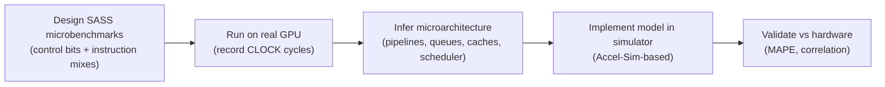
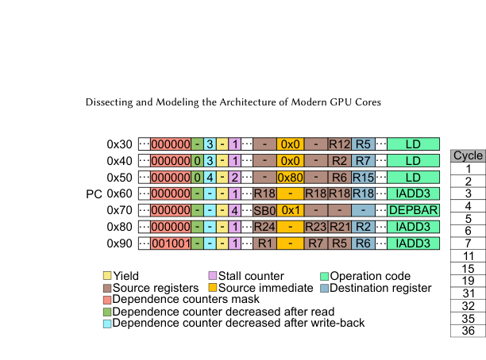
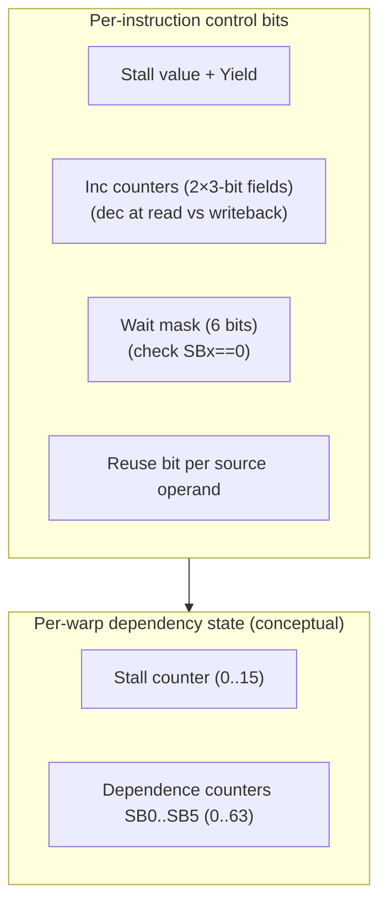
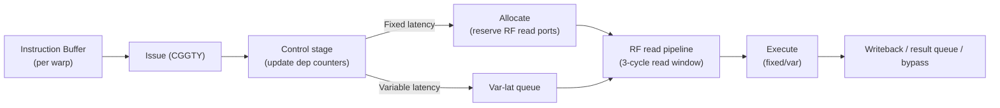
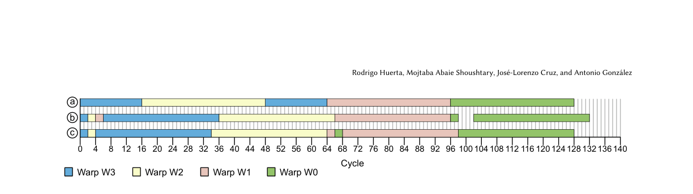
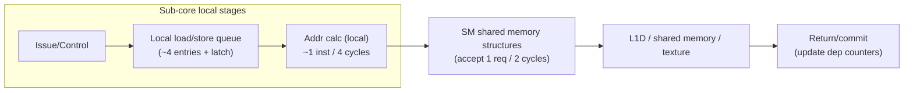

# Dissecting and Modeling the Architecture of Modern GPU Cores

## 0. Metadata
- **Full Title**: Dissecting and Modeling the Architecture of Modern GPU Cores
- **Authors**: Rodrigo Huerta; Mojtaba Abaie Shoushtary; José-Lorenzo Cruz; Antonio González
- **Venue / Year**: MICRO 2025 (58th IEEE/ACM International Symposium on Microarchitecture)
- **Links**: PDF: `paper-source/modern-gpu-cores/modern-gpu-cores.pdf` | Paper (md): `paper-source/modern-gpu-cores/modern-gpu-cores.md` | DOI: https://doi.org/10.1145/3725843.3756041 | Code: https://github.com/upc-arco/modern-gpu-simulator-micro-2025
- **Keywords**: GPU microarchitecture; reverse engineering; NVIDIA; control bits; warp scheduling; register file cache; instruction prefetching; simulation; validation; Accel-Sim
- **Paper ID (short handle)**: modern-gpu-cores-micro25

## 1. TL;DR (3–5 bullets)
- **Problem**: Academic GPU simulators often model decades-old cores, so results can diverge from modern NVIDIA GPUs.
  > "most microarchitectural research in academia relies on simulators that model GPU core architectures based on designs that are more than 15 years old" (Abstract; paper-source/modern-gpu-cores/modern-gpu-cores.md)
- **Idea**: Reverse engineer modern NVIDIA core microarchitecture (Turing/Ampere/Blackwell) via targeted SASS microbenchmarks, then implement the discovered details in a simulator.
  > "This work reverse engineers the architecture of modern NVIDIA GPU cores" (Abstract; paper-source/modern-gpu-cores/modern-gpu-cores.md)
- **System**: Model compiler-guided dependence handling (control bits), a new issue policy (CGGTY), L0 I-cache + stream buffer prefetching, a uniform RF + RF cache, and updated memory/constant pipelines.
  > "it reveals how the issue logic works, the structure of the register file and its associated cache, multiple features of the instruction and data memory pipelines." (Abstract; paper-source/modern-gpu-cores/modern-gpu-cores.md)
- **Efficiency**: Replace large scoreboards with a compact software-hardware scheme (stall counter + dependence counters + yield), reducing overhead and often improving performance.
  > "the software-based dependence management mechanism included in modern NVIDIA GPUs outperforms a hardware mechanism based on scoreboards in terms of performance and area." (Abstract; paper-source/modern-gpu-cores/modern-gpu-cores.md)
- **Result**: Accuracy improves substantially vs Accel-Sim (e.g., RTX A6000 MAPE 13.45% vs 34.03%; Blackwell MAPE 17.41%).
  > "The new model achieves a mean absolute percentage error (MAPE) of execution cycles against real hardware of 13.45%, whereas the previous simulator model has a MAPE of 34.03%." (Contributions list; paper-source/modern-gpu-cores/modern-gpu-cores.md)
  > "this is the first work that models the latest NVIDIA GPU architecture, Blackwell, with high accuracy, achieving a MAPE of 17.41%." (Introduction; paper-source/modern-gpu-cores/modern-gpu-cores.md)

## 2. Problem & Motivation

### 2.1 Why “baseline GPUs” in simulation are stale
- **Simulator baselines lag hardware**: Many studies rely on models derived from Tesla-era assumptions, despite major post-Tesla changes (sub-cores, L0 I-cache, uniform RF, new issue/dependence logic).
  > "most current academic studies are based on simulators ... that use the Tesla microarchitecture ... as the baseline, which was launched in 2006." (Introduction; paper-source/modern-gpu-cores/modern-gpu-cores.md)
- **Missing microarchitectural disclosure**: Modern commercial GPU core details are not publicly documented, making faithful modeling hard.
  > "there is scarce information on the architecture of modern commercial GPUs" (Introduction; paper-source/modern-gpu-cores/modern-gpu-cores.md)
- **Research risk**: New ideas evaluated on outdated cores may not transfer to modern GPUs.
  > "GPU architectures have undergone significant changes since Tesla, hence, the reported findings when evaluating a new idea may differ for a more up-to-date model." (Introduction; paper-source/modern-gpu-cores/modern-gpu-cores.md)

### 2.2 Concrete gap: Accel-Sim core model vs modern NVIDIA cores
- **Old core pipeline assumptions**: Accel-Sim’s baseline uses scoreboards + operand collection/collector units and older scheduling assumptions.
  > "In the Issue stage ... following a Greedy Then Oldest (GTO) ... policy. Each warp has two scoreboards..." (Background and Motivation; paper-source/modern-gpu-cores/modern-gpu-cores.md)
- **Missing key modern structures**: The baseline lacks important modern components and updated behaviors.
  > "it lacks some important components that are present in modern NVIDIA GPUs, such as the L0 instruction cache ... and the uniform register file" (Background and Motivation; paper-source/modern-gpu-cores/modern-gpu-cores.md)


> "Figure 1: SM/Core model of Accel-sim." (Figure 1 caption; paper-source/modern-gpu-cores/modern-gpu-cores.md)

### 2.3 What this paper aims to deliver
- **Reverse engineer**: Discover modern core details (issue, fetch, RF/RFC, memory pipelines) using carefully designed microbenchmarks.
  > "This work aims to bridge this gap by unveiling key features and details of modern NVIDIA GPU architectures" (Introduction; paper-source/modern-gpu-cores/modern-gpu-cores.md)
- **Model + validate**: Implement the discovered model in Accel-Sim and validate against real hardware, including Blackwell.
  > "we show that its accuracy is significantly improved" (Abstract; paper-source/modern-gpu-cores/modern-gpu-cores.md)

## 3. Key Ideas & Contributions (Condensed)
- **Compiler-guided dependence handling**: Fixed-latency hazards via per-warp Stall counter; variable-latency hazards via 6 dependence counters (SB0–SB5) + masks + DEPBAR.
  > "data dependencies are not managed by scoreboards, but the compiler is in charge of guiding the hardware" (Section 4; paper-source/modern-gpu-cores/modern-gpu-cores.md)
- **Modern issue policy (CGGTY)**: “Greedy then youngest” warp selection, with readiness defined by control bits and some resource checks.
  > "We call this issue scheduler policy Compiler Guided Greedy Then Youngest (CGGTY)" (Section 5.1.2; paper-source/modern-gpu-cores/modern-gpu-cores.md)
- **Front-end hypothesis with L0 I-cache + stream buffer**: Per-sub-core L0 I-cache with instruction prefetching; assumptions validated via sensitivity analysis.
  > "Each sub-core has a private L0 instruction cache" (Section 5.2; paper-source/modern-gpu-cores/modern-gpu-cores.md)
- **RF/RFC rethinking**: No operand collectors; 1024-bit bank ports; a small compiler-managed register file cache controlled by reuse bits.
  > "modern NVIDIA GPUs do not make use of it [operand collector]" (Section 5.3; paper-source/modern-gpu-cores/modern-gpu-cores.md)
- **Measured memory pipeline constraints**: Per-sub-core queues + SM-shared structures, with quantified contention/latencies and distinct constant-cache paths.
  > "we discover the size of the load/store queues ... and the latency of the different memory instructions." (Section 5.4; paper-source/modern-gpu-cores/modern-gpu-cores.md)

## 4. Method Overview

### 4.1 Reverse engineering workflow
- **Core technique**: Run small, controlled SASS microbenchmarks on real GPUs and infer microarchitecture from measured cycle timelines.
  > "Our approach is based on writing small microbenchmarks and measure their execution time when executed in the real hardware." (Section 3; paper-source/modern-gpu-cores/modern-gpu-cores.md)
- **Measurement primitive**: Use GPU CLOCK reads around instruction regions to compute elapsed cycles.
  > "The elapsed cycles are obtained by surrounding the code with instructions that save the CLOCK counter of the GPU" (Section 3; paper-source/modern-gpu-cores/modern-gpu-cores.md)
- **Control of inputs**: Use hand-written SASS (including control bits) to test hypotheses about readiness, pipelines, ports, queues, and caches.
  > "hand-written SASS instructions ... including their control bits." (Section 3; paper-source/modern-gpu-cores/modern-gpu-cores.md)



### 4.2 Microarchitecture snapshot inferred by this work

> "Figure 3: Modern NVIDIA GPU SM/Core design inferred by this work." (Figure 3 caption; paper-source/modern-gpu-cores/modern-gpu-cores.md)

## 5. Interface / Contract (Inputs & Outputs)
- **Inputs (reverse engineering)**: Real NVIDIA GPUs + SASS microbenchmarks that precisely set control bits and instruction sequences.
  > "The evaluated sequence of instructions typically consists of hand-written SASS instructions ... including their control bits." (Section 3; paper-source/modern-gpu-cores/modern-gpu-cores.md)
- **Outputs (reverse engineering)**: An inferred model of issue/fetch/RF/RFC/memory pipelines (ports, queues, latencies, policies).
  > "we describe in detail the microarchitecture of the issue scheduler, the front-end, the register file, and the memory pipeline." (Section 5; paper-source/modern-gpu-cores/modern-gpu-cores.md)
- **Inputs (modeling/validation)**: Trace-driven simulation (Accel-Sim style) plus tracer support for operand IDs and control bits.
  > "we have extended the tracer tool... to dump the ID of all types of operands" (Section 6; paper-source/modern-gpu-cores/modern-gpu-cores.md)
- **Outputs (modeling/validation)**: Accuracy metrics (MAPE/APE distribution/correlation) compared to real hardware across architectures.
  > "We validate the accuracy ... by comparing ... against hardware counter-metrics obtained in a real GPU." (Section 7.1; paper-source/modern-gpu-cores/modern-gpu-cores.md)

## 6. Architecture / Components

### 6.1 Control bits: software-managed dependence + reuse

#### 6.1.1 Fixed-latency hazards: Stall counter (compile-time scheduled)
- **Mechanism**: Per-warp Stall counter blocks issue while non-zero; compiler sets it based on producer latency and consumer distance.
  > "For dependencies with a fixed latency, each warp has a counter that is referred to as Stall counter." (Section 4; paper-source/modern-gpu-cores/modern-gpu-cores.md)
- **Correctness relies on compiler**: If Stall counters are wrong, the program can compute incorrect results (no hardware RAW checking).
  > "This proves that the hardware does not check for RAW hazards, and simply relies on these compiler-set counters." (Section 4; paper-source/modern-gpu-cores/modern-gpu-cores.md)

#### 6.1.2 Variable-latency hazards: Dependence counters (SB0–SB5) + masks + DEPBAR
- **Counters**: Six per-warp counters (SB0–SB5), range 0–63, incremented after issue and decremented at read or write-back depending on hazard type.
  > "Each warp has six special registers to store these counters, which are referred to as SBx ... store a value in the range of 0 to 63" (Section 4; paper-source/modern-gpu-cores/modern-gpu-cores.md)
- **Wait mechanism**: Each instruction carries a 6-bit mask that stalls issue until the referenced counters reach zero; DEPBAR enables thresholded waits.
  > "every instruction has a mask of 6 bits to indicate which dependence counters it has to check" (Section 4; paper-source/modern-gpu-cores/modern-gpu-cores.md)
  > "An alternative way of checking the value of these counters is through the DEPBAR .LE instruction." (Section 4; paper-source/modern-gpu-cores/modern-gpu-cores.md)
- **Pipeline nuance**: Counter increments become visible one cycle later, so a producer may need Yield or Stall>1 when consumer is next.
  > "The incrementing of the Dependence counters is performed the cycle after issuing the producer instruction" (Section 4; paper-source/modern-gpu-cores/modern-gpu-cores.md)


> "Figure 2: Example of using Dependence counters to handle dependencies." (Figure 2 caption; paper-source/modern-gpu-cores/modern-gpu-cores.md)

#### 6.1.3 Yield bit and reuse bit
- **Yield**: Forces the next cycle to not issue from the same warp (if no other warp ready, a bubble occurs).
  > "There is another control bit that is called Yield ... in the next cycle it must not issue an instruction of the same warp." (Section 4; paper-source/modern-gpu-cores/modern-gpu-cores.md)
- **Reuse bit (RFC control)**: Each source operand can be marked for caching to reduce RF read-port contention and save energy.
  > "GPUs have a register file cache ... software-managed by adding a control bit to each source operand, the reuse bit" (Section 4; paper-source/modern-gpu-cores/modern-gpu-cores.md)



### 6.2 Issue stage and scheduling (CGGTY) + staging (Control/Allocate)

#### 6.2.1 Warp readiness conditions
- **In-order issue per warp**: Only the oldest instruction of a warp can be considered, gated by control-bit dependency state.
  > "Warps issue their instructions in program order." (Section 5.1.1; paper-source/modern-gpu-cores/modern-gpu-cores.md)
  > "Dependencies among instructions are handled through software support by means of the control bits" (Section 5.1.1; paper-source/modern-gpu-cores/modern-gpu-cores.md)
- **Some resource checks at issue**: Example: constant-cache tag lookup for fixed-latency instructions; misses can stall issue.
  > "the tag look-up is performed in the issue stage. If the operand is not in the cache, the scheduler does not issue any instruction until the miss is serviced." (Section 5.1.1; paper-source/modern-gpu-cores/modern-gpu-cores.md)

#### 6.2.2 Pipeline staging between issue and operand read
- **Control stage**: Common stage that updates dependence counters / reads CLOCK; imposes visibility constraints for dependence-counter increments.
  > "The first stage, which we call Control, is common for fixed and variable latency instructions" (Section 5.1.1; paper-source/modern-gpu-cores/modern-gpu-cores.md)
- **Allocate stage (fixed-latency only)**: Reserves RF read ports; stalls until it can guarantee conflict-free RF reads.
  > "We call this stage Allocate." (Section 5.1.1; paper-source/modern-gpu-cores/modern-gpu-cores.md)
- **Variable-latency path**: Bypasses Allocate and enters a queue; fixed-latency instructions take priority for RF port allocation.
  > "Variable-latency instructions ... are delivered directly to a queue after going through the Control stage" (Section 5.1.1; paper-source/modern-gpu-cores/modern-gpu-cores.md)
  > "Fixed-latency instructions are given priority over variable-latency instructions to allocate register file ports" (Section 5.1.1; paper-source/modern-gpu-cores/modern-gpu-cores.md)



#### 6.2.3 Scheduling policy: CGGTY (Compiler Guided Greedy Then Youngest)
- **Policy**: Continue issuing from the same warp if eligible; otherwise select the youngest eligible warp.
  > "uses a greedy policy that selects an instruction from the same warp if it meets the eligibility criteria ... then ... selects an instruction from the youngest warp" (Section 5.1.2; paper-source/modern-gpu-cores/modern-gpu-cores.md)

```python
# Conceptual CGGTY scheduler (per sub-core), based on the paper text.
# warps ordered by age: oldest ... youngest
def select_warp(last_warp, eligible_warps_youngest_first):
    if last_warp in eligible_warps_youngest_first:
        return last_warp
    return eligible_warps_youngest_first[0] if eligible_warps_youngest_first else None
```


> "Figure 4: Timelines of instruction issue from four different warps in three different scenarios." (Figure 4 caption; paper-source/modern-gpu-cores/modern-gpu-cores.md)

### 6.3 Front-end: sub-cores, L0 I-cache, stream buffer, instruction buffer
- **Topology**: 4 sub-cores per SM; warps distributed round-robin; per-sub-core private L0 I-cache connected to shared L1 I-cache.
  > "SMs have four different sub-cores and warps are evenly distributed among sub-cores in a round robin manner" (Section 5.2; paper-source/modern-gpu-cores/modern-gpu-cores.md)
  > "Each sub-core has a private L0 instruction cache that is connected to an L1 instruction cache that is shared" (Section 5.2; paper-source/modern-gpu-cores/modern-gpu-cores.md)
- **Prefetching hypothesis**: They suspect a simple stream buffer; assume size 8 based on accuracy sensitivity.
  > "we suspect it is a simple scheme like a stream buffer" (Section 5.2; paper-source/modern-gpu-cores/modern-gpu-cores.md)
  > "We assume that the stream buffer size is 8" (Section 5.2; paper-source/modern-gpu-cores/modern-gpu-cores.md)
- **Fetch policy is partially inferred**: They could not confirm exact policy; propose a greedy-like fetch with a 3-entry instruction buffer per warp.
  > "We could not confirm the exact instruction fetch policy with our experiments" (Section 5.2; paper-source/modern-gpu-cores/modern-gpu-cores.md)
  > "We assume an Instruction Buffer with three entries per warp" (Section 5.2; paper-source/modern-gpu-cores/modern-gpu-cores.md)

### 6.4 Register files, RF ports, and the Register File Cache (RFC)

#### 6.4.1 Register file types and organization
- **Multiple RF namespaces**: Regular, uniform, predicates, uniform predicates, SB counters, etc.
  > "Modern NVIDIA GPUs have various register files" (Section 5.3; paper-source/modern-gpu-cores/modern-gpu-cores.md)
- **Regular RF scale + banking**: 65,536 32-bit registers per SM; per-sub-core distribution; 2 banks per sub-core.
  > "Recent NVIDIA architectures have 65536 32-bit registers per SM" (Section 5.3; paper-source/modern-gpu-cores/modern-gpu-cores.md)
  > "the registers in each sub-core are organized in two banks" (Section 5.3; paper-source/modern-gpu-cores/modern-gpu-cores.md)

#### 6.4.2 No operand collectors (and why)
- **Finding**: Operand collectors (as assumed in prior simulators) are absent in modern NVIDIA cores.
  > "modern NVIDIA GPUs do not make use of it [operand collector]" (Section 5.3; paper-source/modern-gpu-cores/modern-gpu-cores.md)
- **Reasoning**: Collector-induced timing variability would break compiler-scheduled fixed-latency dependence correctness.
  > "Operand collector units would introduce variability ... making it impossible to handle dependencies correctly ... since its execution latency must be known at compile time." (Section 5.3; paper-source/modern-gpu-cores/modern-gpu-cores.md)

#### 6.4.3 RF ports, result queue/bypass, and read scheduling (Allocate)
- **Write ports + arbitration**: Single 1024-bit write port per bank; load vs fixed-latency conflicts suggest fixed-latency prioritization and a result queue for fixed-latency completion alignment.
  > "each register file bank has a single write port of 1024 bits." (Section 5.3; paper-source/modern-gpu-cores/modern-gpu-cores.md)
  > "This implies the use of a result queue ... for fixed-latency instructions." (Section 5.3; paper-source/modern-gpu-cores/modern-gpu-cores.md)
- **Read bandwidth**: 1024-bit per bank; conflicts create bubbles depending on operand banking and instruction type.
  > "we have observed a bandwidth of 1024 bits per bank." (Section 5.3; paper-source/modern-gpu-cores/modern-gpu-cores.md)
- **Allocate behavior (best-fit model)**: Reserve ports so fixed-latency instruction reads are conflict-free across a 3-cycle read window.
  > "If the instruction in the Allocate stage realizes that it cannot read all its operands in the next three cycles, it is held in this stage" (Section 5.3; paper-source/modern-gpu-cores/modern-gpu-cores.md)

#### 6.4.4 Register File Cache (RFC) details
- **Structure**: One RFC entry per bank (2 banks) per sub-core; each entry stores 3×1024-bit values (one per operand slot); total 6 operand values cached.
  > "it has one entry for each of the two register file banks in each sub-core. Each entry stores three 1024-bit values" (Section 5.3.1; paper-source/modern-gpu-cores/modern-gpu-cores.md)
- **Hit conditions**: Same warp; same register ID; same operand position as the caching instruction.
  > "A subsequent instruction will obtain its register source operand ... if the instruction is from the same warp, the register ID matches ... and the operand position ... is the same" (Section 5.3.1; paper-source/modern-gpu-cores/modern-gpu-cores.md)
- **Replacement/availability rule**: Cache availability is tied to reads to the same bank+operand slot; re-marking reuse can “retain” a value.
  > "A cached value is unavailable after a read request arrives to the same bank and operand position, regardless of whether it hits in the RFC." (Section 5.3.1; paper-source/modern-gpu-cores/modern-gpu-cores.md)

### 6.5 Memory pipeline (queues, contention, latencies, constant caches)
- **Shared vs local**: Early stages are local to each sub-core; later stages are shared among the 4 sub-cores.
  > "initial stages local to each sub-core, whereas the last stages ... are shared by the four sub-cores" (Section 5.4; paper-source/modern-gpu-cores/modern-gpu-cores.md)
- **Queueing + throughput**: Each sub-core buffers ~5 consecutive memory instructions; shared structures accept one request every 2 cycles.
  > "we estimate that it has a size of four, and there is an additional latch ... so each sub-core can buffer five consecutive instructions." (Section 5.4; paper-source/modern-gpu-cores/modern-gpu-cores.md)
  > "structures can receive a memory request every two cycles from any of the sub-cores." (Section 5.4; paper-source/modern-gpu-cores/modern-gpu-cores.md)
- **Latency characterization**: Reports RAW/WAW vs WAR latencies and notes transfer bandwidth for load data is 512 bits/cycle.
  > "We also measured two latencies ... RAW/WAW latency ... WAR latency." (Section 5.4; paper-source/modern-gpu-cores/modern-gpu-cores.md)
  > "We have measured that the bandwidth for this transfer is 512 bits per cycle." (Section 5.4; paper-source/modern-gpu-cores/modern-gpu-cores.md)
- **Constant memory nuance**: Fixed-latency constant operands use a different cache path (L0 FL) vs LDC loads (L0 VL).
  > "fixed-latency instructions accessing the constant address space use the L0 FL ... while LDC instructions use ... the L0 VL ... constant cache" (Section 5.4; paper-source/modern-gpu-cores/modern-gpu-cores.md)



### 6.6 Modeling in Accel-Sim + tracer extensions
- **Core model redesign**: Rebuild SM/core model to include control bits, CGGTY, L0 I-cache + stream buffer, and new pipeline stages (Control/Allocate).
  > "We have designed from scratch the SM/core model of the Accel-sim framework simulator ... to implement all the details" (Section 6; paper-source/modern-gpu-cores/modern-gpu-cores.md)
  > "We included the Control stage ... and the Allocate stage" (Section 6; paper-source/modern-gpu-cores/modern-gpu-cores.md)
- **Memory modeling**: Add per-sub-core + shared memory units, plus PRT for coalescing and other instruction modeling improvements.
  > "we implement a Pending Request Table (PRT) ... to accurately simulate the timing behavior associated with intra-warp memory access coalescing." (Section 6; paper-source/modern-gpu-cores/modern-gpu-cores.md)
- **Tracing/control bits extraction**: NVBit lacks control bits, so they extract SASS at compile time; hybrid scoreboard fallback when SASS is unavailable.
  > "obtain the control bits ... since NVBit ... does not provide access to them." (Section 6; paper-source/modern-gpu-cores/modern-gpu-cores.md)
  > "we use a hybrid mode for dependencies where traditional scoreboards are employed in kernels that do not have the SASS code" (Section 6; paper-source/modern-gpu-cores/modern-gpu-cores.md)
- **Code availability**: Enhanced tracer/simulator is public.
  > "The code of this enhanced tracer and simulator based on Accelsim is available at [42]." (Section 6; paper-source/modern-gpu-cores/modern-gpu-cores.md)

## 7. Algorithm / Pseudocode (Optional)

### 7.1 Putting the dependence scheme together (conceptual)
```python
# Per-warp state (conceptual; matches paper's described mechanisms)
stall_counter = 0               # fixed-latency hazards
sb = [0, 0, 0, 0, 0, 0]         # SB0..SB5 for variable-latency hazards

def can_issue(inst):
    # 1) Must have valid inst in IB and be oldest in warp (in-order per warp).
    # 2) Fixed-latency gating
    if stall_counter != 0:
        return False
    # 3) Variable-latency gating (mask of counters must be zero)
    for i in inst.dep_mask:     # indices with mask bit = 1
        if sb[i] != 0:
            return False
    return True

def on_issue(inst):
    # Counter increments become visible one cycle later (paper), so model as delayed.
    schedule_next_cycle(lambda: inc_sb(inst.inc_at_wb))
    schedule_next_cycle(lambda: inc_sb(inst.inc_at_read))
    # Stall counter + Yield influence issue eligibility next cycles.
    set_stall_counter_from_inst(inst)
```

- **Why “delayed increment” matters**: consecutive producer/consumer needs Yield or Stall>1 for dependence counters to be observable.
  > "The incrementing of the Dependence counters is performed the cycle after issuing the producer instruction, so it is not effective until one cycle later." (Section 4; paper-source/modern-gpu-cores/modern-gpu-cores.md)
- **Fixed-latency correctness**: wrong Stall counter settings can produce wrong results (no hardware RAW).
  > "the hardware does not check for RAW hazards" (Section 4; paper-source/modern-gpu-cores/modern-gpu-cores.md)

## 8. Training Setup
- **N/A (no ML training)**: The paper is about microarchitecture reverse engineering + simulation modeling, not model training.
  > "This work reverse engineers the architecture of modern NVIDIA GPU cores" (Abstract; paper-source/modern-gpu-cores/modern-gpu-cores.md)
- **Evaluation setup (closest analogue)**: Uses multiple GPUs and a large benchmark set; CUDA 12.8; traces via NVBIT 1.7.5; compares against vanilla Accel-Sim.
  > "In total, we use 128 benchmarks from 84 different applications." (Section 7.1; paper-source/modern-gpu-cores/modern-gpu-cores.md)
  > "All benchmarks were executed using CUDA 12.8" (Section 7.1; paper-source/modern-gpu-cores/modern-gpu-cores.md)
  > "Tracing was conducted using NVBIT version 1.7.5" (Section 7.1; paper-source/modern-gpu-cores/modern-gpu-cores.md)

## 9. Inference / Runtime Behavior
- **Trace-driven simulation dependency**: Accurate modeling depends on getting per-instruction control bits; missing SASS forces fallback scoreboard modeling (hybrid mode).
  > "NVIDIA tools do not provide the SASS code ... which prevents obtaining the control bits" (Section 6; paper-source/modern-gpu-cores/modern-gpu-cores.md)
  > "we use a hybrid mode for dependencies where traditional scoreboards are employed" (Section 6; paper-source/modern-gpu-cores/modern-gpu-cores.md)
- **Runtime sensitivity: instruction prefetching**: Stream buffer size strongly affects both simulation accuracy and speed.
  > "The characteristics of the stream buffer instruction prefetcher have a high impact on the global model accuracy." (Section 7.3; paper-source/modern-gpu-cores/modern-gpu-cores.md)
- **Runtime sensitivity: RF/RFC contention**: Benchmarks heavy in 3-operand fixed-latency ops are sensitive to RF port contention and RFC effectiveness.
  > "Both benchmarks rely heavily on fixed-latency arithmetic instructions, which are particularly sensitive to stalls caused by contention in the register file access" (Section 7.4; paper-source/modern-gpu-cores/modern-gpu-cores.md)

## 10. Experiments & Results

### 10.1 Validation methodology and datasets
- **Scope**: 128 benchmarks across 13 suites; validates across Ampere, Turing, and Blackwell.
  > "We use a wide variety of benchmarks from 13 different suites" (Section 7.1; paper-source/modern-gpu-cores/modern-gpu-cores.md)
  > "We use different NVIDIA Ampere ..., Turing ..., and Blackwell ... GPUs" (Section 7.1; paper-source/modern-gpu-cores/modern-gpu-cores.md)
- **Metric**: Mean absolute percentage error (MAPE) over execution cycles; plus correlation and per-benchmark APE.
  > "mean percentage absolute error (MAPE)" (Section 7.2; paper-source/modern-gpu-cores/modern-gpu-cores.md)

### 10.2 Headline accuracy improvements vs Accel-Sim
- **Across architectures**: The new model is consistently closer to hardware than vanilla Accel-Sim.
  > "our model is significantly more accurate than Accel-sim in all the evaluated GPUs." (Section 7.2; paper-source/modern-gpu-cores/modern-gpu-cores.md)
- **RTX A6000**: MAPE improves from 34.03% (Accel-Sim) to 13.45% (new model).
  > "The new model achieves a mean absolute percentage error (MAPE) of execution cycles against real hardware of 13.45%, whereas the previous simulator model has a MAPE of 34.03%." (Contributions list; paper-source/modern-gpu-cores/modern-gpu-cores.md)
- **Blackwell**: First (to their knowledge) accurate Blackwell core model in the GPGPU simulation field; reports 17.41% MAPE and 0.99 correlation.
  > "this is the first work that models the latest NVIDIA GPU architecture, Blackwell, with high accuracy, achieving a MAPE of 17.41%." (Introduction; paper-source/modern-gpu-cores/modern-gpu-cores.md)
  > "for Blackwell, our model achieves a MAPE of 17.41% and a correlation of 0.99" (Section 7.2; paper-source/modern-gpu-cores/modern-gpu-cores.md)
- **Tail robustness**: Accel-Sim can exceed 100% APE (up to 513%), while the new model stays below 62% APE in their set.
  > "Accel-sim has an absolute percentage error greater or equal to 100% for 6 applications, and it reaches 513% ... whereas our model never has an absolute percentage error greater than 62%." (Section 7.2; paper-source/modern-gpu-cores/modern-gpu-cores.md)


> "Figure 5: Percentage absolute error of NVIDIA RTX A6000 model for each benchmark in ascending order." (Figure 5 caption; paper-source/modern-gpu-cores/modern-gpu-cores.md)

## 11. Ablations & Analysis

### 11.1 Instruction prefetching sensitivity (stream buffer)
- **Best setting**: Stream buffer size 8 gives best MAPE among tested sizes; also close to perfect I-cache for many GPU workloads.
  > "the best accuracy is obtained with a stream buffer of size 8." (Section 7.3; paper-source/modern-gpu-cores/modern-gpu-cores.md)
  > "this simple prefetcher behaves close to a perfect instruction cache in GPUs." (Section 7.3; paper-source/modern-gpu-cores/modern-gpu-cores.md)
- **When perfect I-cache is misleading**: For control-flow-heavy kernels, perfect I-cache/omitting stream buffers can increase error substantially.
  > "for benchmarks where control flow is relevant ... employing a perfect instruction cache or omitting stream buffers results in significant inaccuracies" (Section 7.3; paper-source/modern-gpu-cores/modern-gpu-cores.md)

### 11.2 Register file architecture sensitivity (RFC + read ports)
- **Compiler evolution matters**: Newer CUDA compilers set reuse bits more often, increasing RFC relevance.
  > "ratio of instructions with at least one operand with the reuse bit set increases from CUDA 11.4 to CUDA 12.8" (Section 7.4; paper-source/modern-gpu-cores/modern-gpu-cores.md)
- **Workload dependence**: RFC absence hurts some kernels strongly (e.g., Cutlass-sgemm) while others (MaxFlops) may be insensitive due to low reuse-bit incidence.
  > "a single-port configuration without a register file cache leads to substantial performance degradation (0.69x)." (Section 7.4; paper-source/modern-gpu-cores/modern-gpu-cores.md)
  > "performance is the same regardless of whether the RFC is present, since only 1.32% of static instructions make use of it." (Section 7.4; paper-source/modern-gpu-cores/modern-gpu-cores.md)

### 11.3 Alternative dependence management: control bits vs scoreboard
- **Area/perf trade-off**: Scoreboards are larger and slightly slower/less accurate than control bits, especially when tracking many consumers.
  > "A mechanism based on a traditional scoreboard is slightly less accurate, has slightly lower performance, and has a much higher area overhead." (Section 7.5; paper-source/modern-gpu-cores/modern-gpu-cores.md)
- **Control bits are tiny**: 41 bits/warp (0.09% RF size) vs multi-kilobit scoreboards per warp.
  > "requires six Dependence Counters ... a Stall Counter ... and a yield bit. This amounts to just 41 bits per warp" (Section 7.5; paper-source/modern-gpu-cores/modern-gpu-cores.md)

## 12. Limitations, Risks, Ethics
- **Some policies are inferred/assumed**: Fetch policy is not fully confirmed; some pipeline models are best-fit approximations over many experiments.
  > "We could not confirm the exact instruction fetch policy with our experiments" (Section 5.2; paper-source/modern-gpu-cores/modern-gpu-cores.md)
  > "we could not find a model that perfectly fits all the experiments. However, the model that we describe below is correct for almost all the cases" (Section 5.1.1; paper-source/modern-gpu-cores/modern-gpu-cores.md)
- **Unexplained observations remain**: Some constant-cache latency asymmetries are reported without a confirmed explanation.
  > "We could not confirm any hypothesis that explains this observation." (Section 5.4; paper-source/modern-gpu-cores/modern-gpu-cores.md)
- **Toolchain limitations**: NVBit does not expose control bits; some kernels lack SASS availability, requiring hybrid dependency handling.
  > "NVBit ... does not provide access to [control bits]" (Section 6; paper-source/modern-gpu-cores/modern-gpu-cores.md)
  > "NVIDIA tools do not provide the SASS code ... To simulate these applications, we use a hybrid mode" (Section 6; paper-source/modern-gpu-cores/modern-gpu-cores.md)

## 13. Applicability & Integration Notes (Project-Focused)
- **Compiler–hardware co-design pattern**: Consider “software-managed hazards” (control bits / counters) to reduce scoreboard area in accelerator cores with mostly fixed-latency pipelines.
- **Microbenchmark-driven modeling**: Use the paper’s methodology (CLOCK-bracketed microbenchmarks) to validate any NPU pipeline assumptions (queues/ports/stalls) when RTL is not available.
- **Operand reuse structure**: RFC-like small, compiler-steered operand caching may reduce RF bandwidth needs in SIMD/SIMT-like NPU datapaths.
- **Simulator fidelity**: If building an NPU simulator, prefer modeling the real scheduler/queues/ports rather than assuming generic GTO + scoreboards.

## 14. Reproducibility Plan
- **Get artifacts**: Paper provides the enhanced tracer/simulator.
  > "The code of this enhanced tracer and simulator based on Accelsim is available at [42]." (Section 6; paper-source/modern-gpu-cores/modern-gpu-cores.md)
- **Hardware/benchmarks**: Use a GPU similar to the validated set and run the benchmark suites with the same CUDA version where possible.
  > "All benchmarks were executed using CUDA 12.8" (Section 7.1; paper-source/modern-gpu-cores/modern-gpu-cores.md)
- **Trace & simulate**:
  - **Step 1**: Compile benchmarks (note: control bits extracted from SASS at compile time).
    > "obtaining the SASS through the CUDA binary utilities ... at compile time" (Section 6; paper-source/modern-gpu-cores/modern-gpu-cores.md)
  - **Step 2**: Trace with NVBIT; ensure control bits + operand IDs are captured.
    > "Tracing was conducted using NVBIT version 1.7.5" (Section 7.1; paper-source/modern-gpu-cores/modern-gpu-cores.md)
  - **Step 3**: Run simulations; compute MAPE vs hardware cycle counts and inspect APE tail (Figure 5-style plots).
    > "compare ... against real hardware" (Section 7; paper-source/modern-gpu-cores/modern-gpu-cores.md)

## 15. Related Work
- **Public GPU simulators**: Accel-Sim (CUDA/NVIDIA-like) and MGPUSim (AMD GCN 3) are cited as the main academic baselines.
  > "In the academic sphere, there are two popular public-domain simulators, Accel-Sim and MGPUSim." (Related Work; paper-source/modern-gpu-cores/modern-gpu-cores.md)
- **Prior NVIDIA reverse engineering**: Prior work targets specific components (NoC, caches, tensor cores, TLBs), while this paper targets end-to-end core microarchitecture.
  > "several works have been pursued to unveil specific components of GPUs." (Related Work; paper-source/modern-gpu-cores/modern-gpu-cores.md)
- **Compiler hints/control bits lineage**: Control bits appear since Kepler; newer arch embeds hint bits in each instruction.
  > "Compiler hints (a.k.a. control bits) have been used in GPUs at least since the NVIDIA Kepler architecture" (Related Work; paper-source/modern-gpu-cores/modern-gpu-cores.md)

## 16. Open Questions & Follow-Ups
- **Can we validate fetch policy more directly?** What microbenchmarks would isolate fetch scheduling vs issue scheduling effects?
- **RFC semantics across architectures**: Are the RFC size and operand-position behavior stable from Turing → Blackwell?
- **Generalization beyond NVIDIA**: Can similar “control-bit-first” modeling improve AMD/Intel GPU simulators (or NPUs)?
- **Compiler vs hardware boundary**: When does pushing dependence handling to the compiler become too brittle (e.g., for more variable pipelines)?

## 17. Glossary / Notation
- **Warp**: A SIMT execution group (32 threads for NVIDIA) scheduled as a unit.
- **SM**: Streaming Multiprocessor (NVIDIA’s core cluster); contains multiple sub-cores/processing blocks.
- **Sub-core / Processing Block**: A partition within an SM that issues/executes for a subset of warps.
- **Stall counter**: Per-warp counter for fixed-latency dependence scheduling; blocks issue when non-zero.
- **Dependence counters (SB0–SB5)**: Per-warp counters for variable-latency hazards; waited on via per-instruction mask or DEPBAR.
- **DEPBAR .LE**: Wait instruction that requires an SB counter to be ≤ threshold (plus optional “all-zero” constraints).
- **Yield bit**: Control bit hint forcing the scheduler to not issue from same warp next cycle.
- **Reuse bit**: Per-operand hint to cache operand in the register file cache (RFC).
- **RFC (Register File Cache)**: Small compiler-managed operand cache per sub-core/bank to reduce RF read contention.
- **CGGTY**: Compiler Guided Greedy Then Youngest issue policy.
- **MAPE / APE**: Mean / per-benchmark absolute percentage error in predicted cycles vs hardware.
- **L0 FL / L0 VL constant cache**: Distinct constant-cache paths for fixed-latency constant operands vs LDC-style loads.

## 18. Figures & Diagrams (Optional)
- **Baseline core model**: `figures/figure-1.png`
- **Dependence counters example**: `figures/figure-2.png`
- **Inferred modern SM/core model**: `figures/figure-3.png`
- **Issue scheduler timelines**: `figures/figure-4.png`
- **Accuracy distribution**: `figures/figure-5.png`

## 19. BibTeX / Citation
```bibtex
@inproceedings{huerta2025modern_gpu_cores,
  title = {Dissecting and Modeling the Architecture of Modern GPU Cores},
  author = {Huerta, Rodrigo and Abaie Shoushtary, Mojtaba and Cruz, Jos{\'e}-Lorenzo and Gonz{\'a}lez, Antonio},
  booktitle = {Proceedings of the 58th IEEE/ACM International Symposium on Microarchitecture (MICRO '25)},
  year = {2025},
  pages = {369--384},
  publisher = {Association for Computing Machinery},
  address = {New York, NY, USA},
  doi = {10.1145/3725843.3756041}
}
```
