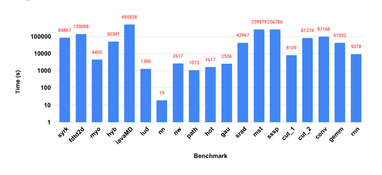
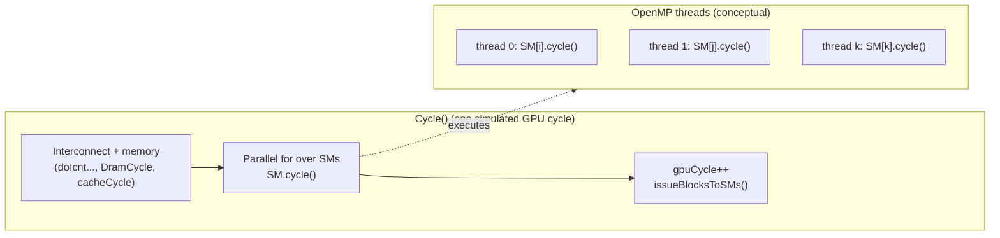
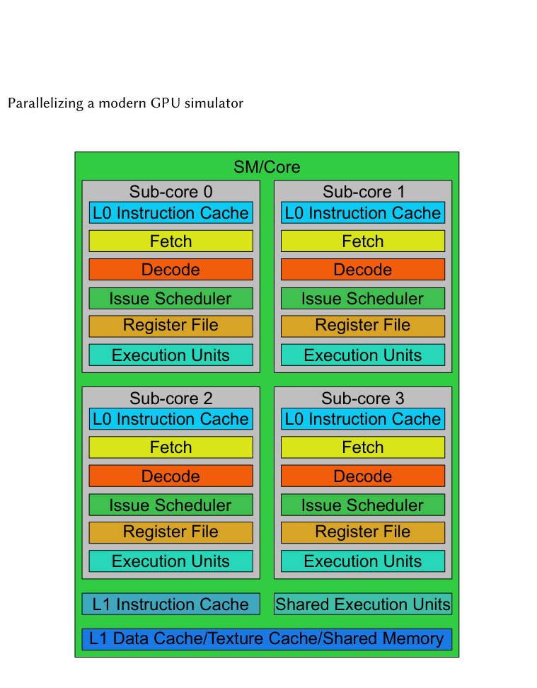
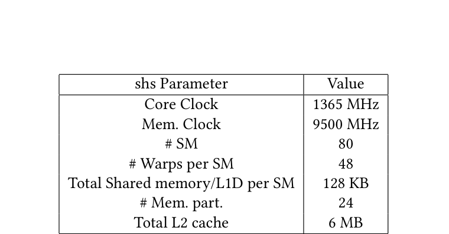
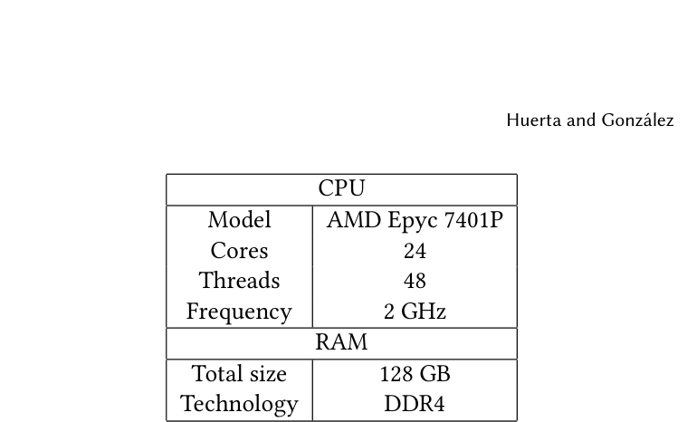
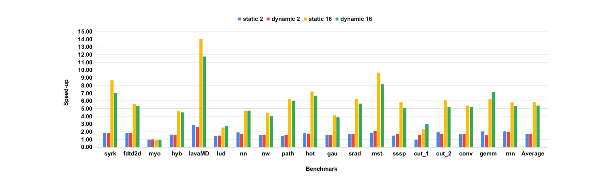

# Parallelizing a modern GPU simulator

## 0. Metadata
- **Full Title**: Parallelizing a modern GPU simulator
- **Authors**: Rodrigo Huerta; Antonio González
- **Venue / Year**: arXiv (cs.DC), 2025
- **Links**: PDF: `paper-source/parallelizing-modern-gpu-simulator/parallelizing-modern-gpu-simulator.pdf` | Paper (md): `paper-source/parallelizing-modern-gpu-simulator/parallelizing-modern-gpu-simulator.md` | ArXiv: https://arxiv.org/abs/2502.14691
- **Keywords**: GPU; GPGPU; microarchitecture; simulation; OpenMP; parallelization; GPGPU-Sim; Accel-sim
- **Paper ID (short handle)**: parallelizing-accel-sim-openmp-arxiv25

## 1. TL;DR (3–5 bullets)
- **Problem**: A single-threaded, cycle-level simulator (Accel-sim) can take multiple days on some GPGPU workloads.
  > "This paper demonstrates that simulating some GPGPU workloads in a single-threaded stateof-the-art simulator such as Accel-sim can take more than five days." (Abstract; paper-source/parallelizing-modern-gpu-simulator/parallelizing-modern-gpu-simulator.pdf p.1)
- **Idea**: Parallelize Accel-sim with minimal code changes using OpenMP.
  > "we present a simple approach to parallelize this simulator with minimal code changes by using OpenMP." (Abstract; paper-source/parallelizing-modern-gpu-simulator/parallelizing-modern-gpu-simulator.pdf p.1)
- **System**: Parallelize the per-cycle per-SM loop and remove shared-state races by restructuring stats and unsafe containers.
  > "we have isolated all these stats to be calculated by SM instead of globally for the whole GPU." (Section 3; paper-source/parallelizing-modern-gpu-simulator/parallelizing-modern-gpu-simulator.pdf p.3)
- **Determinism**: Multi-threaded runs match single-threaded results (no accuracy loss from parallelization).
  > "our parallelization technique is deterministic, so the simulator provides the same results for single-threaded and multi-threaded simulations." (Abstract; paper-source/parallelizing-modern-gpu-simulator/parallelizing-modern-gpu-simulator.pdf p.1)
- **Result**: Speed-ups scale to 5.83× (avg) with 16 threads and up to 14× on some workloads.
  > "Figure 5 shows the speed-up obtained with 2, 4, 8, 16, and 24 threads, averaging 1.72x, 2.64x, 3.95x, 5.83x, and 7.08x, respectively, against the single-threaded simulator." (Section 4.2; paper-source/parallelizing-modern-gpu-simulator/parallelizing-modern-gpu-simulator.pdf p.4)

## 2. Problem & Motivation

### 2.1 Why modern GPU simulation is too slow
- **Single-thread bottleneck**: Accel-sim is single-threaded and can require multi-day runs for some benchmarks.
  > "The Accel-sim framework is single-threaded, and simulating some workloads requires an immense amount of time to complete." (Introduction; paper-source/parallelizing-modern-gpu-simulator/parallelizing-modern-gpu-simulator.pdf p.1)
- **Research-loop impact**: Multi-day runs reduce the number of design-evaluate iterations.
  > "This long simulation runs compromise the amount of iterations in the typical research loop (propose a new feature, evaluate it) that can be performed and therefore, it limits the productivity of researchers." (Introduction; paper-source/parallelizing-modern-gpu-simulator/parallelizing-modern-gpu-simulator.pdf p.1)


> "Figure 1: Time in seconds required to execute each workload with a single thread." (Introduction; paper-source/parallelizing-modern-gpu-simulator/parallelizing-modern-gpu-simulator.pdf p.1)

### 2.2 Why “just parallelize it” is non-trivial (accuracy + determinism)
- **Nondeterminism in prior work**: Existing parallel GPU simulators can introduce deviations vs the sequential baseline.
  > "executing GpuTejas in parallel has an indeterministic behavior, leading to accuracy simulation errors of up to 7.7% compared to the single-threaded execution." (Related Work; paper-source/parallelizing-modern-gpu-simulator/parallelizing-modern-gpu-simulator.pdf p.2)
- **Goal of this paper**: Parallelize Accel-sim without changing simulation outputs.
  > "our approach does not compromise the simulation accuracy and determinism when the simulator runs in parallel and provides the same results as the sequential version." (Related Work; paper-source/parallelizing-modern-gpu-simulator/parallelizing-modern-gpu-simulator.pdf p.2)

## 3. Key Ideas & Contributions (Condensed)
- **Profile-guided target selection**: Identify SM modeling as the dominant runtime cost and focus parallelism there.
  > "Figure 4 depicts the output of the Gperftools profiler, which shows that over 93% of the execution time is spent executing the SM cycles." (Section 3; paper-source/parallelizing-modern-gpu-simulator/parallelizing-modern-gpu-simulator.pdf p.3)
- **Minimal OpenMP parallelization**: Add OpenMP support and parallelize the loop over SMs inside the per-cycle function.
  > "Then, we added the clause of OpenMP to parallelize for-loops in line 20 (#pragma omp parallel for) of algorithm 1." (Section 3; paper-source/parallelizing-modern-gpu-simulator/parallelizing-modern-gpu-simulator.pdf p.3)
- **Deterministic stats restructuring**: Convert global GPU-wide counters to per-SM counters and reduce at safe points.
  > "Once the kernel execution has finished, each of the stats reported by SM is gathered into a single GPU stat to report stats in the same way as the single-threaded simulator." (Section 3; paper-source/parallelizing-modern-gpu-simulator/parallelizing-modern-gpu-simulator.pdf p.3)
- **Practical thread-safety playbook**: Handle `map/set`-style stats explicitly (locks vs per-SM vs sequential insertion).
  > "maps or sets are not thread-safe structures in C++ [27], meaning they undermine behavior and can lead to segmentation fault errors." (Section 3; paper-source/parallelizing-modern-gpu-simulator/parallelizing-modern-gpu-simulator.pdf p.3)
- **Scaling + scheduler sensitivity**: Measure speed-ups across thread counts and compare OpenMP schedulers (static vs dynamic).
  > "There are two main OpenMP schedulers: static and dynamic." (Section 4.3; paper-source/parallelizing-modern-gpu-simulator/parallelizing-modern-gpu-simulator.pdf p.4)

## 4. Method Overview

The simulator advances in cycles. Each cycle runs sequential code for the interconnect/memory system and then iterates over SMs to model compute. The paper parallelizes this per-SM cycle loop with OpenMP (shared-memory threads) and resolves data races by isolating stats per SM and merging deterministically after kernel completion.



### 4.1 Baseline simulator structure (Algorithm 1)
- **Cycle-level structure**: Each cycle models interconnect, memory partitions, L2 slices, then executes each SM’s cycle.
  > "Algorithm 1 shows the high-level structure of the simulator’s code... Then, it continues by executing the work in each GPU’s SMs (lines 21-23)..." (Section 3; paper-source/parallelizing-modern-gpu-simulator/parallelizing-modern-gpu-simulator.pdf p.2)

```text
Algorithm 1 (from the paper; lightly reflowed)

while !simulation.done():
  doIcntToSm()
  for memSubpartition in GPU_memSubpartition:
    doMemSubpartitionToIcnt()
  for memPartition in GPU_Partition:
    memPartition.DramCycle()
  for memSubpartition in GPU_memSubpartition:
    doIcntToMemSubpartition()
    memSubpartition.cacheCycle()
  doIcntScheduling()

  for SM in GPU_SMs:
    SM.cycle()

  gpuCycle++
  issueBlocksToSMs()
```

### 4.2 Identify the hotspot (profiling)
- **Profiler evidence**: The SM loop dominates runtime (≈93% in the shown profiling run).
  > "Figure 4 ... shows that over 93% of the execution time is spent executing the SM cycles." (Section 3; paper-source/parallelizing-modern-gpu-simulator/parallelizing-modern-gpu-simulator.pdf p.3)


> "Figure 4: Profiler output." (Section 3; paper-source/parallelizing-modern-gpu-simulator/parallelizing-modern-gpu-simulator.pdf p.3)

### 4.3 Parallelize the SM loop with OpenMP
- **Build change**: Enable OpenMP at compile time.
  > "First, we have added the -fopenmp flag to the simulator compilation." (Section 3; paper-source/parallelizing-modern-gpu-simulator/parallelizing-modern-gpu-simulator.pdf p.3)
- **Code change**: Parallelize the `for SM in GPU_SMs` loop with an OpenMP parallel-for.
  > "Then, we added the clause of OpenMP to parallelize for-loops in line 20 (#pragma omp parallel for) of algorithm 1." (Section 3; paper-source/parallelizing-modern-gpu-simulator/parallelizing-modern-gpu-simulator.pdf p.3)

### 4.4 Preserve determinism: per-SM stats + deterministic reduction
- **Root cause of races**: Global GPU stats are shared across SMs and create data races when SMs run concurrently.
  > "Most of the stats of the Accel-sim simulator are shared among all the SMs to report a unique stat for the GPU." (Section 3; paper-source/parallelizing-modern-gpu-simulator/parallelizing-modern-gpu-simulator.pdf p.3)
- **Fix**: Keep stats per SM, then gather/merge after kernel execution.
  > "Therefore, we have isolated all these stats to be calculated by SM instead of globally for the whole GPU. Once the kernel execution has finished, each of the stats reported by SM is gathered into a single GPU stat..." (Section 3; paper-source/parallelizing-modern-gpu-simulator/parallelizing-modern-gpu-simulator.pdf p.3)
- **Why not locks**: Avoid frequent critical sections because they would serialize execution and add lock overhead.
  > "this approach is much better than creating a critical section whenever we want to increase a stat counter because this kind of construct would damage performance due to frequent code serialization and lock management [26]." (Section 3; paper-source/parallelizing-modern-gpu-simulator/parallelizing-modern-gpu-simulator.pdf p.3)

### 4.5 Handle complex (non-counter) stats safely (sets/maps)
- **Problem**: Some stats need `set/map` (e.g., unique addresses), but these STL containers are not thread-safe.
  > "maps or sets are not thread-safe structures in C++ [27], meaning they undermine behavior and can lead to segmentation fault errors." (Section 3; paper-source/parallelizing-modern-gpu-simulator/parallelizing-modern-gpu-simulator.pdf p.3)
- **Options**: Thread-safe shared structure (locks), per-SM structures + union, or move updates into a sequential region.
  > "Therefore, there are three possible solutions to this problem. The first one is to make this structure thread-safe by ourselves. The second one is to have one of these structures per SM and then compute the union... The third one is to find a place where the simulator is executed sequentially..." (Section 3; paper-source/parallelizing-modern-gpu-simulator/parallelizing-modern-gpu-simulator.pdf p.3)

## 5. Interface / Contract (Inputs & Outputs)
- **Inputs**: GPU microarchitecture configuration, benchmark/workload, and the number of OpenMP threads.
  > "the user can easily configure how many threads each simulated workload will use" (Introduction; paper-source/parallelizing-modern-gpu-simulator/parallelizing-modern-gpu-simulator.pdf p.1)
- **Outputs**: Simulator statistics and results identical to single-threaded execution, plus reduced wall-clock time.
  > "our parallelization technique is deterministic, so the simulator provides the same results for single-threaded and multi-threaded simulations." (Abstract; paper-source/parallelizing-modern-gpu-simulator/parallelizing-modern-gpu-simulator.pdf p.1)
- **Correctness contract**: No deviation/accuracy loss from parallel execution.
  > "it does not incur simulation inaccuracies due to parallelization as some previous works do." (Conclusions; paper-source/parallelizing-modern-gpu-simulator/parallelizing-modern-gpu-simulator.pdf p.6)

## 6. Architecture / Components

### 6.1 Modeled GPU “macro” components (Figure 2)
- **Memory system**: VRAM, multiple memory partitions, sub-partitions, and L2 slices connected via an interconnect.
  > "The GPU has a dedicated main memory (VRAM), usually GDDR or HBM. There are several memory partitions... Memory partitions are divided into two sub-partitions, each with a slice of the L2 cache." (Section 3; paper-source/parallelizing-modern-gpu-simulator/parallelizing-modern-gpu-simulator.pdf p.2)
- **Compute system**: Many SMs execute the kernel instructions.
  > "Finally, there are a number of SMs (GPU cores) in charge of executing the user kernel instructions." (Section 3; paper-source/parallelizing-modern-gpu-simulator/parallelizing-modern-gpu-simulator.pdf p.2)


> "Figure 2: GPU design." (Section 3; paper-source/parallelizing-modern-gpu-simulator/parallelizing-modern-gpu-simulator.pdf p.2)

### 6.2 Modeled SM “micro” components (Figure 3)
- **Sub-core organization**: Each SM is split into 4 sub-cores with shared caches/memory and shared execution units.
  > "each core is divided into four sub-cores... shared components such as an L1 instruction cache, the L1 Data Cache/Texture Cache/Shared memory..." (Section 3; paper-source/parallelizing-modern-gpu-simulator/parallelizing-modern-gpu-simulator.pdf p.2)
- **Per-cycle pipeline**: Fetch from L0 I$, decode, schedule/issue, read RF operands, execute in units (FP32/INT32/etc).
  > "The warp instruction fetcher requests... Once an instruction is received, it is decoded... An Issue Scheduler checks which warps... Then, its operands are read from the register file..." (Section 3; paper-source/parallelizing-modern-gpu-simulator/parallelizing-modern-gpu-simulator.pdf p.2)


> "Figure 3: SM design." (Section 3; paper-source/parallelizing-modern-gpu-simulator/parallelizing-modern-gpu-simulator.pdf p.3)

### 6.3 Parallelization boundary (what’s parallel vs sequential)
- **Parallel region**: Only the `for each SM ∈ GPU_SMs: SM.cycle()` portion is parallelized.
  > "we have a clear target: parallelize the execution of all the SMs" (Section 3; paper-source/parallelizing-modern-gpu-simulator/parallelizing-modern-gpu-simulator.pdf p.3)
- **Sequential regions**: Interconnect/memory/L2 and block issuing remain sequential (per Algorithm 1).
  > "The cycle function has different tasks to do. The first one processes all the interconnection network work... It also models the main memory... and the accesses to the L2 cache..." (Section 3; paper-source/parallelizing-modern-gpu-simulator/parallelizing-modern-gpu-simulator.pdf p.2)

## 7. Algorithm / Pseudocode (Optional)

### 7.1 Deterministic per-cycle parallelism (conceptual)
```python
def cycle():
    # sequential (shared global structures)
    doIcntToSm()
    for mem_sub in gpu_mem_subpartitions:
        doMemSubpartitionToIcnt(mem_sub)
    for mem_part in gpu_mem_partitions:
        mem_part.dram_cycle()
    for mem_sub in gpu_mem_subpartitions:
        doIcntToMemSubpartition(mem_sub)
        mem_sub.cache_cycle()
    doIcntScheduling()

    # parallel (per-SM modeled state)
    # pragma omp parallel for
    parallel_for sm in gpu_sms:
        sm.cycle()
        # update per-SM stats only (no global shared counters)
        # sm.stats[...]+=...

    gpu_cycle += 1
    issueBlocksToSMs()

    # sequential reduction point (end of kernel)
    if kernel_finished:
        gpu_stats = reduce_per_sm_stats([sm.stats for sm in gpu_sms])
```

- **Evidence (parallel loop)**: OpenMP parallel-for is applied to the SM loop.
  > "we added the clause of OpenMP to parallelize for-loops in line 20 (#pragma omp parallel for) of algorithm 1." (Section 3; paper-source/parallelizing-modern-gpu-simulator/parallelizing-modern-gpu-simulator.pdf p.3)
- **Evidence (deterministic stats)**: Stats are computed per SM then gathered into a single GPU stat.
  > "each of the stats reported by SM is gathered into a single GPU stat" (Section 3; paper-source/parallelizing-modern-gpu-simulator/parallelizing-modern-gpu-simulator.pdf p.3)

### 7.2 Handling set/map stats (conceptual patterns)
- **Pattern A (preferred when possible)**: Apply updates in a sequential region to avoid thread-safety issues.
  > "The third one is to find a place where the simulator is executed sequentially and handle that stat there" (Section 3; paper-source/parallelizing-modern-gpu-simulator/parallelizing-modern-gpu-simulator.pdf p.3)
- **Pattern B (fallback)**: Per-SM sets + union at end (memory vs contention tradeoff).
  > "have one of these structures per SM and then compute the union of all SM data structures at the end." (Section 3; paper-source/parallelizing-modern-gpu-simulator/parallelizing-modern-gpu-simulator.pdf p.3)

## 8. Training Setup
- **Not ML training**: This is a simulator parallelization paper; there is no learned model or training procedure.
  > "This paper demonstrates that simulating some GPGPU workloads..." (Abstract; paper-source/parallelizing-modern-gpu-simulator/parallelizing-modern-gpu-simulator.pdf p.1)
- **Build configuration**: Enable OpenMP and use an OpenMP-parallel loop in the simulator.
  > "added the -fopenmp flag to the simulator compilation." (Section 3; paper-source/parallelizing-modern-gpu-simulator/parallelizing-modern-gpu-simulator.pdf p.3)
- **Correctness validation**: Results are identical between single-threaded and multi-threaded executions.
  > "provides the same results when running the simulator singlethreaded or multi-threaded." (Conclusions; paper-source/parallelizing-modern-gpu-simulator/parallelizing-modern-gpu-simulator.pdf p.6)

## 9. Inference / Runtime Behavior
- **Scaling trend**: Efficiency decreases beyond 8 threads on average, but some workloads scale very well.
  > "Executing the simulator with more than eight threads is less efficient: the efficiency is 0.36 for 16 threads, and 0.3 for 24 threads." (Section 4.2; paper-source/parallelizing-modern-gpu-simulator/parallelizing-modern-gpu-simulator.pdf p.4)
- **Workload dependence (active SMs)**: Workloads with few CTAs may not benefit because most SMs remain idle.
  > "myocyte... has a tiny number of CTAs (thread blocks) per kernel (2), do not benefit from parallelization" (Section 4.2; paper-source/parallelizing-modern-gpu-simulator/parallelizing-modern-gpu-simulator.pdf p.4)
- **Scheduler dependence**: Dynamic scheduling can help unbalanced cases; static can win when overhead dominates.
  > "Other regular and balanced benchmarks, such as cut_2 or lavaMD, consistently perform better with the static than with the dynamic, as it does not have the scheduler overheads." (Section 4.3; paper-source/parallelizing-modern-gpu-simulator/parallelizing-modern-gpu-simulator.pdf p.5)

## 10. Experiments & Results

### 10.1 Setup (GPU config, benchmarks, host node)
- **Simulated GPU**: NVIDIA RTX 3080 Ti (Ampere) parameters.
  > "We have configured the simulator with the parameters shown in Table 1, which represent an NVIDIA RTX 3080 TI GPU based on the Ampere architecture." (Section 4.1; paper-source/parallelizing-modern-gpu-simulator/parallelizing-modern-gpu-simulator.pdf p.4)
- **Benchmark suites**: Rodinia, Polybench, Lonestar, DeepBench, Cutlass.
  > "Table 2 lists the different benchmark suites that we have employed to measure the efficacy of the parallelization." (Section 4.1; paper-source/parallelizing-modern-gpu-simulator/parallelizing-modern-gpu-simulator.pdf p.4)
- **Host node**: 24-core / 48-thread AMD EPYC 7401P, 128GB DDR4.
  > "All the simulations have been executed in a cluster of homogeneous nodes with the specifications shown in Table 3." (Section 4.1; paper-source/parallelizing-modern-gpu-simulator/parallelizing-modern-gpu-simulator.pdf p.4)


> "Table 1: NVIDIA RTX 3080 TI GPU simulator parameters." (Section 4; paper-source/parallelizing-modern-gpu-simulator/parallelizing-modern-gpu-simulator.pdf p.4)


> "Table 2: Benchmarks." (Section 4; paper-source/parallelizing-modern-gpu-simulator/parallelizing-modern-gpu-simulator.pdf p.4)


> "Table 3: Node specifications." (Section 4; paper-source/parallelizing-modern-gpu-simulator/parallelizing-modern-gpu-simulator.pdf p.4)

### 10.2 Speed-up results (Figure 5)
- **Average speed-ups**: 1.72× (2 threads), 2.64× (4), 3.95× (8), 5.83× (16), 7.08× (24).
  > "Figure 5 shows the speed-up obtained with 2, 4, 8, 16, and 24 threads, averaging 1.72x, 2.64x, 3.95x, 5.83x, and 7.08x, respectively" (Section 4.2; paper-source/parallelizing-modern-gpu-simulator/parallelizing-modern-gpu-simulator.pdf p.4)
- **Best case highlight**: lavaMD reaches 14× speed-up (0.88 efficiency) with 16 threads.
  > "lavaMD... reaching a speed-up of 14x and an efficiency of 0.88 with 16 threads." (Section 4.2; paper-source/parallelizing-modern-gpu-simulator/parallelizing-modern-gpu-simulator.pdf p.4)


> "Figure 5: Speed-up with a different number of threads against the single-threaded version." (Section 4.2; paper-source/parallelizing-modern-gpu-simulator/parallelizing-modern-gpu-simulator.pdf p.5)

## 11. Ablations & Analysis

### 11.1 Why some workloads don’t speed up (CTAs and active SMs)
- **CTA scarcity**: With only 2 CTAs, only 2 SMs are active (round-robin mapping), so parallelizing the rest is wasted.
  > "As there are only two CTAs, only two SMs are active during the simulation. Therefore, parallelizing the execution of the rest of the SMs is useless." (Section 4.2; paper-source/parallelizing-modern-gpu-simulator/parallelizing-modern-gpu-simulator.pdf p.4)
- **Correlation**: Speed-up with 16 threads correlates with single-thread execution time (ρ = 0.78).
  > "Computing the correlation factor between the speed-up obtained with 16 threads and the time to execute a workload in a singlethread, reveals a strong positive correlation with a value of 0.78." (Section 4.2; paper-source/parallelizing-modern-gpu-simulator/parallelizing-modern-gpu-simulator.pdf p.4)


> "Figure 7: Number of CTAs per kernel." (Section 4.2; paper-source/parallelizing-modern-gpu-simulator/parallelizing-modern-gpu-simulator.pdf p.5)

### 11.2 OpenMP scheduler effects (static vs dynamic) (Figure 6)
- **Dynamic can help small-CTA / unbalanced workloads**: Example: `cut_1` improves from 0.97× (static, 2 threads) to 1.61× (dynamic, 2 threads).
  > "cut_1 goes from the 0.97x speedup with the static scheduler to 1.61x when running with two threads." (Section 4.3; paper-source/parallelizing-modern-gpu-simulator/parallelizing-modern-gpu-simulator.pdf p.5)
- **Static can win on balanced workloads**: Dynamic scheduler overhead can reduce speed-up.
  > "cut_2 or lavaMD, consistently perform better with the static than with the dynamic, as it does not have the scheduler overheads." (Section 4.3; paper-source/parallelizing-modern-gpu-simulator/parallelizing-modern-gpu-simulator.pdf p.5)


> "Figure 6: Speed-up obtained with the dynamic and static OpenMP for-loop scheduler with 2 and 16 threads against the singlethreaded version." (Section 4.3; paper-source/parallelizing-modern-gpu-simulator/parallelizing-modern-gpu-simulator.pdf p.5)

## 12. Limitations, Risks, Ethics
- **Amdahl + overhead limits**: Beyond 8 threads, average efficiency drops substantially.
  > "Executing the simulator with more than eight threads is less efficient" (Section 4.2; paper-source/parallelizing-modern-gpu-simulator/parallelizing-modern-gpu-simulator.pdf p.4)
- **Parallelism depends on CTA availability**: Kernels with few CTAs keep most SMs idle (little benefit).
  > "myocyte... has a tiny number of CTAs (thread blocks) per kernel (2), do not benefit from parallelization" (Section 4.2; paper-source/parallelizing-modern-gpu-simulator/parallelizing-modern-gpu-simulator.pdf p.4)
- **Implementation maintenance risk**: New shared stats or containers can reintroduce races if not handled via the prescribed patterns.
  > "stats had data races." (Section 3; paper-source/parallelizing-modern-gpu-simulator/parallelizing-modern-gpu-simulator.pdf p.3)

## 13. Applicability & Integration Notes (Project-Focused)
- **Where this maps to NPU simulators**: Any cycle-based simulator with per-core/per-tile `cycle()` loops can often parallelize those loops if cross-core interactions are handled in deterministic sequential phases (similar to this paper’s Cycle structure).
- **Determinism technique to copy**: Move global counters/aggregations to per-unit collection + deterministic reduction points; avoid fine-grained locks around hot counters.
  > "this approach is much better than creating a critical section whenever we want to increase a stat counter" (Section 3; paper-source/parallelizing-modern-gpu-simulator/parallelizing-modern-gpu-simulator.pdf p.3)

## 14. Reproducibility Plan
- **Step 1 (build)**: Enable OpenMP in the simulator build.
  > "added the -fopenmp flag to the simulator compilation." (Section 3; paper-source/parallelizing-modern-gpu-simulator/parallelizing-modern-gpu-simulator.pdf p.3)
- **Step 2 (run sweep)**: Run a workload suite with thread counts {1,2,4,8,16,24} and record wall-clock times.
  > "Figure 5 shows the speed-up obtained with 2, 4, 8, 16, and 24 threads" (Section 4.2; paper-source/parallelizing-modern-gpu-simulator/parallelizing-modern-gpu-simulator.pdf p.4)
- **Step 3 (determinism check)**: Compare reported stats between the 1-thread and N-thread runs for exact match.
  > "provides the same results when running the simulator singlethreaded or multi-threaded." (Conclusions; paper-source/parallelizing-modern-gpu-simulator/parallelizing-modern-gpu-simulator.pdf p.6)
- **Step 4 (scheduler check)**: Compare static vs dynamic schedules on representative workloads (e.g., `cut_1`, `cut_2`, `lavaMD`).
  > "Figure 6: Speed-up obtained with the dynamic and static OpenMP for-loop scheduler..." (Section 4.3; paper-source/parallelizing-modern-gpu-simulator/parallelizing-modern-gpu-simulator.pdf p.5)

## 15. Related Work
- **Functional vs timing simulators**: Barra is parallel but functional-only (no timing), older architecture target.
  > "Barra [9], a GPU functional simulator... achieves a speed-up of 3.53x with 4 threads... does not provide a timing model." (Related Work; paper-source/parallelizing-modern-gpu-simulator/parallelizing-modern-gpu-simulator.pdf p.2)
- **Parallel timing simulator with error**: GpuTejas reports high speedup but exhibits nondeterminism and up to 7.7% errors.
  > "GpuTejas... achieves a mean speed-up of 17.33x with 64 threads... leading to accuracy simulation errors of up to 7.7%" (Related Work; paper-source/parallelizing-modern-gpu-simulator/parallelizing-modern-gpu-simulator.pdf p.2)
- **Conservative parallel simulation**: MGPUSim avoids deviation errors via conservative event simulation but shows modest speedups.
  > "MGPUSim follows a conservative parallel simulation approach... preventing any deviation error... It achieves a mean speed-up of 2.5x when executed with 4 threads." (Related Work; paper-source/parallelizing-modern-gpu-simulator/parallelizing-modern-gpu-simulator.pdf p.2)
- **Parallelizing GPGPU-Sim**: Lee et al. parallelize parts of the simulator but report ~3% simulation error.
  > "Lee et al. approach has an average 3% simulation error... achieving an average speed-up of 5x and up to 8.9x" (Related Work; paper-source/parallelizing-modern-gpu-simulator/parallelizing-modern-gpu-simulator.pdf p.2)
- **Orthogonal speedups**: NVAS reduces detail; sampling approaches reduce simulated work.
  > "Some simulators, such as NVAS [30]... by reducing the detail of some components." (Related Work; paper-source/parallelizing-modern-gpu-simulator/parallelizing-modern-gpu-simulator.pdf p.2)

## 16. Open Questions & Follow-Ups
- **Parallelize beyond SMs**: Can memory partitions / interconnect phases be parallelized while preserving determinism?
- **Reduce overhead on idle-SM workloads**: Can the simulator avoid cycling inactive SMs (or schedule only active SMs) to reduce OpenMP overhead on small-CTA kernels?
- **NUMA/thread placement**: How sensitive is scaling to thread pinning and memory locality on multi-socket hosts?

## 17. Glossary / Notation
- **SM (Streaming Multiprocessor)**: GPU “core” that executes warps (SIMT).
- **Sub-core**: Partition inside an SM; the paper illustrates 4 sub-cores per SM in its model.
- **Warp**: Group of threads scheduled together on an SM (SIMT execution).
- **CTA (Cooperative Thread Array) / Thread block**: Scheduling unit assigned to SMs (round-robin distribution in this simulator).
- **OpenMP static schedule**: Loop iterations assigned to threads ahead of time (low overhead).
- **OpenMP dynamic schedule**: Loop iterations assigned at runtime as threads become idle (higher overhead, helps imbalance).

## 18. Figures & Diagrams (Optional)
- **Overview time breakdown**: `notes/parallelizing-modern-gpu-simulator/figures/figure-1.png`
- **GPU/SM diagrams**: `notes/parallelizing-modern-gpu-simulator/figures/figure-2.png`, `notes/parallelizing-modern-gpu-simulator/figures/figure-3.png`
- **Profiler**: `notes/parallelizing-modern-gpu-simulator/figures/figure-4.png`
- **Speed-ups + analysis**: `notes/parallelizing-modern-gpu-simulator/figures/figure-5.png`, `notes/parallelizing-modern-gpu-simulator/figures/figure-6.png`, `notes/parallelizing-modern-gpu-simulator/figures/figure-7.png`
- **Tables**: `notes/parallelizing-modern-gpu-simulator/figures/table-1.png`, `notes/parallelizing-modern-gpu-simulator/figures/table-2.png`, `notes/parallelizing-modern-gpu-simulator/figures/table-3.png`

## 19. BibTeX / Citation
```bibtex
@article{huerta2025parallelizing,
  title        = {Parallelizing a modern GPU simulator},
  author       = {Huerta, Rodrigo and Gonz{\\'a}lez, Antonio},
  journal      = {arXiv preprint arXiv:2502.14691},
  year         = {2025},
  url          = {https://arxiv.org/abs/2502.14691}
}
```

