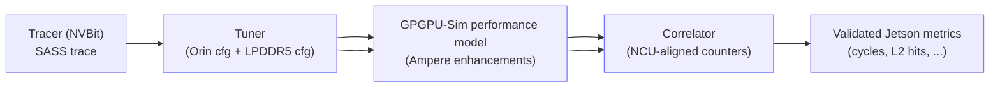
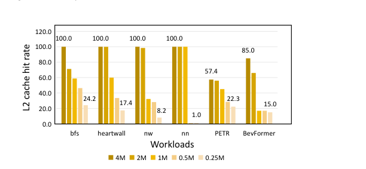

# Repurpose Accel-Sim for Next Generation NVIDIA Jetson GPU Architectural Design

## 0. Metadata
- **Full Title**: Repurpose Accel-Sim for Next Generation NVIDIA Jetson GPU Architectural Design
- **Authors**: Tianhao Huang; Lingyu Sun; Chao Li; Xiaofeng Hou; Yaqian Zhao; Jingwen Leng; Li Li; Minyi Guo
- **Venue / Year**: ISLPED 2025
- **Links**: PDF: `paper-source/repurpose-accel-sim-jetson-gpu/repurpose-accel-sim-jetson-gpu.pdf` | Paper (md): `paper-source/repurpose-accel-sim-jetson-gpu/repurpose-accel-sim-jetson-gpu.md` | Source PDF: https://www.cs.sjtu.edu.cn/~lichao/publications/Repurpose_Accel-Sim_ISLPED-2025-Huang.pdf | Code: https://github.com/sjtu-SAIL-lab/accel-sim-framework
- **Keywords**: integrated GPU simulation; NVIDIA Jetson; Accel-Sim; GPGPU-Sim; Ampere; Tensor Cores; LPDDR5; Nsight Compute; cache modeling; C2C ratio
- **Paper ID (short handle)**: accel-sim-j-jetson-islped25

## 1. TL;DR (3–5 bullets)
- **Problem**: Existing cycle-accurate GPU simulators target discrete GPUs and become inaccurate on Jetson integrated GPUs; Accel-Sim lacks Jetson support.
  > "Existing cycle-accurate GPU simulators primarily target traditional discrete GPUs and exhibit significant inaccuracies when applied to Jetson integrated GPUs." (Abstract; paper-source/repurpose-accel-sim-jetson-gpu/repurpose-accel-sim-jetson-gpu.pdf p.1)
- **Idea**: Repurpose Accel-Sim into **Accel-Sim-J** by refining tuner, performance model, and correlator for Jetson.
  > "We propose Accel-Sim-J, which bridges the gap by repurposing Accel-Sim simulation framework to NVIDIA Jetson GPUs." (Abstract; paper-source/repurpose-accel-sim-jetson-gpu/repurpose-accel-sim-jetson-gpu.pdf p.1)
- **System**: Add Jetson/LPDDR configs + LPDDR model, enhance Ampere Tensor-core instruction modeling (async copy + L2 prefetch), and align correlator with Jetson Nsight Compute behavior (L2 invalidation).
  > "We refine three major Accel-Sim framework components by applying tuner modifications, GPGPU-Sim performance model enhancements, and correlator adjustments." (Abstract; paper-source/repurpose-accel-sim-jetson-gpu/repurpose-accel-sim-jetson-gpu.pdf p.1)
- **Accuracy**: Reduce cycle error (Rodinia: 29.0%→22.7%; transformer block: 26.1%→16.1%) and fix L2 read-hit correlation (59.8%→3.3% NRMSE).
  > "reducing simulation cycle errors from 29.0% to 22.7% on the Rodinia benchmark and from 26.1% to 16.1% on a transformer block." (Abstract; paper-source/repurpose-accel-sim-jetson-gpu/repurpose-accel-sim-jetson-gpu.pdf p.1)
- **Architecture insight**: Jetson workloads show higher optimal **Compute-to-Cache (C2C) ratio** than discrete GPUs, suggesting less L2 area proportion in future Jetsons.
  > "We conclude that Jetson GPUs demonstrate a higher optimal C2C ratio than discrete GPUs for the same workloads." (Abstract; paper-source/repurpose-accel-sim-jetson-gpu/repurpose-accel-sim-jetson-gpu.pdf p.1)

## 2. Problem & Motivation

### 2.1 Why integrated-GPU simulation matters for edge AI
- **Edge constraints**: Edge-AI apps demand tight latency/energy; Jetson integrated GPUs are widely deployed.
  > "Edge-AI devices have gained widespread popularity... which demand stringent requirements on latency and energy efficiency" (Introduction; paper-source/repurpose-accel-sim-jetson-gpu/repurpose-accel-sim-jetson-gpu.pdf p.1)
- **Tooling gap**: Existing simulators do not explicitly target Jetson integrated GPUs or lose accuracy when ported.
  > "none of them explicitly target integrated GPUs on NVIDIA Jetson series. They either lack support entirely or fail to maintain simulation accuracy when ported to integrated GPUs." (Introduction; paper-source/repurpose-accel-sim-jetson-gpu/repurpose-accel-sim-jetson-gpu.pdf p.1)

### 2.2 Why Accel-Sim fails on Jetson (root causes)
- **Config + memory mismatch**: Missing correct Jetson configuration and shared LPDDR memory modeling.
  > "Firstly, it cannot provide the correct configuration for a Jetson device and its shared LPDDR memory." (Introduction; paper-source/repurpose-accel-sim-jetson-gpu/repurpose-accel-sim-jetson-gpu.pdf p.1)
- **Ampere modeling gaps**: Defective Ampere modeling for GEMM using 3rd-gen Tensor Cores (e.g., async copy, L2 prefetch).
  > "its modeling of the Ampere GPU architecture is defective, resulting in significant accuracy degradation for GEMM operations utilizing the 3rd generation Tensor cores" (Introduction; paper-source/repurpose-accel-sim-jetson-gpu/repurpose-accel-sim-jetson-gpu.pdf p.1)
- **Counter calibration mismatch**: Correlation tooling does not faithfully capture Jetson hardware counters (NCU behavior).
  > "Thirdly, its statistics correlation tool does not faithfully capture hardware counters on a Jetson device to calibrate the simulator." (Introduction; paper-source/repurpose-accel-sim-jetson-gpu/repurpose-accel-sim-jetson-gpu.pdf p.1)

### 2.3 How the paper addresses it (Accel-Sim-J)
- **Three-component fix**: Tuner + performance model + correlator modifications (tracer unchanged).
  > "Consequently, we make enhancements to the tuner, GPGPU-Sim performance model, and correlator" (Section III; paper-source/repurpose-accel-sim-jetson-gpu/repurpose-accel-sim-jetson-gpu.pdf p.3)
- **Compatibility goal**: Keep compatibility with Accel-Watch energy modeling.
  > "All our modifications maintain compatibility with Accel-Watch [10]" (Introduction; paper-source/repurpose-accel-sim-jetson-gpu/repurpose-accel-sim-jetson-gpu.pdf p.1)

## 3. Key Ideas & Contributions (Condensed)
- **First integrated Jetson accuracy study**: Positioning as first in-depth accuracy enhancement for Jetson integrated GPU simulation.
  > "we are the first to conduct an in-depth study and enhance the simulation accuracy on the integrated GPU of NVIDIA Jetson devices." (Contributions; paper-source/repurpose-accel-sim-jetson-gpu/repurpose-accel-sim-jetson-gpu.pdf p.2)
- **Accuracy gains**: Reduce average cycle error and cap worst-case transformer-block kernel error.
  > "decreasing the average cycle error from 26.1% to 16.1% and the max cycle error from 140.1% to 50.2%." (Contributions; paper-source/repurpose-accel-sim-jetson-gpu/repurpose-accel-sim-jetson-gpu.pdf p.2)
- **Jetson vs discrete cache provisioning insight**: Use C2C ratio to compare optimal SM/L2 trade-offs on Orin vs RTX 3090.
  > "we introduce the workload-specific Compute-to-Cache Ratio (C2C ratio)." (Introduction; paper-source/repurpose-accel-sim-jetson-gpu/repurpose-accel-sim-jetson-gpu.pdf p.2)

## 4. Method Overview

Accel-Sim-J preserves Accel-Sim’s 4-stage workflow (trace → tune → simulate → correlate) but repurposes the middle/validation stages for Jetson’s integrated-memory system and Ampere behaviors. The main changes are: (1) Jetson-specific config + LPDDR5 model in the tuner, (2) Ampere Tensor-core instruction and memory-system enhancements in GPGPU-Sim, and (3) correlator alignment with Nsight Compute’s Jetson cache invalidation behavior.




> "Fig. 2: Accel-Sim-J framework." (Section III; paper-source/repurpose-accel-sim-jetson-gpu/repurpose-accel-sim-jetson-gpu.pdf p.3)

### 4.1 Jetson integrated-GPU architecture differences that matter for simulation
- **Integrated LPDDR and shared memory**: Jetson Orin uses integrated LPDDR5 shared with CPU/accelerators.
  > "On the Jetson Orin platform, these on-chip components are interfaced with the integrated LPDDR5 memory, which is shared with the CPU and other accelerators." (Section II-A; paper-source/repurpose-accel-sim-jetson-gpu/repurpose-accel-sim-jetson-gpu.pdf p.2)
- **L2 cache as LLC + banking/sectoring + hashing**: L2 is partitioned/banked/sectored and uses IPOLY hashing to spread traffic.
  > "The GPU’s L2 cache is the Last Level Cache (LLC). It adopts a partitioned, banked, and sectored design..." (Section II-A; paper-source/repurpose-accel-sim-jetson-gpu/repurpose-accel-sim-jetson-gpu.pdf p.2)


> "Fig. 1: Jetson AGX Orin architecture." (Section II-A; paper-source/repurpose-accel-sim-jetson-gpu/repurpose-accel-sim-jetson-gpu.pdf p.2)

### 4.2 Accel-Sim components (baseline)
- **4-part framework**: Tracer, Tuner, GPGPU-Sim performance model, Correlator.
  > "The Accel-Sim simulation framework comprises four main components: 1) Tracer... 2) Tuner... 3) GPGPU-Sim performance model... and 4) Correlator" (Section II-B; paper-source/repurpose-accel-sim-jetson-gpu/repurpose-accel-sim-jetson-gpu.pdf p.2)
- **Jetson limitations**: Lack of correct hardware config, insufficient modeling, erroneous correlator.
  > "Its limitation for Jetson GPU arises from the lack of correct hardware configuration, insufficiently refined performance modeling, and an erroneous correlator." (Section II-B; paper-source/repurpose-accel-sim-jetson-gpu/repurpose-accel-sim-jetson-gpu.pdf p.2)

## 5. Interface / Contract (Inputs & Outputs)
- **Inputs**: Jetson hardware definitions + configs (including LPDDR), SASS traces, and profiler counters for calibration.
  > "We provide LPDDR memory configurations and relevant hardware details of the Jetson GPUs" (Section III; paper-source/repurpose-accel-sim-jetson-gpu/repurpose-accel-sim-jetson-gpu.pdf p.3)
- **Outputs**: Cycle-level simulation metrics and cache statistics correlated against Nsight Compute counters.
  > "quantifying the correlation and error between the simulated values and the NCU measured ground truth of each GPU kernel" (Section IV; paper-source/repurpose-accel-sim-jetson-gpu/repurpose-accel-sim-jetson-gpu.pdf p.5)
- **Correctness expectation**: Improved accuracy on Jetson integrated GPUs while retaining Accel-Sim-style validation workflow.
  > "our repurposed simulator achieves a simulation accuracy comparable to that of the original Accel-Sim" (Introduction; paper-source/repurpose-accel-sim-jetson-gpu/repurpose-accel-sim-jetson-gpu.pdf p.2)

## 6. Architecture / Components

### 6.1 Tuner modification (Jetson configs + LPDDR5 model)
- **Goal**: Enable realistic Jetson Orin config generation and LPDDR5 memory modeling.
  > "We provide LPDDR memory configurations and relevant hardware details of the Jetson GPUs" (Section III; paper-source/repurpose-accel-sim-jetson-gpu/repurpose-accel-sim-jetson-gpu.pdf p.3)

#### 6.1.1 LPDDR5 memory model integration
- **Missing in baseline**: Accel-Sim tuner lacks LPDDR modeling support.
  > "The tuner integrated within the Accel-Sim framework lacks support for LPDDR memory modeling." (Section III-A; paper-source/repurpose-accel-sim-jetson-gpu/repurpose-accel-sim-jetson-gpu.pdf p.3)
- **Concrete Orin LPDDR5 parameters**: 16 channels, 1 chip/channel, 16-bit chip width, 256-bit total, 6400 Mbps, 204.8 GB/s.
  > "we set the memory channel number to 16... Each memory chip has a 16-bit data width... total bandwidth of 204.8 GB/s." (Section III-A; paper-source/repurpose-accel-sim-jetson-gpu/repurpose-accel-sim-jetson-gpu.pdf p.3)

```python
# Conceptual: provide LPDDR5 parameters + hook into Accel-Sim tuner output
lpddr = {
    "channels": 16,
    "chips_per_channel": 1,
    "chip_data_width_bits": 16,
    "total_bus_width_bits": 256,
    "data_rate_mbps": 6400,
    "bandwidth_gbps": 204.8,
}
write_cfg("LPDDR.cfg", lpddr)
```

#### 6.1.2 Fix “misc” Jetson parameters the microbenchmarks misreport
- **Issue**: Automated microbenchmarks can misreport parameters on Jetson; configs are supplemented via docs/tools.
  > "we find that the automated microbenchmarks provided by original Accel-Sim fail to report correct information on certain hardware parameters." (Section III-A; paper-source/repurpose-accel-sim-jetson-gpu/repurpose-accel-sim-jetson-gpu.pdf p.3)
- **Examples fixed**: GPU/memory frequency, shared-mem partitioning options, L2 slice count, L2 MSHR sizing.
  > "we also rectify the memory frequency, the partitioning options for shared memory, the L2 slice number and the L2 MSHR size." (Section III-A; paper-source/repurpose-accel-sim-jetson-gpu/repurpose-accel-sim-jetson-gpu.pdf p.3)

### 6.2 GPGPU-Sim performance model enhancement (Ampere correctness)
- **Motivation**: Ampere introduces behaviors (3rd-gen Tensor cores) that Accel-Sim models inaccurately.
  > "It lacks accurate support for certain behaviors associated with the newly introduced 3rd generation Tensor cores in the Ampere architecture, including asynchronous copy, L2 prefetch, etc" (Section II-B; paper-source/repurpose-accel-sim-jetson-gpu/repurpose-accel-sim-jetson-gpu.pdf p.3)

#### 6.2.1 Tensor core instruction modeling: LDGSTS, LDSM, HMMA
- **Modeling target**: Correct the simplified/inaccurate modeling of Ampere Tensor-core-related SASS instructions.
  > "the instructions LDGSTS... LDSM... and HMMA... are inaccurately modeled." (Section III-B; paper-source/repurpose-accel-sim-jetson-gpu/repurpose-accel-sim-jetson-gpu.pdf p.4)

- **LDGSTS (async copy) + DEPBAR**: LDGSTS enables non-blocking global→shared movement; implement correct DEPBAR handling and L2 prefetch variants.
  > "The Ampere architecture introduces LDGSTS instruction to support asynchronous copy." (Section III-B; paper-source/repurpose-accel-sim-jetson-gpu/repurpose-accel-sim-jetson-gpu.pdf p.4)
  > "We fix the problem... that the DEPBAR is handled incorrectly when there are no LDGSTS instructions." (Section III-B; paper-source/repurpose-accel-sim-jetson-gpu/repurpose-accel-sim-jetson-gpu.pdf p.4)
  > "Ampere supports L2 cache-level prefetching in LDGSTS and LDG if used with indicator LTC64B or LTC128B." (Section III-B; paper-source/repurpose-accel-sim-jetson-gpu/repurpose-accel-sim-jetson-gpu.pdf p.4)
- **LDSM (matrix-format shared→reg load)**: Model 16B units + extended shared-memory access pattern.
  > "the Ampere architecture also adds another instruction LDSM to support loading data from shared memory to registers in specialized matrix format" (Section III-B; paper-source/repurpose-accel-sim-jetson-gpu/repurpose-accel-sim-jetson-gpu.pdf p.4)
- **HMMA (tensor MMA) variants**: Assign different execution cycles to different HMMA shapes/types for Ampere.
  > "in Ampere architecture, HMMA instruction is much extended... Correspondingly, we extend Accel-Sim to assign different execution cycles to different HMMA instructions." (Section III-B; paper-source/repurpose-accel-sim-jetson-gpu/repurpose-accel-sim-jetson-gpu.pdf p.4)

```mermaid
flowchart LR
  subgraph AmpereTC["Ampere Tensor-Core data path (modeled)"]
    direction LR
    GMEM["Global memory"] -->|LDGSTS (+L2 prefetch)| SMEM["Shared memory"]
    SMEM -->|LDSM (matrix format)| REG["Registers"]
    REG -->|HMMA variants\n(shape/type dependent cycles)| TC["Tensor Cores"]
  end
```

#### 6.2.2 Memory-system modeling: IPOLY hash coverage
- **Broader channel support**: Extend IPOLY hash implementation for more channel configurations.
  > "we extend the Ipoly hash implementation to incorporate memory channel configurations of 4, 8, 128, and 256" (Section III-B; paper-source/repurpose-accel-sim-jetson-gpu/repurpose-accel-sim-jetson-gpu.pdf p.4)

### 6.3 Correlator adjustment (align to Nsight Compute on Jetson)

#### 6.3.1 L2 cache invalidation to match NCU behavior
- **Observed mismatch**: Large L2 hit-metric discrepancy during correlation vs NCU.
  > "we identify significant discrepancies in L2 cache hit metrics (average error of 59.8% on the Rodinia 2.0 benchmark)." (Section III-C; paper-source/repurpose-accel-sim-jetson-gpu/repurpose-accel-sim-jetson-gpu.pdf p.4)
- **Root cause (NCU Jetson)**: The NCU flag to control post-kernel L2 invalidation is non-functional and defaults to always invalidating.
  > "an important flag indicating whether the L2 cache is invalidated after each kernel during NCU profiling is non-functional, defaulting to always invalidating." (Section III-C; paper-source/repurpose-accel-sim-jetson-gpu/repurpose-accel-sim-jetson-gpu.pdf p.4)
- **Fix**: Invalidate L2 after each kernel and adjust memcpy behavior to match Jetson profiling reality.
  > "we implement a new cache invalidate mechanism triggered after each kernel execution and set the gpgpu perf sim memcpy flag... to 0." (Section III-C; paper-source/repurpose-accel-sim-jetson-gpu/repurpose-accel-sim-jetson-gpu.pdf p.4)

```python
def after_kernel():
    # NCU-aligned behavior on Jetson (conceptual)
    l2.invalidate_all_lines()
```

## 7. Algorithm / Pseudocode (Optional)

### 7.1 C2C ratio definition and search (Algorithm 1)
- **Definition**: Optimal C2C ratio is `SM_count / min_L2_size` that achieves ≤110% of the minimal cycle count.
  > "we define the optimal C2C ratio as the ratio of SM count to minimum L2 cache size, where the cycle count achieved is less than 110% of the minimal cycle count." (Section V-B; paper-source/repurpose-accel-sim-jetson-gpu/repurpose-accel-sim-jetson-gpu.pdf p.6)

```python
# Inputs:
#   n_sm: int
#   l2_existing_mb: float
#   cycle_min: float  # minimal cycle count observed across L2 sizes
# Output:
#   c2c_opt: float  # SM / L2_MB

for scale in [0.125, 0.25, 0.5, 1, 2, 4, 8]:
    l2_mb = scale * l2_existing_mb
    if cycles(n_sm=n_sm, l2_mb=l2_mb) <= 1.1 * cycle_min:
        c2c_opt = n_sm / l2_mb
        break
```

## 8. Training Setup
- **Not ML training**: This work is a simulator repurposing + calibration effort (no learned parameters).
  > "We propose Accel-Sim-J" (Abstract; paper-source/repurpose-accel-sim-jetson-gpu/repurpose-accel-sim-jetson-gpu.pdf p.1)

## 9. Inference / Runtime Behavior
- **Execution mode used**: Compare original Accel-Sim vs Accel-Sim-J in SASS mode on Orin.
  > "We compare Accel-Sim-J against the original version both in SASS mode." (Section IV; paper-source/repurpose-accel-sim-jetson-gpu/repurpose-accel-sim-jetson-gpu.pdf p.5)
- **Metrics**: Use MAPE for cycles (non-zero), NRMSE for L2 hits (can be zero), plus Pearson correlation.
  > "we focus on two critical metrics: GPU cycle count and L2 cache hit count... mean absolute percentage error (MAPE)... normalized root mean square error (NRMSE)... Pearson’s correlation coefficient" (Section IV-B; paper-source/repurpose-accel-sim-jetson-gpu/repurpose-accel-sim-jetson-gpu.pdf p.5)

## 10. Experiments & Results

### 10.1 Experimental setup (device + workloads)
- **Target platform**: Jetson AGX Orin (Ampere, 16 SMs, 4MB L2, 32GB LPDDR5, 204.8GB/s).
  > "Our experimental platform is a Jetson AGX Orin... an NVIDIA Ampere GPU with 4M L2 cache, and a 32 GB LPDDR5 shared memory." (Section IV-A; paper-source/repurpose-accel-sim-jetson-gpu/repurpose-accel-sim-jetson-gpu.pdf p.4)
- **Benchmarks**: Rodinia 2.0 + a transformer block from PETR.
  > "We employ the Rodinia 2.0 benchmark suite... Furthermore, we extract a transformer block from... PETR" (Section IV-A; paper-source/repurpose-accel-sim-jetson-gpu/repurpose-accel-sim-jetson-gpu.pdf p.4)

**Table I (from paper): Jetson AGX Orin GPU configuration**

| Parameter | Config |
|---|---|
| GPU architecture | Ampere |
| CUDA cores | 2048 |
| SMs | 16 |
| Warp schedulers per SM | 4 |
| Tensor cores | 64 |
| L1/SMEM per SM | 128 KB |
| L2 cache | 4 MB |
| GPU frequency | 1.3 GHz |
| LPDDR5 size | 32 GB |
| Memory bandwidth | 204.8 GB/s |

> "TABLE I: NVIDIA Jetson AGX Orin GPU configuration." (Section IV; paper-source/repurpose-accel-sim-jetson-gpu/repurpose-accel-sim-jetson-gpu.pdf p.5)

### 10.2 Accuracy results (Figure 3)
- **Rodinia cycles + L2 hits**: Cycles MAPE 29.0%→22.7%; L2 read hits NRMSE 59.8%→3.3%.
  > "the GPU cycle simulation error decreases from 29.0% to 22.7% on the Rodinia benchmark, while the L2 read hit error reduces from 59.8% to 3.3%." (Section IV-B; paper-source/repurpose-accel-sim-jetson-gpu/repurpose-accel-sim-jetson-gpu.pdf p.5)
- **Transformer block + CUTLASS GEMM kernel**: Cycles error 26.1%→16.1% overall; GEMM kernel 140.1%→50.2% (and 92.4%→22.0%).
  > "This optimization reduces GPU cycle errors from 26.1% to 16.1%" (Section IV-B; paper-source/repurpose-accel-sim-jetson-gpu/repurpose-accel-sim-jetson-gpu.pdf p.5)
  > "CUTLASS-optimized GEMM kernel shows substantial improvement, with cycle errors decreasing from 140.1% to 50.2% and 92.4% to 22.0%" (Section IV-B; paper-source/repurpose-accel-sim-jetson-gpu/repurpose-accel-sim-jetson-gpu.pdf p.5)


> "Fig. 3: We use MAPE for correlation of GPU cycles and NPMSE for L2 read hits from original Accel-Sim versus ours." (Section IV; paper-source/repurpose-accel-sim-jetson-gpu/repurpose-accel-sim-jetson-gpu.pdf p.4)

## 11. Ablations & Analysis

### 11.1 L2 cache resizing on Orin (Figures 4–5)
- **Workloads used**: 6 cache-intensive workloads (Rodinia bfs/heartwall/nw/nn + PETR transformer block + BevFormer deformable attention).
  > "We select six cache-intensive workloads, including bfs, heartwall, nw, and nn from the Rodinia benchmark, a transformer block from PETR and the deformable attention from BevFormer" (Section V-A; paper-source/repurpose-accel-sim-jetson-gpu/repurpose-accel-sim-jetson-gpu.pdf p.5)
- **Key observation**: Halving L2 shows no measurable impact for some; others <15% cycle increase; attention workloads largely insensitive.
  > "For heartwell, nn and PETR, halving the L2 cache capacity demonstrates no measurable performance impact... and for the rest... marginal performance degradation (< 15% cycle increase)." (Section V-A; paper-source/repurpose-accel-sim-jetson-gpu/repurpose-accel-sim-jetson-gpu.pdf p.5)
- **Design implication**: Orin’s L2 may be redundant; comparable performance with 50–75% less L2 for many edge-AI apps.
  > "This phenomenon implies that the current L2 cache on Orin might be redundant... we can achieve comparable performance on Jetson AGX Orin with 50-75% less L2 resources" (Section V-A; paper-source/repurpose-accel-sim-jetson-gpu/repurpose-accel-sim-jetson-gpu.pdf p.5)


> "Fig. 4: GPU cycles increase ratio with different L2 cache size." (Section V-A; paper-source/repurpose-accel-sim-jetson-gpu/repurpose-accel-sim-jetson-gpu.pdf p.5)


> "Fig. 5: L2 cache hit rate with different L2 cache size." (Section V-A; paper-source/repurpose-accel-sim-jetson-gpu/repurpose-accel-sim-jetson-gpu.pdf p.5)

### 11.2 C2C ratio comparison: Orin vs RTX 3090 (Figure 6)
- **Existing ratios**: Orin C2C = 4 (16 SM / 4MB); RTX 3090 C2C = 14.3 (86 SM / 6MB).
  > "The original C2C ratio of the existing Orin and RTX 3090 is 4 (16:4) and 14.3 (86:6), respectively." (Section V-B; paper-source/repurpose-accel-sim-jetson-gpu/repurpose-accel-sim-jetson-gpu.pdf p.6)
- **Optimal ratios found**: RTX 3090 optimal ≈3.5 (86:24) for most; Orin optimal higher ≈8 (16:2) or 16 (16:1).
  > "we determine that the optimal ratio for the 3090 is approximately 3.5 (86:24) for most workloads. For the Jetson AGX Orin, the optimal ratio is consistently higher... about 8 (16:2) or 16 (16:1)." (Section V-B; paper-source/repurpose-accel-sim-jetson-gpu/repurpose-accel-sim-jetson-gpu.pdf p.6)


> "Fig. 6: Optimal C2C ratio between Orin and RTX 3090." (Section V-B; paper-source/repurpose-accel-sim-jetson-gpu/repurpose-accel-sim-jetson-gpu.pdf p.6)

## 12. Limitations, Risks, Ethics
- **Workload coverage risk**: Evaluation focuses on Rodinia 2.0 and selected transformer/attention blocks; broader workloads may expose other modeling gaps.
  > "We employ the Rodinia 2.0 benchmark suite... Furthermore, we extract a transformer block... PETR" (Section IV-A; paper-source/repurpose-accel-sim-jetson-gpu/repurpose-accel-sim-jetson-gpu.pdf p.4)
- **Profiler/tool dependence risk**: Correlator alignment depends on observed Nsight Compute behavior on Jetson (always invalidating L2 post-kernel in their setup).
  > "an important flag... is non-functional, defaulting to always invalidating." (Section III-C; paper-source/repurpose-accel-sim-jetson-gpu/repurpose-accel-sim-jetson-gpu.pdf p.4)
- **Ethics**: Standard computer architecture tooling research; no human-subject data or model bias considerations are discussed.

## 13. Applicability & Integration Notes (Project-Focused)
- **Porting a simulator to a new platform**: Use the paper’s “3-layer” checklist—(1) config + memory model, (2) new ISA/microarch behaviors, (3) calibration tooling parity.
  > "we make enhancements to the tuner, GPGPU-Sim performance model, and correlator" (Section III; paper-source/repurpose-accel-sim-jetson-gpu/repurpose-accel-sim-jetson-gpu.pdf p.3)
- **Design-space exploration metric**: C2C ratio operationalizes SM-vs-cache provisioning; similar ratios could guide NPU PE-array vs SRAM sizing trade-offs (workload-specific).
  > "we introduce the workload-specific Compute-to-Cache Ratio (C2C ratio)." (Introduction; paper-source/repurpose-accel-sim-jetson-gpu/repurpose-accel-sim-jetson-gpu.pdf p.2)

## 14. Reproducibility Plan
- **Get code**: Use the authors’ open-source repo.
  > "Software availability: The implementation of this work is available as open-source software at [GitHub repository: https://github.com/sjtu-SAIL-lab/accel-sim-framework]." (Conclusion; paper-source/repurpose-accel-sim-jetson-gpu/repurpose-accel-sim-jetson-gpu.pdf p.6)
- **Collect counters**: Profile Jetson Orin kernels with Nsight Compute to obtain ground-truth counters.
  > "hardware counters obtained through the Nsight Compute profiler" (Section III; paper-source/repurpose-accel-sim-jetson-gpu/repurpose-accel-sim-jetson-gpu.pdf p.3)
- **Run simulation**: Run in SASS mode and compare against NCU at kernel granularity; compute Corr/MAPE/NRMSE.
  > "quantifying the correlation and error between the simulated values and the NCU measured ground truth of each GPU kernel" (Section IV; paper-source/repurpose-accel-sim-jetson-gpu/repurpose-accel-sim-jetson-gpu.pdf p.5)

## 15. Related Work
- **Cycle-accurate vs approximate**: Approximate simulators trade accuracy for speed; Accel-Sim is widely adopted for NVIDIA accuracy.
  > "Cycle-approximate simulators often trade off simulation accuracy for speed... Accel-Sim [7] is the most widely adopted for its superior simulation accuracy on NVIDIA GPUs." (Section II-B; paper-source/repurpose-accel-sim-jetson-gpu/repurpose-accel-sim-jetson-gpu.pdf p.2)
- **Cache capacity exploration**: Morpheus shows performance gains from enlarged L2 on discrete GPUs; paper contrasts Jetson behavior.
  > "a recent architectural investigation... has identified significant performance gains when enlarging the L2 cache" (Section II-C; paper-source/repurpose-accel-sim-jetson-gpu/repurpose-accel-sim-jetson-gpu.pdf p.3)

## 16. Open Questions & Follow-Ups
- **Generality across Jetson SKUs**: Do the same correlator issues and optimal C2C ratios hold for Xavier / Nano / future architectures?
- **More metrics**: Extend validation beyond cycles and L2 hits (e.g., DRAM queueing, interconnect contention, power via Accel-Watch).
  > "can be further used in energy efficiency analysis for edge AI applications." (Introduction; paper-source/repurpose-accel-sim-jetson-gpu/repurpose-accel-sim-jetson-gpu.pdf p.1)
- **NCU behavior evolution**: If Nsight Compute fixes the L2 invalidation flag, what should the correlator do to remain portable?

## 17. Glossary / Notation
- **Accel-Sim / Accel-Sim-J**: Accel-Sim is an academic NVIDIA GPU simulation framework; Accel-Sim-J is the Jetson-targeted repurposing.
  > "We propose Accel-Sim-J" (Abstract; paper-source/repurpose-accel-sim-jetson-gpu/repurpose-accel-sim-jetson-gpu.pdf p.1)
- **NCU (Nsight Compute)**: NVIDIA profiling tool used for hardware performance counters.
  > "hardware counters obtained from the Nsight Compute (NCU) tool" (Introduction; paper-source/repurpose-accel-sim-jetson-gpu/repurpose-accel-sim-jetson-gpu.pdf p.1)
- **LPDDR5**: Low-power DRAM used as integrated shared memory in Jetson Orin.
  > "integrated LPDDR5 memory, which is shared with the CPU and other accelerators." (Section II-A; paper-source/repurpose-accel-sim-jetson-gpu/repurpose-accel-sim-jetson-gpu.pdf p.2)
- **C2C ratio**: Compute-to-Cache ratio, defined via SM count divided by minimum L2 size meeting a cycle threshold.
  > "we define the optimal C2C ratio as the ratio of SM count to minimum L2 cache size" (Section V-B; paper-source/repurpose-accel-sim-jetson-gpu/repurpose-accel-sim-jetson-gpu.pdf p.6)

## 18. Figures & Diagrams (Optional)
- **Jetson architecture**: `notes/repurpose-accel-sim-jetson-gpu/figures/figure-1.png`
- **Framework overview**: `notes/repurpose-accel-sim-jetson-gpu/figures/figure-2.png`
- **Accuracy correlation**: `notes/repurpose-accel-sim-jetson-gpu/figures/figure-3.png`
- **Cache resizing**: `notes/repurpose-accel-sim-jetson-gpu/figures/figure-4.png`, `notes/repurpose-accel-sim-jetson-gpu/figures/figure-5.png`
- **C2C ratio**: `notes/repurpose-accel-sim-jetson-gpu/figures/figure-6.png`

## 19. BibTeX / Citation
```bibtex
@inproceedings{huang2025accelsimj,
  title     = {Repurpose Accel-Sim for Next Generation NVIDIA Jetson GPU Architectural Design},
  author    = {Huang, Tianhao and Sun, Lingyu and Li, Chao and Hou, Xiaofeng and Zhao, Yaqian and Leng, Jingwen and Li, Li and Guo, Minyi},
  booktitle = {International Symposium on Low Power Electronics and Design (ISLPED)},
  year      = {2025},
  url       = {https://www.cs.sjtu.edu.cn/~lichao/publications/Repurpose_Accel-Sim_ISLPED-2025-Huang.pdf}
}
```

