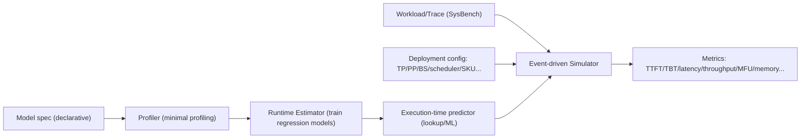

# Vidur: A Large-Scale Simulation Framework for LLM Inference

## 0. Metadata
- **Full Title**: Vidur: A Large-Scale Simulation Framework for LLM Inference
- **Authors**: Amey Agrawal; Nitin Kedia; Jayashree Mohan; Ashish Panwar; Nipun Kwatra; Bhargav S. Gulavani; Ramachandran Ramjee; Alexey Tumanov
- **Venue / Year**: MLSys 2024 (arXiv 2024)
- **Links**: PDF/ArXiv: https://arxiv.org/abs/2405.05465 | Code: https://github.com/microsoft/vidur | Talk: https://mlsys.org/virtual/2024/poster/2667
- **Keywords**: LLM inference; performance simulation; profiling; scheduling/batching; parallelism (TP/PP); configuration search; cost optimization
- **Paper ID (short handle)**: vidur-mlsys24

## 1. TL;DR (3–5 bullets)
- **Problem**: Optimizing LLM inference deployments requires running real workloads over a huge configuration space, which is expensive and hard to scale; the best config depends on the workload trace.
  > "Optimizing the deployment of Large language models (LLMs) is expensive today..." (Abstract; paper-source/vidur/tex/0-abstract.tex)
- **Idea**: Decompose inference into a small set of shared operators and predict per-iteration runtimes using minimal profiling plus learned regression models for unprofiled input sizes.
  > "\sysname models the performance of LLM operators using a combination of experimental profiling and predictive modeling..." (Abstract; paper-source/vidur/tex/0-abstract.tex)
- **System**: Vidur is an event-driven, extensible simulator that emulates both model execution and a multi-tier scheduling stack (replica + cluster).
  > "\sysname leverages domain knowledge... emulates the behavior of all layers of the inference stack..." (Section \sysname; paper-source/vidur/tex/3-design.tex)
- **Fidelity**: It estimates inference latency with < 9% error across models/workloads; for dynamic workloads near capacity it still achieves high accuracy.
  > "we validate the fidelity of \sysname... estimates inference latency with less than 9\% error..." (Abstract; paper-source/vidur/tex/0-abstract.tex)
- **Outcome**: SysSearch uses the simulator to find cost-effective configurations under SLOs, replacing tens of thousands of GPU-hours with CPU-hours.
  > "\syssearch finds the best deployment configuration for \llamaL in one hour on a CPU machine... would require 42K GPU hours..." (Abstract; paper-source/vidur/tex/0-abstract.tex)

## 2. Problem & Motivation

### 2.1 Why systematic LLM deployment optimization is hard
- **Large knob space**: Providers must choose parallelism (TP/PP/replicas), scheduling algorithms (Orca/vLLM/Sarathi-Serve/etc.), batching parameters (batch size, wait times, chunk sizes, watermarks), and hardware SKU.
  > "the provider has to choose... parallelization strategy... scheduling algorithms... configuration parameters..." (Introduction; paper-source/vidur/tex/1-intro.tex)
- **Cost of experimentation**: Combining “many models × many configs × many traces” makes hardware-based exploration impractical.
  > "{\it Systematically optimizing deployment of tens of models with hundreds of configuration options is expensive and impractical.}" (Introduction; paper-source/vidur/tex/1-intro.tex)
- **Workload-aware optimum**: The optimal config is a function of (model, trace); using the best config from one trace on another can be ~2× worse.
  > "optimal configuration is a function of a model-trace pair..." (Introduction; paper-source/vidur/tex/1-intro.tex)
  > "the optimal config on one trace used for another results in up to 2\myx cost difference" (Figure caption; paper-source/vidur/tex/figures-tex/fig-best-configs.tex)

### 2.2 How the paper addresses it
- **Simulation-first optimization**: Combine (i) Vidur (simulator), (ii) Vidur-Bench (workload suite), and (iii) Vidur-Search (configuration search) to explore cheaply.
  > "we present \sysname{}... and \syssearch{}... Together, they enable \textit{fast} and \textit{inexpensive} exploration..." (Introduction; paper-source/vidur/tex/1-intro.tex)
  > "\sysbench is a benchmark suite..." (Section \sysbench; paper-source/vidur/tex/4-benchmark.tex)

## 3. Key Ideas & Contributions (Condensed)
- **Architectural reuse**: Most LLMs share common transformer structure; a declarative model spec is enough to generate operators and sharding choices.
  > "The large majority of LLMs share fundamentally similar architectures..." (Key Insights; paper-source/vidur/tex/3-design.tex)
- **Operator triaging**: Classify operators into token-level, sequence-level, and communication operators; each bucket gets a tailored prediction strategy.
  > "all the operators can be placed on one of the three buckets: Token-level... Sequence-level... Communication Operators" (Profiler; paper-source/vidur/tex/3-design.tex)
- **Attention-specific approximations**: Prefill attention uses an “equivalent batch” approximation based on \(\sqrt{\sum p_i^2}\); decode attention is treated as memory-bound and modeled via KV-cache reads.
  > "equivalent batch... \(\sqrt{\Sigma_{i=1}^P p_i^2}\)" (Profiler; paper-source/vidur/tex/3-design.tex)
  > "attention decode operation is largely memory-bound..." (Profiler; paper-source/vidur/tex/3-design.tex)
- **Data-frugal regression**: Use random forest regression to interpolate/approximate runtimes over a wide input space from limited profiling points.
  > "we find that random forest (RF) regression models achieve the right balance..." (Runtime Estimator; paper-source/vidur/tex/3-design.tex)
- **Three-tier scheduling + event-driven simulation**: A hierarchical scheduler (global/replica/stage) inside an event-driven simulator yields both request-level and cluster-level metrics.
  > "we adopt a three-tier hierarchical scheduler architecture" (Scheduler; paper-source/vidur/tex/3-design.tex)

## 4. Method Overview
- **Summary**: Vidur profiles a minimal set of operator runtimes for a model/hardware setting, trains a runtime estimator to predict unprofiled inputs, then simulates end-to-end inference for different workloads/configurations using an event-driven core and pluggable schedulers to output latency/throughput/utilization metrics.
  > "\sysname primarily has two phases of processing... model onboarding... Once the model is onboarded, the user can perform simulations..." (System Overview; paper-source/vidur/tex/3-design.tex)



## 5. Interface / Contract (Inputs & Outputs)
- **Inputs**: Model spec, device SKU/network topology, parallelism (TP/PP/replicas), scheduler/batching policy and parameters, workload/trace (arrival process + token length distributions).
  > "The input to the search tool consists of the LLM model, the workload... available GPU SKUs..." (Syssearch; paper-source/vidur/tex/4-benchmark.tex)
- **Outputs**: Request-level metrics (e.g., scheduling delay, TTFT, per-token timing), replica/cluster metrics (e.g., MFU, memory/\kvcache utilization).
  > "predicts... TTFT, TBT... as well as cluster-level metrics such as Model Flops Utilization (MFU) and memory utilization." (Introduction; paper-source/vidur/tex/1-intro.tex)

## 6. Architecture / Components
- **Declarative model spec**: Model parameters are represented in code (and can be extended); these drive operator shapes and constraints.
  > "use a common declarative model specification format..." (Key Insights; paper-source/vidur/tex/3-design.tex)
  > `class BaseModelConfig(...): num_layers, num_q_heads, embedding_dim, ...` (extern/vidur/vidur/config/model_config.py:11)
- **Profiler**: Collects runtime characteristics for selected operators and parallelism configurations; handles attention separately for prefill vs decode.
  > "we separately profile the attention kernels for prefill and decode phases..." (Profiler; paper-source/vidur/tex/3-design.tex)
- **Runtime estimator / execution-time predictor**: Trains regression models (RF) and produces predictions/lookup tables used during simulation.
  > "rely on small machine-learning models to interpolate the runtimes" (Runtime Estimator; paper-source/vidur/tex/3-design.tex)
  > `return RandomForestRegressor()` (extern/vidur/vidur/execution_time_predictor/random_forrest_execution_time_predictor.py:37)
- **Event-driven simulator core**: Uses a priority queue of events, advancing simulation time and generating new events (arrival → scheduling → stage execution → completion).
  > "At the core of our event-driven simulator..." (System Overview; paper-source/vidur/tex/3-design.tex)
  > `while self._event_queue and not self._terminate: ... event.handle_event(...)` (extern/vidur/vidur/simulator.py:64)
- **Three-tier scheduling stack**: Global routing, replica-level batching/memory management, and stage-level pipeline scheduling.
  - **Global scheduler (routing)**: Maps arriving requests to replicas (supports round-robin, least-outstanding-requests, and stateful policies).
    > "First is the global scheduler, that is responsible for request routing..." (Scheduler; paper-source/vidur/tex/3-design.tex)
    > `execution_time_predictor = ExecutionTimePredictorRegistry.get(...)` (extern/vidur/vidur/scheduler/global_scheduler/base_global_scheduler.py:19)
  - **Replica scheduler (batching + memory mgmt)**: Maintains the request queue, KV-cache memory planner/manager, and implements batching policies (vLLM/Orca/Sarathi/FT/LightLLM).
    > "Second is the replica scheduler that encapsulates two key responsibilities; batching and memory management." (Scheduler; paper-source/vidur/tex/3-design.tex)
    > "all the aforementioned policies have been implemented each in less than 150 lines of Python code..." (Scheduler; paper-source/vidur/tex/3-design.tex)
  - **Replica stage scheduler (pipeline stage)**: Schedules microbatches within a pipeline stage; currently synchronous pipeline parallelism.
    > "The final component... replica stage scheduler... only support synchronous pipeline parallel scheduling policy" (Scheduler; paper-source/vidur/tex/3-design.tex)
- **Memory planner + MFU**: Estimates maximum batch size/slots from parameter + KV-cache memory; computes MFU from FLOPs estimates.
  > `number_of_requests = memory_for_kv_cache // kv_cache_memory_per_device_per_request` (extern/vidur/vidur/scheduler/utils/memory_planner.py:40)
  > `return total_flops_per_second * 100 / self._device_flops` (extern/vidur/vidur/utils/mfu_calculator.py:41)
- **SysBench (workloads + metrics)**: Provides traces from public datasets and a comprehensive set of operator/request/replica/hardware metrics.
  > "\sysbench provides a set of workloads curated from publicly available datasets" (Sysbench; paper-source/vidur/tex/4-benchmark.tex)
  > "Details of the workloads curated from open-source datasets." (Table caption; paper-source/vidur/tex/tables/bench_workloads.tex)
- **SysSearch (config search)**: Enumerates configurations and finds the maximum sustainable QPS per config via binary search under scheduling-delay constraints; then optimizes QPS per dollar under SLOs.
  > "a simple binary search which searches for the maximum QPS..." (Syssearch; paper-source/vidur/tex/4-benchmark.tex)
  > `Perform binary search to find the maximum QPS under the SLO` (extern/vidur/vidur/config_optimizer/config_explorer/capacity_search.py:125)

## 7. Algorithm / Pseudocode (Optional)

### 7.1 Attention runtime modeling: “equivalent batch” (prefill) + “memory-bound” (decode)
- **Prefill equivalent batch**: Collapse a batch of prefills with quadratic cost into a single equivalent length \(\sqrt{\sum p_i^2}\).
  > "The cost of prefill attention... proportional to \(\Sigma_{i=1}^P p_i^2\)... equivalent batch... \(\sqrt{\Sigma_{i=1}^P p_i^2}\)" (Profiler; paper-source/vidur/tex/3-design.tex)
  > `agg_prefill_chunk_size = sum([x**2 for x in prefill_chunk_sizes]) ** 0.5` (extern/vidur/vidur/execution_time_predictor/sklearn_execution_time_predictor.py:861)
- **Decode (memory-bound)**: Runtime depends mainly on KV-cache data volume; in code this is captured via decode batch size and an (rounded) average KV-cache length.
  > "runtime... mainly determined by the total data volume that needs to be fetched from the \kvcache" (Profiler; paper-source/vidur/tex/3-design.tex)
  > `decode_avg_kv_cache_size = int(np.mean(decode_kv_cache_sizes))` (extern/vidur/vidur/execution_time_predictor/sklearn_execution_time_predictor.py:740)

```python
def prefill_equiv_length(prefill_chunk_sizes):
    # sqrt(sum(p_i^2))
    return (sum(p * p for p in prefill_chunk_sizes)) ** 0.5

def estimate_attention_times(batch):
    # batch: list of requests at mixed phases (prefill/decode)
    prefill = [(kv_cache_size(req), prefill_chunk_size(req)) for req in batch if not req.prefill_done]
    decode_kv = [req.processed_tokens for req in batch if req.prefill_done]

    if prefill:
        agg_kv = sum(kv for kv, _ in prefill)
        equiv = prefill_equiv_length([p for _, p in prefill])
        t_prefill = AttnPrefillModel.predict(kv_cache_size=agg_kv,
                                             prefill_chunk_size_squared=round(equiv) ** 2)
    else:
        t_prefill = 0.0

    if decode_kv:
        bs = len(decode_kv)
        avg_kv = round_to_granularity(mean(decode_kv))
        t_decode = AttnDecodeModel.predict(batch_size=bs, kv_cache_size=avg_kv)
    else:
        t_decode = 0.0

    return t_prefill, t_decode
```

### 7.2 SysSearch capacity search: per-config binary search on QPS
- **Capacity notion**: The maximum arrival rate that does not trigger runaway queueing delay; used to compute QPS per dollar.
  > "capacity point... the maximum arrival rate the system can sustain without overloading" (Dynamic Workloads; paper-source/vidur/tex/5-eval.tex)
  > "We use this property to find the maximum QPS supported by a system via a simple binary search..." (Syssearch; paper-source/vidur/tex/4-benchmark.tex)

```python
def capacity_search(config, slo_quantile, slo_value):
    left, right = 0.0, 2.0 * config.start_qps
    best = None
    for _ in range(MAX_ITERS):
        qps = 0.5 * (left + right)
        ok, delay = run_sim_and_measure_delay(config, qps, slo_quantile)
        if ok:
            best = qps
            left = qps
        else:
            right = qps
    return best
```

> `qps = (left + right) / 2` (extern/vidur/vidur/config_optimizer/config_explorer/capacity_search.py:144)

## 8. Training Setup
- **What is “trained”**: The runtime estimator trains small regression models to predict operator runtimes beyond the profiled points (not ML model training).
  > "we collect minimal data during the profiling phase and then train small machine-learning models to generate predictions..." (System Overview; paper-source/vidur/tex/3-design.tex)
- **Model choice**: Random forest regression for a practical balance between data efficiency and fidelity.
  > "random forest (RF) regression models achieve the right balance..." (Runtime Estimator; paper-source/vidur/tex/3-design.tex)
- **Error metric**: Implementation includes a MAPE-style scorer when fitting models.
  > `mean_absolute_percentage_error(...)` (extern/vidur/vidur/execution_time_predictor/sklearn_execution_time_predictor.py:244)

## 9. Inference / Runtime Behavior
- **Overload sensitivity**: Near capacity, small runtime prediction errors can cascade into large queueing-delay differences; the paper evaluates dynamic fidelity at 85% of capacity to reflect realistic provisioning buffers.
  > "we evaluate \sysname's fidelity near the \textit{capacity point}" (Dynamic Workloads; paper-source/vidur/tex/5-eval.tex)
  > "as we approach capacity point, any small deltas in prediction can lead to significant blow up of the errors." (Dynamic Workloads; paper-source/vidur/tex/5-eval.tex)
- **Normalized latency**: Dynamic evaluation uses normalized end-to-end latency (latency divided by output length); the implementation computes `e2e_time / num_decode_tokens`.
  > "normalized end-to-end latency... latency divided by its output length" (Evaluation Metric; paper-source/vidur/tex/5-eval.tex)
  > `return self.e2e_time / self.num_decode_tokens` (extern/vidur/vidur/entities/request.py:123)

## 10. Experiments & Results
- **End-to-end error bound (headline)**: < 9% error across several LLMs.
  > "estimates inference latency with less than 9\% error across the range." (Abstract; paper-source/vidur/tex/0-abstract.tex)
- **Static workloads**: Even P95 normalized execution latency error is up to 3.33% across four models and three traces.
  > "predicts even the tail latency (P95) with upto 3.33\% error..." (Static Workloads; paper-source/vidur/tex/5-eval.tex)
- **Dynamic workloads**: At 85% of capacity, errors are < 5% in almost all scenarios.
  > "\sysname achieves high fidelity ($< 5\%$ error) in almost all scenarios with request rate set to 85\% of the system capacity" (Dynamic Workloads; paper-source/vidur/tex/5-eval.tex)
- **Search cost reduction**: A what-if analysis required 35,565 simulator runs; projected deployment runs cost \$1,139,865, while simulation costs \$125 on CPU.
  > "required a total of 35,565 runs... projected GPU duration of 1,139,865 dollars... costing just \$125." (Appendix; paper-source/vidur/tex/9-appendix.tex)

## 11. Ablations & Analysis
- **SLO vs Pareto tradeoffs**: A config optimal for one metric may violate SLOs for another; small SLO changes can cause large cost changes (example ~1.85×).
  > "configurations which are optimal on one metric may not satisfy the SLO constraint on the other metric" (Pareto Frontier Analysis; paper-source/vidur/tex/5-eval.tex)
  > "if the TBT SLO is changed from 0.12 seconds to 0.14 seconds... $\sim 1.85\times$ reduction in cost!" (Pareto Frontier Analysis; paper-source/vidur/tex/5-eval.tex)
- **Dominant feature analysis**: Uses spider charts to identify which configuration parameters dominate near-Pareto solutions for different latency metrics.
  > "Spider chart illustrating the role of individual configuration parameters in optimizing latency metrics..." (Figure caption; paper-source/vidur/tex/figures-tex/fig-dominant-features.tex)

## 12. Limitations, Risks, Ethics
- **Approximation boundary**: Prefill equivalence and decode memory-bound assumptions depend on attention kernel behavior (especially with skewed context lengths).
  > "might not be able to effectively parallelize \kvcache fetch... when there is a large skew... However, we observe that..." (Profiler; paper-source/vidur/tex/3-design.tex)
- **Capacity-point fragility**: At tipping points, queueing delay dominates and makes reconciliation harder between simulated and actual systems.
  > "at capacity... even slight increase... leads to a sharp increase... due to uncontrolled queue delays." (Dynamic Workloads; paper-source/vidur/tex/5-eval.tex)
- **Implementation-coupled overheads**: CPU overhead modeling is tied to the served implementation and may need re-profiling when switching frameworks.
  > "However, they tie the simulator closely to the implementation eg. `vLLM`." (extern/vidur/docs/profiling.md:120)

## 13. Applicability & Integration Notes (Project-Focused)
- **NPU design takeaways**: Vidur is a concrete blueprint for “operator microbenchmarks + learned performance models + system-level discrete-event simulation,” which maps well to NPU inference stacks (compiler/runtime/scheduler/hardware knobs).
  > "\sysname models the performance of LLM operators using a combination of experimental profiling and predictive modeling..." (Abstract; paper-source/vidur/tex/0-abstract.tex)
- **Reusable architecture pattern**: Registry-based pluggability, hierarchical scheduling abstractions, and traceability (chrome traces + metric logs) are good teaching references for system modeling.
  > "three-tier hierarchical scheduler architecture... powerful and extensible interface." (Scheduler; paper-source/vidur/tex/3-design.tex)

## 14. Reproducibility Plan
- **Minimal run**: Run the simulator with `python -m vidur.main` from the Vidur repository root (or use the full CLI example).
  > "To run the simulator, execute the following command from the repository root," (extern/vidur/README.md:92)
- **Profiling prerequisites**: Ensure profiling CSVs exist (compute + network + CPU overhead) and that model training can be cached.
  > "The profiling data is stored in the `data/profiling` directory. The profiling data is stored in CSV format." (extern/vidur/docs/profiling.md:5)
- **Reproduction outline**: Two typical workflows (fidelity checking and configuration search).
  - **Fidelity**: Fix (model, trace, scheduler, TP/PP) and compare simulated vs measured normalized latency (static + dynamic).
    > "compare the percentage error... normalized end-to-end latency" (Evaluation Metric; paper-source/vidur/tex/5-eval.tex)
  - **Search**: Enumerate configs and run per-config capacity search, then compute QPS/$ and Pareto curves under TTFT/TBT SLOs.
    > "We parallelize these runs by running each search on a separate core." (Syssearch; paper-source/vidur/tex/4-benchmark.tex)

## 15. Related Work
- **Contrast to training simulators**: Prior simulators (Habitat/Daydream/Proteus) focus on training iterations; Vidur targets inference-specific challenges (fine time scale, varying input sizes, cascading errors).
  > "State-of-the-art DNN simulation frameworks... focus on training jobs." (Challenges; paper-source/vidur/tex/2-background.tex)
  > "Different from these training-based simulators, \sysname is the first simulator that accounts for the specific properties of LLM inference." (Related Work; paper-source/vidur/tex/7-related.tex)

## 16. Open Questions & Follow-Ups
- **More inference optimizations**: How should the model expand for prefix caching, speculative decoding, sequence parallelism, and asynchronous communication?
  > "in the future... asynchronous communication, sequence parallelism... speculative pipelined decoding" (Scheduler; paper-source/vidur/tex/3-design.tex)
- **Cross-kernel/hardware robustness**: How stable are the learned predictors across kernel/library/driver versions, and what adaptation is needed?
- **Error attribution tooling**: When tail-latency mismatches occur, how to separate operator-model error vs CPU overhead vs scheduler state effects?

## 17. Glossary / Notation
- **Prefill / Decode**: Two inference phases; prefill processes the prompt and produces the first token, decode produces subsequent tokens autoregressively.
  > "LLM inference request processing consists of two distinct phases -- prefill and decode." (Background; paper-source/vidur/tex/2-background.tex)
- **KV cache**: Stores key/value activations from previous tokens to avoid recomputation during decode.
  > "store them in \kvcache." (Background; paper-source/vidur/tex/2-background.tex)
- **TTFT**: Time to First Token.
- **TBT (TPOT)**: Time Between Tokens (per-token interval).
- **TP / PP**: Tensor Parallelism / Pipeline Parallelism.
  > "Tensor Parallelism (TP)... Alternatively, Pipeline Parallelism (PP)..." (Background; paper-source/vidur/tex/2-background.tex)
- **Capacity point**: Maximum sustainable arrival rate without overload (queueing delay blow-up).
  > "capacity point... maximum arrival rate the system can sustain without overloading" (Dynamic Workloads; paper-source/vidur/tex/5-eval.tex)
- **Normalized latency**: End-to-end latency divided by output length; in implementation `e2e_time / num_decode_tokens`.
  > "latency divided by its output length" (Evaluation Metric; paper-source/vidur/tex/5-eval.tex)

## 18. Figures & Diagrams (Optional)
- **High-level architecture figure**: `paper-source/vidur/tex/graphs/vidur-hld.pdf`
  > "\sysname Simulator High Level Architecture." (Figure caption; paper-source/vidur/tex/figures-tex/fig-hld.tex)
- **Optimal configs + misconfiguration cost**: `paper-source/vidur/tex/graphs/parallel_coord.pdf`, `paper-source/vidur/tex/graphs/confusion_matrix_Llama-2-70b-hf.pdf`
  > "Both the model and workload matter for the optimal deployment configuration" (Figure caption; paper-source/vidur/tex/figures-tex/fig-best-configs.tex)

## 19. BibTeX / Citation
```bibtex
@misc{agrawal2024vidurlargescalesimulationframework,
      title={Vidur: A Large-Scale Simulation Framework For LLM Inference},
      author={Amey Agrawal and Nitin Kedia and Jayashree Mohan and Ashish Panwar and Nipun Kwatra and Bhargav Gulavani and Ramachandran Ramjee and Alexey Tumanov},
      year={2024},
      eprint={2405.05465},
      archivePrefix={arXiv},
      primaryClass={cs.LG},
      url={https://arxiv.org/abs/2405.05465},
}
```
