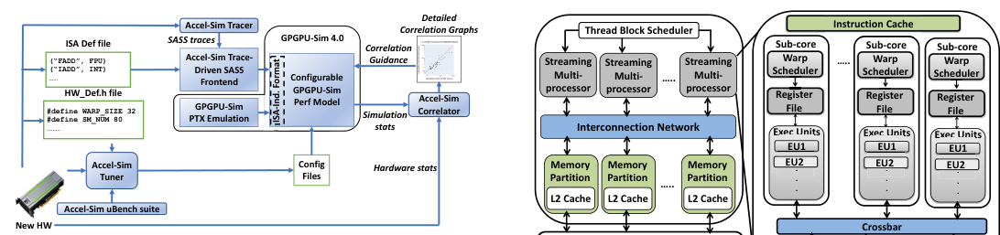
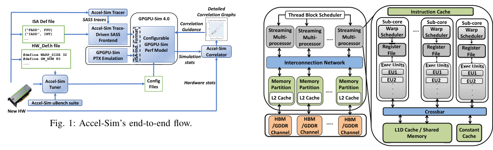
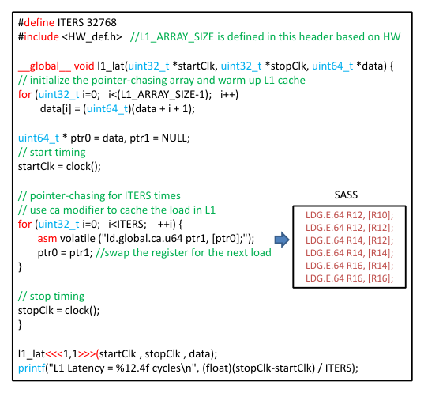
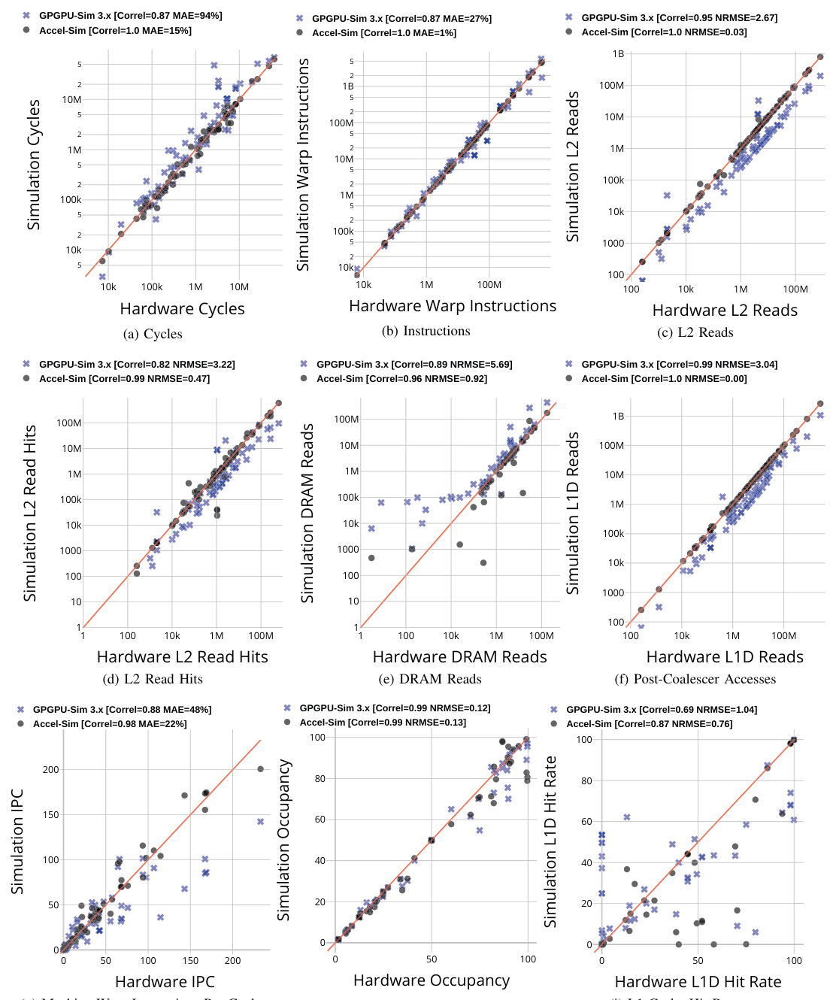
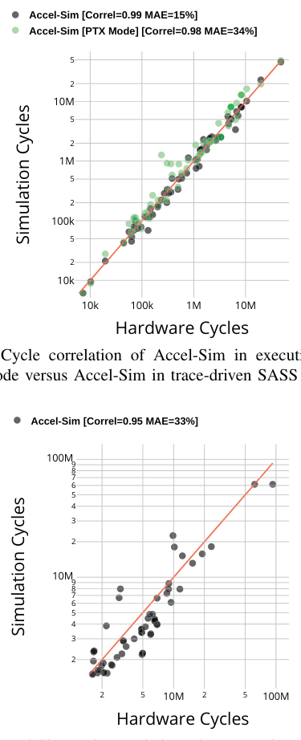
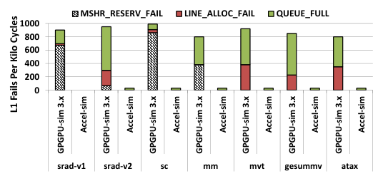

# Accel-Sim: An Extensible Simulation Framework for Validated GPU Modeling
_Venue: 2020 ACM/IEEE 47th Annual International Symposium on Computer Architecture (ISCA)._

## Authors
- Mahmoud Khairy (Purdue University) <abdallm@purdue.edu>
- Zhesheng Shen (Purdue University) <shen203@purdue.edu>
- Tor M. Aamodt (University of British Columbia) <aamodt@ece.ubc.ca>
- Timothy G. Rogers (Purdue University) <timrogers@purdue.edu>

## Abstract
In computer architecture, significant innovation frequently comes from industry. However, the simulation tools used by industry are often not released for open use, and even when they are, the exact details of industrial designs are not disclosed. As a result, research in the architecture space must ensure that assumptions about contemporary processor design remain true. To help bridge the gap between opaque industrial innovation and public research, we introduce three mechanisms that make it much easier for GPU simulators to keep up with industry. First, we introduce a new GPU simulator frontend that minimizes the effort required to simulate different machine ISAs through trace-driven simulation of NVIDIA’s native machine ISA, while still supporting execution-driven simulation of the virtual ISA. Second, we extensively update GPGPU-Sim’s performance model to increase its level of detail, configurability and accuracy. Finally, surrounding the new frontend and flexible performance model is an infrastructure that enables quick, detailed validation. A comprehensive set of microbenchmarks and automated correlation plotting ease the modeling process. We use these three new mechanisms to build Accel-Sim, a detailed simulation framework that decreases cycle error 79 percentage points, over a wide range of 80 workloads, consisting of 1,945 kernel instances. We further demonstrate that Accel-Sim is able to simulate benchmark suites that no other open-source simulator can. In particular, we use Accel-Sim to simulate an additional 60 workloads, comprised of 11,440 kernel instances, from the machine learning benchmark suite Deepbench. Deepbench makes use of closed-source, hand-tuned kernels with no virtual ISA implementation. Using a rigorous counter-by-counter analysis, we validate Accel-Sim against contemporary GPUs. Finally, to highlight the effects of falling behind industry, this paper presents two case-studies that demonstrate how incorrect baseline assumptions can hide new areas of opportunity and lead to potentially incorrect design decisions.

## Index Terms
GPGPU, Modeling and Simulation

## I. Introduction

Research cannot look ahead, if its baseline assumptions are too far behind. To keep up with industry, state-of-the-art academic and public research must both be aware of and adapt to changes in contemporary designs. In the computer architecture space, keeping up with proprietary industrial machines is a challenge. This is a problem in all segments of the processor industry, but perhaps a more acute challenge in the programmable accelerator space, where the rapid scaling of parallelism, introduction of new processing pipelines (i.e. Tensor Cores [10]) and undocumented changes to both the microarchitecture and Instruction Set Architecture (ISA) are commonplace in each new product generation. GPU architectures have widely embraced the use of a virtual ISA (vISA), which provides hardware vendors with tremendous flexibility to make machine ISA (mISA) changes while still maintaining binary compatibility. Vendors like NVIDIA keep the operation of these ISAs private, while others like AMD document each new machine ISA, but freely make drastic changes which open-source simulators must then implement. This situation presents three separate, but related challenges: (1) How do academic researchers quickly simulate a new, often undocumented ISA every year and a half? (2) Once functionally correct, how are changes to the architecture detected and modeled? (3) What is a sustainable, rigorous validation mechanism to ensure that new baselines are still tracking industrial designs? We present a new simulation framework, Accel-Sim, that is designed to address all three challenges. Accel-Sim introduces a flexible frontend, that enables it to operate in either trace-or execution-driven mode. Accel-Sim includes a trace-generation tool (built using the NVBit [70] binary instrumentation tool), that produces machine ISA instruction traces from any CUDA binary, including those that use closed-source libraries, like cuDNN [43]. These machine ISA traces are then converted into an ISA-independent intermediate representation that is input to the performance model. The trace-driven frontend allows Accel-Sim to simulate the machine ISA in new cards without implementing the ISA’s functional model and increases the accuracy of the simulator over executing the virtual ISA. However, trace-based simulation has its drawbacks. Evaluating new designs that rely on the data values stored in registers or memory [72] and global synchronization mechanisms [63] are either not possible or very difficult to study without emulation-based execution-driven simulation. Since Accel-Sim is based on an ISA-independent performance model, it is also capable of running emulation-based execution-driven simulations using NVIDIA’s relatively stable, well documented virtual ISA, PTX. Accel-Sim is the first academic simulation framework to support contemporary CUDA applications, modern Source and ASSembly (SASS) machine ISAs and simulate hand-tuned assembly in closed-source GPU binaries. Table I presents a survey of the open-source GPU simulation space. Over the last decade, several GPU simulators have been developed, each serving a different purpose. MacSim [28] is an early GPU simulator that performs trace-based simulation of NVIDIA’s virtual ISA and includes a Fermi-like microarchitecture model. Recent work on MacSim has extended the

DOI 10.1109/ISCA45697.2020.00047

TABLE I: Landscape of open-source GPU simulation. Accuracy numbers are taken from each simulator’s respective publication.

|  |  |  |  |  |  |  |
| --- | --- | --- | --- | --- | --- | --- |
|  | GPGPU-Sim 3.x [5] | Gem5-  APU [6], [18] | MGPU-Sim [67] | MacSim  [14], [28] | Multi2-  Sim [15], [69] | **Accel-Sim** |
| ISA | vISA +  mISA GT200 | vISA +  AMD mISA | vISA +  AMD mISA | vISA +  Intel mISA | vISA +  mISA Kepler +  mISA AMD | vISA +  NVBit-generated [70] mISA |
| Front-end | Execution | Execution | Execution | Trace | Execution | Traceand Execution-driven |
| Validated perf. model | Fermi | AMD | AMD | Fermi | Kepler | Kepler, Pascal, Volta, Turing |
| Validated Workloads | 14 | 10 | 7 | N/A | 24 | 80 |
| Reported Accuracy (error %) | 35% [1] | 42% [18] | 5.5% [67] | N/A | 19% [15] | 15% |
| Simulation rate (KIPS) | 3 | N/A | 28 [67] | N/A | 0.8 [67] | 12.5 (Trace-driven mode) 6 (Exec-driven mode) |
| Multi-threaded simulation | X | X | ✓ | X | X | X |
| Hand-tuned NVIDIA libraries  (i.e. Volta cuDNN) | X | X | X | X | X | ✓ |

simulator to execute traces for Intel GPUs [14]. Multi2-Sim is a versatile GPU simulator that has emulation-based functional simulation for both the virtual ISA and a subset of older machine ISAs from both AMD and NVIDIA. GPGPU-Sim [5] is a CUDA-centric simulator capable of functionally executing NVIDIA’s virtual ISA and a subset of an older machine ISA. More recently, Gem5 has been augmented to support an APU performance model for AMD’s virtual and machine ISAs [6]. MGPU-Sim [67] is a parallel GPU simulator for AMD’s virtual and machine ISAs. One of the primary drawbacks with all the simulators that support execution-driven machine ISAs is the challenge of keeping up with changes to the mISAs functional model. As a result, only a limited subset of the instruction set (and hence applications) are ever fully supported. This is especially important for supporting optimized libraries that often use exotic, hand-tuned machine code to improve performance, such as NVIDIA’s cuDNN. Although recent work has augmented GPGPU-Sim [31] to enable virtual ISA execution of these libraries, the functionality only works in pre-Volta GPUs. For Volta and Turing, cuDNN executes hand-tuned SASS kernels for which there is no virtual ISA implementation. Accel-Sim’s support for machine ISA traces bypasses all of these issues. In addition, existing GPU simulation frameworks lack a systematic methodology to validate and model new architectural designs quickly.

Shifting the focus from implementing an undocumented functional model enables Accel-Sim to focus on the performance model. We extensively modify GPGPU-Sim’s performance model (which we release as part of GPGPU-Sim 4.0) to increase its level of detail, configurability and accuracy. To facilitate rigorous validation, the performance model outputs a set of counters that have 1:1 equivalents with hardware data emitted by NVIDIA profilers, in addition to the detailed statistics that can only be provided by simulation. These counter values are then fed into an automated tuning framework that generates correlation plots and modifies the simulator’s configuration files, making it easier to create a validated performance model for a new GPU.

Using our new frontend and validation infrastructure, we perform an extensive modeling effort that builds on GPGPU-Sim’s [5] performance model to create a more flexible, extensible GPU simulator. Through careful counter-by-counter validation, we expose several changes to contemporary GPU hardware. We demonstrate Accel-Sim’s flexibility and accuracy by validating it against four generations of NVIDIA GPUs ranging from Kepler to Turing, performing an extensive side-by-side comparison of Accel-Sim and GPGPU-Sim 3.x modeling a Volta V100 [46].

During the course of this analysis we uncover a number of interesting insights into how contemporary hardware works. We utilized every publicly available resource to construct the performance model, capturing the details of what others have either disclosed or discovered [26], [34], [37], [73]. In the process of correlating the memory system we discover and model several undocumented features, such as: details of the streaming, adaptive L1 data cache, sectoring of both the L1 and L2, a sub-warp, sector-centric memory coalescing policy, and an L2 write policy that conserves memory bandwidth in the presence of sub-sector reads.

Finally, this paper performs two case-studies to highlight new research opportunities on contemporary GPUs and to demonstrate pitfalls that are alleviated by having a simulation infrastructure that is easier to validate. In particular, we demonstrate that out-of-order memory access scheduling, which appears relatively ineffective using an older model, yields a significant performance improvement when the level of detail in the memory system is increased to more closely match hardware. We also demonstrate that the L1 cache throughput bottleneck present in GPUs no longer exists in contemporary hardware, decreasing the effectiveness of techniques that selectively bypass the L1 for throughput reasons.

This paper makes the following contributions:

- It introduces Accel-Sim, a simulation framework explicitly designed to make modeling and validating future GPUs easier. By utilizing a flexible frontend, capable of switching between execution-driven vISA simulation and trace-driven mISA simulation, we are able to simulate hand-tuned machine code from NVIDIA binaries without giving up the option to perform execution-driven simulation when appropriate. We demonstrate Accel-Sim’s flexibility by modeling GPUs from Kepler to Turing.

- It performs a rigorous, counter-by-counter comparison of our new performance model against state-of-the-art simulation when modeling an NVIDIA Volta card, reducing error by 79 percentage points. Through this analysis, we uncover and model several previously undocumented architectural features in contemporary GPUs.

Fig. 1: Accel-Sim’s end-to-end flow.

- It introduces a comprehensive set of validation infrastructure that includes: a set of targeted GPU microbenchmarks, an automated parameter tuner and an automatic correlation visualizer, useful for adapting Accel-Sim to model new designs quickly.

- It performs a set of case-studies to concretely demonstrate the effects of falling behind industry and uses Accel-Sim to suggest future areas of new research for GPUs.

## II. Accel-Sim Simulation Framework

Figure 1 depicts an overview of our new simulation framework. Accel-Sim is composed of: (1) a flexible frontend that supports execution-driven simulation of NVIDIA’s virtual ISA and trace-driven simulation of contemporary machine ISAs, (2) a flexible and detailed performance model, (3) a correlation generation tool, and (4) a microbenchmarks-based configuration tuner. Together, the four components reduce the effort required to model contemporary and future GPUs.

### A. Flexible Frontend

Our new frontend supports both vISA (PTX) execution-driven and mISA (SASS) trace-driven simulation. In trace-driven mode, mISA traces are converted into an ISA-independent intermediate representation, that has a 1:1 correspondence to the original SASS instructions. Table II depicts an example of how SASS instructions from different machine generations and the virtual instructions from PTX are translated into the ISA-independent representation used by the performance model. The intermediate format is integrated into GPGPU-Sim 4.0 and represents the interface between the frontend and the performance model. The format includes all the information necessary to perform timing simulation, in particular: (1) the instruction’s control flow (PC and active mask), (2) the instruction’s datapath information (registers accessed and execution unit) and (3) memory addresses for ld/st instructions. In execution-driven mode, the active mask and memory addresses are computed by emulating the PTX instructions, whereas these values are embedded in the trace when executing the machine ISA.

We generate the traces from NVIDIA GPUs using Accel-Sim’s tracer tool that is built on top of NVbit [70]. We use base+stride compression for the memory traces to keep the trace sizes within an acceptable range. When a new SASS

**Thread Block Scheduler**

|  |  |  |
| --- | --- | --- |
| **Sub-core** |  | **Sub-core** |
| **Scheduler** |  | **Scheduler** |

Fig. 2: Updated GPGPU-Sim 4.0 performance model.

ISA is released, users provide the frontend with an *ISA Def* file that specifies where each instruction should be executed. This is a relatively simple mapping that can be derived from publicly available information on NVIDIA’s machine ISA [42].

By not emulating hundreds of scalar threads each cycle, Accel-Sim’s trace-driven mode improves simulation speed versus execution-driven mode. Prior work [18], [22] demonstrates that executing GPU vISAs may not be an accurate representation of some workloads. The mISA representation of the program includes register allocation and other compiler optimizations, whereas the vISA assumes an infinite register space and has naive instruction scheduling. Further, supporting SASS gives researchers the ability to simulate closed-source, optimized libraries, such as cuDNN [43], which are written in hand-tuned SASS.

### B. Flexible And Detailed Performance Model

To accurately model contemporary GPUs, we make extensive modifications to GPGPU-Sim 3.x’s performance model. This new performance model is released as part of GPGPU-Sim 4.0 and can be used, independent of Accel-Sim, for PTX simulation. Accel-Sim utilizes our GPGPU-Sim 4.0 performance model, interfacing with it through the ISA-independent instruction representation.

Figure 2 depicts an overview of the performance model. Streaming multiprocessors (SMs) are composed of multiple warp schedulers. Each warp scheduler has a dedicated register file (RF) and its own execution units (EUs). A warp scheduler with its dedicated RF and EUs is called a sub-core [10], [55]. Sub-cores are isolated, sharing only the instruction cache and the memory subsystem. The memory coalescing unit is designed to support sub-warp coalescing on every consecutive group of N threads. Our performance model is capable of simulating both separate and unified L1D cache and shared memory scratchpad [45]. Contemporary GPU architectures make use of an *adaptive cache* mechanism, in which the device driver transparently configures the shared memory capacity and L1D capacity on a per-kernel basis. Using the adaptive cache, if a kernel does not utilize shared memory, all the onchip storage will be assigned to the L1D cache [50].

**lsA-l nd. Format**

Simulation QV100 SM Cycles

1M 2 5 10M 2 5 100M Hardware QV100 SM Cycles

TABLE II: Example demonstrating how mISA instruction traces and vISA instructions translate into the ISA-independent intermediate representation used by the performance model. In traces, the mapping between opcode and execution unit is provided by the *ISA def* file in Figure 1. *\* indicates these values are computed using emulation.*

|  |  |  |  |  |  |  |  |
| --- | --- | --- | --- | --- | --- | --- | --- |
| Execution Mode | Example Instruction | ISA-independent representation | | | | | |
| PC | Active  mask | Reg info:  (dsts, srcs) | Exec. unit | Memory  addresses, width | Memory scope |
| [Trace] Kepler mISA | LD.E R4, [R6] | 0x78 | 0xFFFF | R4, R6 | Memory unit | 0x2000,..., 4 | global, L1 cached |
| [Trace] Volta mISA | LDG.E.U32.SYS R4, [R6] | 0x32 | 0x00FF | R4, R6 | Memory unit | 0x4000,..., 4 | global, L1 cached |
| [Trace] Pascal mISA | IADD.X R7,R7,R0 | 0x12 | 0x00EF | R7, R0 | INT unit | - | - |
| [Exec] PTX vISA | ld.global.cg.b32 r1, [r0]; | \* | \* | R1, R0 | Memory unit | \* | global, L2 cached |

With the slowing growth of Moore’s law, domain-specific processing pipelines continue to be introduced in GPUs (i.e. Tensor cores in Volta [46]). To ensure extensibility with this trend, Accel-Sim supports adding simple execution units from the configuration file, without the need to update the codebase. To add a new specialized unit, the user declares the new unit in the configuration file and maps the machine ISA op codes that use this unit in the *ISA def* file, as described in Figure 1. If execution-driven PTX support is required, then the user must also implement the code to emulate the new instruction’s functionality. To determine the latency and throughput of the new unit, the user specifies a sequence of instructions that can be measured by the microbenchmark tuning framework (described in Section II-C). We follow this process to model Volta and Turing’s Tensor Cores.

Our GPU cache model supports a throughput-oriented, banked, and sectored cache design [32], [62]. The cache is flexible enough to model GPUs from Kepler through Turing. We also model the CPU-GPU memory copy engine, since all DRAM accesses go through the L2, including CPU-GPU memory copies [53]. To reduce unbalanced memory accesses across L2 memory partitions, which we refer to as partition camping [3], [33], we add advanced partition indexing that xors the L2 bank bits with randomly selected bits from the page row bits using a Galois-based irreducible polynomial (IPOLY) interleaving mechanism [56]. Partition camping is a major problem in contemporary GPUs that have 2n memory partitions, like High Bandwidth Memory (HBM) [24] which has 8 channels per stack [33], [51]. IPOLY hashing is guaranteed to be conflict-free for all 2n strides, which are common in GPGPU applications, and also shows reasonable, deterministic performance for other strides [56].

In the memory system, we model new advances in HBM and GDDR6 [24], [51]. This includes the dual-bus interface to launch row and column commands simultaneously, increasing bank parallelism [51], and detailed HBM timing. Further, we implement well-known memory optimization techniques such as advanced xor-based bank indexing and separate read/write buffers, to reduce memory bank conflicts and read-write interference [8], [30], [66].

### C. Tuner And Targeted Microbenchmarks

Accel-Sim includes a microbenchmark suite to pinpoint latency, bandwidth and geometry changes to known hardware structures from one generation to another. When new hardware is released, the user provides a *hardware def* header file to

|  |  |  |
| --- | --- | --- |
| #define ITERS 32768  #include <HW\_def.h> //L1\_ARRAY\_SIZE is defined in this header based on HW  \_\_global\_\_ void l1\_lat(uint32\_t \*startClk, uint32\_t \*stopClk, uint64\_t \*data) {  // initialize the pointer-chasing array and warm up L1 cache  for (uint32\_t i=0; i<(L1\_ARRAY\_SIZE-1); i++)  data[i] = (uint64\_t)(data + i + 1); | | |
| uint64\_t \* ptr0 = data, ptr1 = NULL;  // start timing  startClk = clock();  // pointer-chasing for ITERS times  // use ca modifier to cache the load in L1  for (uint32\_t i=0; i<ITERS; ++i) {  asm volatile ("ld.global.ca.u64 ptr1, [ptr0];");  ptr0 = ptr1; //swap the register for the next load }  // stop timing  stopClk = clock(); } | SASS | |
|  | |  | | --- | | LDG.E.64 R12, [R10];  LDG.E.64 R12, [R12];  LDG.E.64 R14, [R12];  LDG.E.64 R14, [R14];  LDG.E.64 R16, [R14];  LDG.E.64 R16, [R16]; | |
| l1\_lat<<<1,1>>>(startClk , stopClk , data);  printf("L1 Latency = %12.4f cycles\n", (float)(stopClk-startClk) / ITERS); | | |

Fig. 3: L1 latency microbenchmark

the tuner, as shown in Figure 1. The file is used by the microbenchamrks to help discover non-public configuration parameters. The def file enumerates a minimal amount of information (such as number of SMs, warp size, etc.) that can be derived from publicly available documents [46].

In total, we have 38 microbenchmarks that span from L1/L2/shared memory latency and attained bandwidth, cache write policy, cache configuration, access/sector granularity, number of cache banks, memory coalescing policy, cache streaming behavior, execution unit latency/throughput and DRAM latency/bandwidth for different data elements: float, double and 128-bit vector. To illustrate the general configuration of the microbenchmarks, Figure 3 lists the code for our L1 latency microbenchmark that uses pointer chasing [34], [60] to create data dependencies with minimal overhead. The microbenchmark is written such that the kernel’s execution time is dominated by the L1 latency. After execution, the tuner reads the microbenchmark’s output and generates a configuration file for the performance model.

For other parameters that cannot be directly determined by our microbenchmarks (such as warp scheduling, memory scheduling, the L2 cache interleaving granularity and the L2 cache hashing function), Accel-Sim simulates each possible combination of these four parameters on a set of memory

bandwidth microbenchmarks (l1-bw, l2-bw, shd-bw and membw). The combination with the highest average hardware correlation is chosen by the tuner.

### D. Correlator

An automated configuration tuner does not capture more drastic architectural changes in different generations. Manual effort is required to model such changes. However, the magnitude of the effort can be lessened with quickly generated, targeted information on inaccuracy. Accel-Sim’s correlation tool automates the process of generating counter-by-counter correlation data for different architectures. The tool generates graphs and data that serve as correlation guidance to pinpoint workloads and metrics where the simulator is not well correlated to hardware. Using insights from the correlation of various performance counters over different realistic workloads and microbenchmarks, performance bugs or misrepresentations in the simulator are identified and corrected.

### E. Simulation Rate

Adding detail and flexibility to a performance model often comes at the expense of increased simulation time. Although Accel-Sim is not multithreaded, we take steps to improve its speed. With our improvements, Accel-Sim in trace-driven mode is able to perform 12.5 kilo warp instructions per second, a 4.3 × simulation time improvement over GPGPU-Sim 3.x. Half of our speed improvement comes from the fact that trace-driven mode avoids functional execution. The second half comes from a simulation optimization strategy we call *simulation-gating*, which is a trade-off between eventdriven and cycle-driven simulation. GPU simulations involve thousands of in-flight memory requests and hundreds of active threads. Thus, there will always be something to simulate each cycle. Similar to GPGPU-Sim 3.x, the updated performance model is cycle-driven, ticking all the components every cycle. However, we observe that the simulator ticks many empty components and spends a significant amount of time doing non-useful work. To overcome this issue, we keep a status state for each component (core, execution unit, cache, dram channel), then the simulator only ticks active components every cycle and skips unnecessary code and loop iterations when there is no useful work in the pipeline. Finally, in trace-driven mode, the user can set kernel-based checkpointing to select the desired hotspot kernels to simulate and avoid executing long running initialization kernels, which can further improve simulation speed.

## III. Workloads

To validate Accel-Sim and perform a detailed comparative analysis against prior work, we use a wide range of applications from different domains and benchmark suites. With the exception of a handful of applications with trace-size issues, we run all the applications found in Rodinia 3.1 [9], the CUDA SDK [40], Parboil [65], Polybench [16], CUTLASS [47], our microbenchmark suite, and cutting-edge machine learning workloads from the Deepbench benchmark suite [35]. The

TABLE III: Workloads used in our study. Table VIII lists the hardware cycles for each workload.

|  |  |  |
| --- | --- | --- |
| Benchmark Suite | Workloads | Trace Size [Compressed] |
| Rodinia 3.1 [9] | b+tree, backprob, bfs, hotspot, srad-v1, sc, nn, needle, dwt2d, lud, lavaMD, kmeans, myocyte | 302 GB [15 GB] |
| CUDA SDK [40] | sp, blk, vec-add, traspose, conv, scan, sorting-net, walsh-transform, histo, mergesort | 18 GB [1.2 GB] |
| Parboil [65] | sad, sgemm, stencil, cutcp, mri-q, histo, spmv, bfs | 250 GB [12 GB] |
| Polybench [16] | 2dconv, 3dconv, 2mm, 3mm, mvt, atax, bicg, gesummv, gemm, syrk | 743 GB [33 GB] |
| Microbenchamrks | l1-lat, l1-bw, shd-lat, shd-bw, l2-lat, l2-bw, mem-lat, mem-bw, maxflops | 3 GB [94 MB] |
| CUTLASS [47] | SGEMM with tensor cores WMMA (10 different input) and SGEMM with normal floating point (10 different input) | 2.5 TB [125 GB] |
| Deepbench [35] | GEMM bench (10 train, 10 inference), CONV bench (10 train, 10 inference), RNN bench (10 train, 10 inference) | 2.6 TB [130 GB] |

sum total is 140 workloads from the applications listed in Table III. The applications *cfd*, *heartwall*, *hotspot3D*, *huffman*, *leukocyte*, *srad v2* from Rodinia, *lbm* and *tpacf* from Parboil, *corr*, *cover*, *fdtd2d* and *gram-shm* from Polybench are omitted since their trace sizes are prohibitively large. We leave developing trace compression techniques and gradual trace creation to support these workloads as future work. We note that without traces, Accel-Sim is still able to execute these apps in execution-driven mode. The total disk size required for all the traces we simulate is 6.2 TB uncompressed (317 GB compressed) for each card generation. Table III lists the trace size for all the benchmark suites. Generating all 6.2 TB worth of traces takes approximately 48 hours using one GPU. All the workloads are compiled with CUDA 10, using the compute capability of their respective architecture (i.e. sm 70 in the case of Volta). We run the workloads with the input sizes provided by each benchmark suite. Since deep learning performance is highly sensitive to input size, we run Deepbench with multiple inputs, 10 inputs for training and 10 inputs for inference. For the Volta and Turing cards, we execute two versions of the CUTLASS matrix-multiply apps, one that uses tensor cores and one that uses 32-bit floating point operations.

For CUTLASS, the input sizes from DeepBench’s matrix multiply kernels are used. Hardware counters are collected using the nvprof [44] and nsight [49] command-line profilers from CUDA 10. We collect the timing data on a per-kernel basis by running the applications several times and averaging the results.

## IV. Modeling Different GPU Generations

To demonstrate Accel-Sim’s flexibility, we model four different NVIDIA GPU generations (Kepler, Pascal, Volta and Turing). First, we generate the traces for all the benchmarks using Accel-Sim’s tracing tool on each card1. Second, we provide the *ISA def* and *HW Def* files for each card from publicly available documents [42], [46] to the Accel-Sim frontend and

1We use the Volta (sm 70) traces to simulate Turing (sm 75), as NVBit support for Turing is not expected until Summer 2020.

TABLE IV: Accel-Sim modeling properties across four different GPU generations. SPU: Single-Precision Floating Point Unit.

DPU: Double-Precision Unit. SFU: Special Function Unit.

|  |  |  |  |  |
| --- | --- | --- | --- | --- |
|  | Kepler TITAN [39] | Pascal TITAN X [41] | Volta QV100 [46] | Turing RTX 2060 [48] |
| Machine ISA | sm 35 | sm 62 | sm 70 | sm 75 |
| Core Model | shared model | sub core model | sub core model | sub core model |
| Inst Dispatch/Issue | dual-issue | dual-issue | single-issue | single-issue |
| Execution units | SPUs, SFUs | SPUs, SFUs, DPUs | SPUs, SFUs, Tensor Cores | SPUs, SFUs, Tensor Cores |
| L1 Configuration | 128B line, 1 bank , 96-way, 128B/cycle, 42 cycles | 32B sector, 2 banks,  48-way, 64B/cycle, 80 cycles | 32B sector, adaptive, 4 banks, 256-way, 128B/cycle, 28 cycles | 32B sector, 4 banks,  96-way, 28 cycles |
| L2 Configuration | 32B sector, 24 banks,  190 cycles | 32B sector, 24 banks,  238 cycles | 32B sector, 64 banks,  212 cycles, IPOLY hashing | 32B sector, 24 banks,  226 cycles |
| DRAM Configuration | GDDR5 | GDDR5 | HBM | GDDR6 |

TABLE V: Accel-Sim cycle error and correlation factor across four different GPU generations.

|  |  |  |  |  |  |  |  |  |
| --- | --- | --- | --- | --- | --- | --- | --- | --- |
|  | **Kepler [39]**  **TITAN** | | **Pascal [41]**  **TITAN X** | | **Volta [46]**  **QV100** | | **Turing [48]**  **RTX 2060** | |
|  | MAE | Corr. | MAE | Corr. | MAE | Corr. | MAE | Corr. |
| PTX  Exec | 28% | 0.99 | 53% | 0.97 | 34% | 0.98 | 32% | 0.99 |
| SASS  Trace | 25% | 0.99 | 30% | 0.97 | 15% | 1.00 | 25% | 0.99 |

tuner respectively, as illustrated in Section II. Third, we run our microbenchmark suite and automated tuner on each card to configure the performance model’s parameters for the card in question. Fourth, using Accel-Sim’s correlation tool, we generate a set of graphs for performance counters to validate and improve correlation accuracy. Table IV shows the machine ISA version and modeling parameters obtained using Accel-Sim’s tuner to model each GPU generation. These correlation results drive the development of our performance model and enable us to uncover a number of interesting insights into contemporary hardware in different GPU generations. Three significant aspects are:

**Sub-Warp, Sectored Memory Coalescer:** We find that in Pascal, Volta and Turing, both the L1 and L2 caches have 32B sectors [27], with 128B cache lines. This sub-line fetching behavior has a significant impact on irregular applications running with the L1 cache enabled. To support an access granularity of 32B into the cache, the memory coalescer operates across sub-warps of eight threads, as opposed to grouping 32 threads into a wide 128B access, as other contemporary GPU simulators do when the L1 cache is enabled. We speculate that the caches have been sectored to: (1) mitigate the memory over-fetching for uncoalesced accesses [57], and (2) reduce the cache tag overhead, especially the high power consumption associated with the large content-address memory [52] structures required for 4 × more tag comparisons if a 32B line is used as opposed to a 128B with 32B sectors. Our experiments suggest that Kepler does not support such a coalescing mechanism. Accel-Sim’s flexibility allows it to model either the legacy Kepler configuration or the Pascal/Volta/Turing configurations with reasonable accuracy.

**Improved L1 throughput:** The L1 cache in Volta and Pascal is a *streaming cache* [10], [45], which allows many cache misses to be in flight, regardless of how many cache lines

are allocated from the unified scratchpad + L1 (in Volta) or the relatively limited 24kB L1 cache (in Pascal). By running a microbenchmark, similar to [37], we evaluate miss-status holding register [68] (MSHR) throughput and find that the number of MSHR entries has increased substantially. Also, we notice that, independent of L1 configured size, the MSHR throughput is the same, even if more of the on-chip SRAM storage is devoted to shared memory.

**Write-Aware Cache Design:** Using Accel-Sim’s detailed correlation plots, our initial experiments found that hardware conserves memory bandwidth much more than expected when running write-intense GPU workloads. To understand the behaviour, we developed an L2 write policy microbenchmark to confirm that the L2 is write-back with a write-allocate policy. Interestingly, we also observed additional behaviour on write misses. Historically, there are two different write allocation policies [27], *fetch-on-write* and *write-validate*. Using Accel-Sim, we find that the L2 cache in all four generations applies a version of *write-validate* that handles the varying granularity of GPU read/write requests. L2 reads have a minimum granularity of 32B, but writes can be sub-32B. When a write to a single byte is received, it writes the byte to the sector, sets a corresponding write bit in a byte-level write mask and sets the sector as valid and modified. When a sector read request is received to a modified sector, it first checks if the sector write-mask is complete, i.e. all the bytes have been written to and the line is fully readable. If so, it reads the sector, avoiding a DRAM access. If the sector is not fully written, it generates a read request for this sector and merges it with the modified bytes. Applying this write policy saves DRAM bandwidth that can be wasted by read-write interference at the DRAM when sub-sector writes are received at the L2 cache.

To demonstrate Accel-Sim’s ability to model different ISAs and hardware generations in both SASS and PTX simulation, Table V presents the Mean Absolute Error (MAE) and the Karl Pearson Coefficient of dispersion (Correl) for simulated cycles across four different GPU cards. Correl is the ratio of the standard deviation to the mean and indicates how closely the trends in both the simulator data and the hardware data match. Table V demonstrates that correlation is > 0.97 in all instances and error is <= 30% for all SASS simulations. The accuracy gained by executing the machine ISA over the virtual ISA can be as much 2 ×, depending on the generation. The one outlier with the greatest error is Pascal in PTX mode. In Pascal,

TABLE VI: Volta GPU configuration for GPGPU-Sim 3.x vs Accel-Sim. INT: Integer operation unit.

|  |  |  |
| --- | --- | --- |
|  | **GPGPU-Sim 3.x** | **Accel-Sim (SASS + GPGPU-Sim 4.0)** |
| Front End | Execution-driven PTX 2.0 | **Trace-driven SASS 7.0** |
| #SMs | 80 | 80 |
| SM Configuration | Warps per SM = 64, #Schedulers per SM = 4,  #Warps per Sched = 16, RF per SM = 64 KB | **+Subcore model, warp scheduler isolation** |
| #Exec Units | 4 SPUs, 4 SFUs, 4 WMMA Tensors cores [55] | **+ 4 DPUs, 4 INTs, 8 HMMA Tensor cores** |
| Memory Unit | Fermi coalescer (32 thread coalescer) | **sub-warp (8 thread) coalescer + Fair memory issue** |
| Shared Memory | Programmable-specified up to 96 KB | **Adaptive (up to 96 KB), latency = 20 cycles** |
| L1 cache | 32KB, 128B line, 4 sets, write-evict | **+32B sector, adaptive cache (up to 128 KB),**  **Streaming cache, banked, latency = 28 cycles** |
| L2 cache | 6 MB, 64 banks, 128B line, 32 sets, Write Back, Naive write policy, LRU, latency=100 cycles | **+32B sector, subsector write policy, memory copy engine model, +pseudorandom irreducible polynomial L2 hashing with IPOLY(67)** |
| Interconnection | 80x64 crossbar, 32B flit |  |
| Memory Model | GDDR5 model, BW=850 GB/sec, latency=100ns | **HBM Model, dual-bus interface, Read/Write buffers, advanced bank indexing** |

the L1D and texture cache are merged and L1D caching is disabled by default. Without the L1D as a bandwidth filter, L2 throughput is more important in Pascal. The poor instruction scheduling in PTX results in a 53% error that is reduced to 30% when SASS instruction scheduling is used.

## V. A Detailed Correlation Analysis

In this section, we perform a quantitative analysis to demonstrate how our new performance model can be used to simulate an NVIDIA Quadro V100 [10]. We compare Accel-Sim against the state-of-the-art NVIDIA simulation model from GPGPU-Sim 3.x [1], [5]. The GPGPU-Sim 3.x model is a best-effort attempt to model the Volta card using GPGPU-Sim 3.x without the modeling updates described in this paper. Table VI details the configuration parameters used to model the architecture. The left column of the table details the configuration of GPGPU-Sim 3.x, obtained by scaling resources. The right column lists changes made possible using Accel-Sim and our updated GPGPU-Sim 4.0 performance model. For the sake of brevity, we refer to GPGPU-Sim 3.x as ‘GPGPU-Sim’ and Accel-Sim with GPGPU-Sim 4.0 as ‘Accel-Sim’. Note that both simulators are capable of executing NVIDIA’s Tensor Core instructions. GPGPU-Sim uses the PTX-level WMMA tensor core instruction. Based on the analysis from Raihan et al. [55], Accel-Sim models the fine-grained, SASS-level HMMA instruction. Since Accel-Sim is capable of both SASStrace and PTX-execution driven simulation, we refer to them as Accel-Sim and Accel-Sim [PTX Mode] respectively.

In this section, we demonstrate the accuracy of our more flexible performance model and the effect of being able to simulate SASS traces. The correlation figures presented throughout this section plot hardware results from the NVIDIA profilers nvprof [44] and nsight-cli [49] on the x-axis and the simulation results on the y-axis. Depending on the statistic, there are up to 80 datapoints on each graph (80 applications, without the Deepbench workloads). The blue **x** represents the GPGPU-Sim result and the circles represent Accel-Sim. Each plot also lists the Correl and error for the statistic. We use two different aggregation techniques for error. Intuitively, the Mean Absolute Error (MAE) makes the most sense since it provides a percentage error and is resistant to outliers. However, calculating MAE is not possible if the reference counter is zero

TABLE VII: Error and correlation rates of GPGPU-Sim 3.x versus Accel-Sim when modeling an NVIDIA Volta.

|  |  |  |  |  |
| --- | --- | --- | --- | --- |
| Statistic | Error | | Correlation | |
| GPGPU-Sim 3.x | Accel-Sim | GPGPU-Sim 3.x | Accel-Sim |
| L1 Reqs | NRMSE=3.04 | NRMSE=0.00 | 0.99 | 1.00 |
| L1 Hit Ratio | NRMSE=1.04 | NRMSE=0.76 | 0.69 | 0.87 |
| Occupancy | NRMSE=0.12 | NRMSE=0.13 | 0.99 | 0.99 |
| L2 Reads | NRMSE=2.67 | NRMSE=0.03 | 0.95 | 1.00 |
| L2 Read Hits | NRMSE=3.24 | NRMSE=0.47 | 0.82 | 0.99 |
| DRAM Reads | NRMSE=5.69 | NRMSE=0.92 | 0.89 | 0.96 |
| Instructions | MAE=27% | MAE=1% | 0.87 | 1.00 |
| Execution Cycles | MAE=94% | MAE=15% | 0.87 | 1.00 |

and creates the appearance of massive error when small values deviate. As a result, we cannot use the MAE for counters other than the number of cycles, instructions executed and Instructions Per Cycle (IPC), which will always be non-zero values. For the remaining counters, we use the Normalized Root Mean Squared Error (NRMSE). Table VII summarizes the error and correlation co-efficients for GPGPU-Sim versus Accel-Sim, over a number of important performance metrics.

### A. Overall System Correlation

Figure 4 details a direct comparison of GPGPU-Sim to Accel-Sim over a set of key simulation metrics. Figure 4a plots the final number of cycles reported for each application. Rounded to 2 significant digits, Accel-Sim has a 1.00 correlation with hardware, and a 15% mean absolute error. In contrast, GPGPU-Sim has a correlation of 0.87 and 94% error. Generally, GPGPU-Sim’s values are above the x=y line, meaning the simulator is over-estimating the number of cycles for the workload. GPGPU-Sim is not modeling the performance enhancements made to the memory system, which Accel-Sim does.

Accel-Sim’s increased accuracy can be attributed to two factors: the machine ISA representation and the updated performance model. To understand the effect of the instruction set, Figure 4b plots the number of warp instructions executed. Since GPGPU-Sim operates on PTX, the correlation is relatively low and shows a 27% error. In contrast, Accel-Sim has a

1B

Simulation Wa r p Instructions

Hardware Warp Instructions

(f) Post-Coalescer Accesses

**GPGPU-Sim 3.x [Correl=0.69 NRMSE=1.04]**

**Accel-Sim [Correl=0.87 NRMSE=0.76]**

Simulation Occupancy

S imu lation L1D H it Rate

(g) Machine Warp Instructions Per Cycle

(h) Occupancy

Fig. 4: Correlation of key metrics from Accel-Sim versus GPGPU-Sim 3.x over the 80 workloads (comprised of 1945 kernel instances) that can be executed in both the virtual ISA and the machine ISA. These workloads are listed in Table VIII.

Accel-Sim [PTX Mode] and Accel-Sim. In many of the CUTLASS *sgemm* and Rodinia workloads, the error is significantly reduced by moving to SASS-based simulation. In these workloads, capturing the improved instruction scheduling in SASS is critical to simulator accuracy.

S imu lat ion Cycles

1M

2 100k 5

10k

10k 100k 1M 10M

Hardware Cycles

Fig. 5: Cycle correlation of Accel-Sim in execution-driven PTX mode versus Accel-Sim in trace-driven SASS mode.

**Accel-Sim [Correl=0.95 MAE=33%]**

Simulation Cycles

100M

For the CUTLASS *sgemm* workloads (without Tensor Core instructions) the streaming L1 cache, advanced L2 hashing and support for SASS all contribute to reducing the error in Accel-Sim to less than 5%. Interestingly, Accel-Sim’s error for CUTLASS *gemm-wmma* is higher than *sgemm*. In addition, GPGPU-Sim’s error is generally much lower on *gemm-wmma* than on *sgemm*. We find that the abstract WMMA PTX instructions are a good approximation for the SASS instructions. For some input sizes, the abstract instructions are an even better representation than Accel-Sim’s SASS model for HMMA. In these instance, Accel-Sim [PTX Mode] demonstrates nearly zero cycle error, since it benefits from both the memory system updates and the accuracy of the abstract WMMA instructions.

10M

2 5 10M 2 5 100M

Hardware Cycles

Fig. 6: Accel-Sim cycle correlation when executing deepbench workloads, which cannot be executed by GPGPU-Sim 3.x or Accel-Sim [PTX Mode]. 60 workloads (comprised of 11,440 kernel instances).

1.0 correlation and a 1% error. Accel-Sim’s small error occurs because some applications execute a non-deterministic number of instructions in hardware. Figure 4b demonstrates that PTX generally executes a reasonable number of instructions. However, the ordering of the instructions is significantly different in SASS, resulting in better instruction-level parallelism. To quantify the difference between PTX and SASS more clearly, Figure 5 shows the cycle correlation when using Accel-Sim [PTX Mode] versus Accel-Sim. Figure 5 allows us to examine the effect of SASS versus PTX on the same performance model. On average, simulating SASS improves the mean absolute error by 2 ×, reducing the error from 34% to 15%. To provide additional insight on an app-by-app basis, Table VIII enumerates the per-application cycle error for GPGPU-Sim,

We also plot the attained occupancy (Figure 4h) and IPC (Figure 4g). The occupancy data tracks well for both GPGPU-Sim and Accel-Sim, both models correctly estimate the initial occupancy, deviation from hardware occurs in imbalanced kernels where occupancy falls off at different rates. The purpose of correlating IPC is to demonstrate how well the simulator handles different rates of work. In order to avoid negatively biasing GPGPU-Sim (which uses a different instruction set than both Accel-Sim and hardware), we use the machine instruction count as the numerator to calculate the IPC in both simulators. Figure 4g follows from Figure 4a, where Accel-Sim shows better correlation and less error. GPGPU-Sim’s IPC error is less than its cycle error. Most of GPGPU-Sim’s error occurs in long running apps, where the gap in cycles becomes orders of magnitude larger.

|  |  |  |
| --- | --- | --- |

Fig. 7: Measured cache and memory bandwidth for Accel-Sim, GPGPU-Sim 3.x and Volta hardware .

Finally, Figure 6 plots the Deepbench workloads that make use of the closed-source cuDNN and cuBLAS libraries, that include hand-tuned SASS code for which there is no PTX representation. Only Accel-Sim is able to simulate these workloads. Generally, Accel-Sim is well correlated, although the overall error is higher than for the other workloads. Further inspection reveals that the Deepbench workloads make extensive use of texture memory and local loads, which could require additional modeling to improve their accuracy. For hardware occupancy, Accel-Sim achieves 0.9 correlation and 0.16 NRMSE on the Deepbench workloads. Low occupancy in RNN workloads has been observed by prior work [76] in silicon GPUs, which we also observe in Accel-Sim. Accel-Sim’s support of NVIDIA’s hand-tuned libraries enables new architecture research into the performance of RNNs and other deep learning networks on GPUs, which is not possible in any other simulation framework.

### B. Achieved Bandwidth Correlation

GPU workloads are highly sensitive to cache and memory bandwidth, making them important factors for modeling GPUs accurately. Significant effort has been expended to design contemporary GPUs to achieve the highest possible bandwidth. To measure how much memory bandwidth can be saturated, we design a set of microbenchmarks to saturate the memory bandwidth of the L1, L2 and main memory. Figure 7 depicts the cache and memory bandwidth attained for in the Volta card, normalized to the theoretical bandwidth. In Volta [10], [26], the theoretical bandwidth for both simulators have been configured to supply, at most, the theoretical bandwidth of each component.

As shown in Figure 7, GPGPU-Sim is only able to achieve 33% of the theoretical L1 bandwidth, whereas the Accel-Sim’s streaming and banked L1 cache is able to attain 85%, within 10% error of the attained hardware bandwidth. In L2 cache, thanks to our advanced Galios-based random hashing and accurate interconnect bandwidth, Accel-Sim mitigates L2 partition camping, which has been exacerbated in contemporary GPUs with the introduction of HBM [3], [33], and comes within 22% of hardware. We believe that the hashing mechanism used in contemporary GPUs is highly tuned, and eliminating the last 22% error would require extensive reverseengineering. We leave improving the L2 bandwidth for future

TABLE VIII: Cycle mean absolute error per workload in GPGPU-Sim 3.x, Accel-Sim [PTX Mode] and Accel-Sim

|  |  |  |  |  |
| --- | --- | --- | --- | --- |
| Workload | HW  cycles | GPGPU-Sim 3.x  Error (%) | Accel-Sim  [PTX]  Error (%) | Accel-Sim  Error (%) |
| **CUDA SDK** | | | | |
| blk | 10214 | -13 | -11 | -7 |
| conv | 327868 | 3 | 30 | -11 |
| fast-walsh-transform | 731574 | 35 | -6 | 4 |
| merge-sort | 52905 | 17 | -15 | 2 |
| scalar-prod | 300811 | -30 | -30 | -32 |
| sorting-networks | 85713 | 10 | -13 | -10 |
| transpose | 97339 | -2 | 12 | -19 |
| vector-add | 140161 | -22 | 32 | -17 |
| scan | 2659445 | 29 | -16 | -16 |
| histo | 61085 | 21 | 21 | -9 |
| **CUDA SDK MAE** | - | **13** | **16** | **9** |
| **Rodinia Suite** | | | | |
| b+tree | 167146 | -7 | -8 | -19 |
| backprop | 63456 | 0 | 4 | -14 |
| bfs | 1107676 | 61 | -11 | -31 |
| dwt2d | 35246 | 90 | 51 | -3 |
| hotspot | 56101 | 63 | 58 | 16 |
| lud | 710043 | 9 | 48 | -9 |
| myocyte | 4561278 | 51 | 42 | 22 |
| neddle | 3016000 | 151 | 43 | -16 |
| srad-v1 | 6031393 | -7 | 42 | 0 |
| sc | 699593 | 82 | -15 | -8 |
| kmeans | 1437879 | 300 | 300 | 63 |
| nn | 7305 | -59 | -40 | -11 |
| lava-md | 5017353 | 20 | 12 | 8 |
| **Rodinia MAE** | - | **32** | **28** | **8** |
| **Parboil Suite** | | | | |
| bfs | 6396950 | -23 | -22 | -47 |
| histo | 5590035 | -56 | -59 | -39 |
| mri-q | 299165 | 220 | 207 | 9 |
| sad | 131272 | 4 | 9 | -47 |
| sgemm | 362333 | 111 | 148 | -16 |
| spmv | 3405773 | 38 | -8 | -7 |
| stencil | 4698755 | -46 | -17 | -10 |
| cutcp | 5321758 | 75 | 75 | 39 |
| **Parboil MAE** | - | **45** | **37** | **20** |
| **Polybench Suite** | | | | |
| 2dconv | 269298 | 62 | 6 | -15 |
| 2mm | 62994676 | 8 | 0 | 0 |
| 3dconv | 1788022 | -26 | -17 | 3 |
| 3mm | 1766299 | 9 | -12 | -12 |
| atax | 3322009 | 432 | -23 | -23 |
| bicg | 3330876 | 604 | -24 | -23 |
| gemm | 587160 | 19 | -12 | -1 |
| gesummv | 2661367 | 1700 | -7 | -7 |
| mvt | 3323425 | 445 | -24 | -23 |
| syrk | 15668564 | 658 | -7 | -7 |
| **Polybench MAE** | - | **111** | **6** | **4** |
| **Microbenchmark Suite** | | | | |
| maxflops | 73152 | 39 | 3 | 3 |
| l1-bw | 578838 | 134 | 9 | -4 |
| l1-bw-unroll | 237705 | 304 | 433 | -6 |
| l1-lat | 1177511 | -65 | -2 | -8 |
| shared-bw | 4921085 | -1 | -3 | -3 |
| shared-lat | 70231 | 6 | 12 | 12 |
| l2-bw | 786881 | 202 | 31 | 44 |
| l2-lat | 7184779 | -33 | -18 | -19 |
| mem-bw | 382171 | 21 | 15 | 16 |
| mem-lat | 2389456 | -71 | 10 | -16 |
| **Microbenchmark MAE** | - | **37** | **14** | **9** |
| **CUTLASS GEMM wmma Suite** | | | | |
| wmma-2560x128x2560 | 1455597 | 11 | -1 | 10 |
| wmma-2560x16x2560 | 1325345 | 7 | 0 | 15 |
| wmma-2560x32x2560 | 1338720 | 6 | 0 | 14 |
| wmma-2560x64x2560 | 1376862 | 4 | 0 | 13 |
| wmma-2560x7000x2560 | 19717874 | 12 | 0 | 16 |
| wmma-4096x128x4096 | 2231763 | 32 | 0 | 14 |
| wmma-4096x16x4096 | 2055799 | 10 | 1 | 17 |
| wmma-4096x32x4096 | 2060767 | 12 | 1 | 17 |
| wmma-4096x64x4096 | 2103894 | 17 | 2 | 16 |
| wmma-4096x7000x4096 | 48103472 | 21 | 0 | -4 |
| **CUTLASS wmma MAE** | - | **11** | **0.5** | **12** |

|  |  |  |  |  |
| --- | --- | --- | --- | --- |
| **CUTLASS sgemm Suite** | | | | |
| sgemm-2560x1024x2560 | 10525540 | 96 | 54 | -3 |
| sgemm-2560x128x2560 | 5272700 | 97 | 54 | -3 |
| sgemm-2560x16x2560 | 5199087 | 97 | 55 | -2 |
| sgemm-2560x2560x2560 | 26224856 | 95 | 55 | -3 |
| sgemm-2560x32x2560 | 5193979 | 97 | 55 | -2 |
| sgemm-2560x512x2560 | 5289253 | 97 | 54 | -3 |
| sgemm-2560x64x2560 | 5187370 | 98 | 55 | -2 |
| sgemm-4096x128x4096 | 8352408 | 113 | 55 | -3 |
| sgemm-4096x16x4096 | 8266794 | 97 | 55 | -2 |
| sgemm-4096x64x4096 | 8240064 | 100 | 56 | -1 |
| **CUTLASS sgemm MAE** | - | **98** | **54** | **2** |

work. For memory bandwidth, our detailed HBM model with a dual-bus interface, the random partition indexing and write buffers employed in Accel-Sim achieves 82% of the theoretical memory bandwidth and very close to the 85% attained in hardware. In the GPGPU-Sim, read/write interference, low bank-group level parallelism and naive L2 write policy waste memory bandwidth leading it to attain only 62% bandwidth.

### C. L1 Cache Correlation

Figure 4f plots correlation for the post-coalescer accesses received by the L1 cache. As Figure 4f shows, Accel-Sim has a correlation co-efficient of 1.00 correlation and no error. This is primarily due to the implementation of the subwarp coalescer and the fact that the L1 cache is sectored. Figure 4i plots the corresponding hit rate for the L1D cache. We note that this statistic is particularly hard to correlate, given that the warp scheduling policy, cache replacement policy and hit/miss accounting decisions in the profiler can skew the results. For example, through microbenchmarking, we determined that the hardware profiler will count a sector miss on a cache line whose tag is already present as a hit, but will still send the sector access down to the L2. Effectively, the profiler appears to be counting 128B line cache tag hits, even if the sector is missed. Even with these variables, Accel-Sim’s cache model achieves only 0.77 NRMSE and a correlation co-efficient of 0.87. In the apps where pervasive error still exists, we believe more detailed reverse engineering of the warp scheduling policy and replacement policy will help.

GPGPU-Sim have a high correlation, but an NRMSE of 3.06 in L1D read accesses. GPGPU-Sim does not model a sectored cache, thus one 128B access will count as four sector accesses in the hardware. Completely divergent applications show consistent behaviour with hardware since 32 unique sectors are generated in hardware and 32 unique cache lines are generated in GPGPU-Sim.

### D. L2 Cache Correlation

Although all L1D read misses are sent to L2 cache, Accel-Sim’s L2 reads has higher correlation and less error compared to the L1 hit rate. This result confirms our observation that the profiler’s L1 hit/miss accounting decisions are different from our assumption. As shown in Figure 4c, Accel-Sim exhibits 1.00 correlation and normalized error reaching only 0.03. We also collected information on write transactions, and noticed similar behaviour.

We attempted to correlate the L2 cache read hit rate with simulation results, but found that the profiler gives inconsistent results, some of which are greater than 100%. So instead, we correlated with the number of L2 hits, which gave more grounded readings. Figure 4d presents the L2 read hit correlation. Overall, Accel-Sim achieves 0.99 correlation and 0.47 normalized error. Again, at the L2, scheduling effects from the order in which memory accesses reach the L2 will have an effect on it’s hit rate.

### E. DRAM Correlation

Finally, Figure 4e plots the correlation of DRAM read accesses. The NRMSE is 0.93 and has a 0.96 correlation coefficient. The DRAM read correlation remains high and is more accurate for larger kernels. However, Accel-Sim shows a high level of error for smaller workloads.

The results in GPGPU-Sim are significantly worse than those in Accel-Sim. Interestingly, the reason for the massive error in the GPGPU-Sim is due to its per-cacheline fetch on write policy. The end result of that policy was that every write to the writeback L2 fetched 4 32-byte memory values from DRAM, which is why the DRAM reads of the GPGPU-Sim are consistently overestimated. Accel-Sim has eliminated this problem by sectoring the cache and implementing a more accurate write policy, as explained in Section IV.

## VI. Case Studies

This section presents the effect of memory system simulation detail on architectural design decisions. A less detailed architecture model may lead to unrealistic issues or incorrect conclusions that are not relevant to state-of-the-art designs already being used in industry. This section demonstrates how our more accurate GPU model removes the well-studied bottleneck of cache throughput and opens up new research opportunities in chip-wide memory issues.

**L1 cache throughput**: The L1 cache throughput bottleneck for GPUs has been well explored in literature using cache bypassing and warp throttling techniques [25], [29], [61]. Due to massive multithreading, GPGPU L1 caches can suffer from severe resource contention (e.g. MSHRs and cache line allocation [25]). However, contemporary GPUs are designed such that the L1 cache is not a throughput bottleneck. Modern GPUs employ advanced architecture techniques to improve L1 cache throughput, such as sectored, banked, adaptive and streaming L1 caches. These techniques shift the memory bottleneck from the L1 cache to the lower levels of the memory hierarchy. Figure 8 plots the L1 cache reservation fails per kilo cycles for cache sensitive workloads for GPGPU-Sim vs Accel-Sim. The new L1 model eliminates reservation fails and the L1 cache is no longer a throughput bottleneck. Consequentially, any design aimed at mitigating this L1 throughput bottleneck is less effective on a contemporary GPU, which is reflected in our new performance model.

**1000**

**800**

**600**

**400**

**200**

**0**

Fig. 8: L1 cache reservation fails per kilo cycles for cache sensitive workloads in both Accel-Sim and GPGPU-Sim 3.x.

**6**

**5**

**4**

**3**

**2**

**1**

**0**

Fig. 9: FR FCFS performance normalized to the FCFS in Accel-Sim and GPGPU-Sim 3.x for memory intensive workloads in Volta.

**Memory scheduling sensitivity**: Throughput-oriented GPGPU workloads are often sensitive to memory bandwidth. Thus, the DRAM memory access scheduler plays an important role to efficiently utilize bandwidth and improve the performance of memory-intensive workloads (i.e. those that utilize > 50% of DRAM bandwidth). Figure 9 shows the sensitivity of memory-intensive GPGPU workloads for two memory scheduling policies: the na...ıve first-come first-serve scheduling (FCFS) and the advanced out-of-order Firstrow-ready first-come first-serve scheduling (FR FCFS) [58]. FR FCFS performance is normalized to FCFS in both Accel-Sim and GPGPU-Sim to demonstrate the performance improvement from more advanced scheduling. In the GPGPU-Sim, some workloads are insensitive or show little difference between the two scheduling policies. On average, applying FR FCFS in GPGPU-Sim increases performance by 20%.

In Accel-Sim, the memory scheduling policy is more critical. Applying FR FCFS to Accel-Sim improves performance by 2.5 × on average. More detailed coalescing rules, improved on-chip cache throughput, advanced L2 cache interleaving and write allocation policies increase the likelihood of losing page locality, which must be recaptured by out-of-order memory access scheduling. Further, with the new features and capabilities of the HBM such as dual-bus interface [51], pseudoindependent accesses [23] and per-bank refresh command [24], memory scheduling and the interaction with the L2 cache indexing will become a more critical issue to investigate. This experiment demonstrates how accurately modeling contemporary GPU hardware reveals performance issues obscured using a less detailed simulation. We believe Accel-Sim opens up a rich new design space in system-level GPU research where core-level memory issues are alleviated and there is increased sensitivity to chip-wide memory issues.

## VII. Related Work

As Table I illustrates, there has been extensive work done in GPU simulation over the last decade. Xun et al. [15] model GPU Kepler architecture [38] that is integrated with the Multi2sim simulation infrastructure [69]. The new simulator was validated using applications from the CUDA SDK. Power et al. [54] propose the Gem5-GPU simulator which models detailed CPU-GPU interaction. Beckmann et al. [6], [18] introduce a Gem5 GPU model, that simulates AMD’s GCN architecture. Barrio et al. [12] propose ATTILA, which is a trace-driven GPU simulator that models the graphics pipeline for the GT200 architecture. Gubran et al. [17] update GPGPU-Sim to execute graphics workloads. Sniper [7] is a multithreaded CPU simulator that can execute in trace-or execution-driven mode using PIN-based callbacks to simulate instructions without emulation. In this vast landscape, Accel-Sim is the only open-source framework, explicitly designed for validation, that can simulate NVIDIA SASS instructions and accurately model contemporary NVIDIA GPUs.

Stephenson et al. [64] introduce SASSI, a low-level assembly-language instrumentation tool for GPUs. Many previous works [4], [20], [21], [71], [74], [75] aim to estimate the execution time of GPGPU applications throughout sourcelevel analysis, however they do not perform detailed performance modeling for architecture research. Nowatzki et al. [36] show that GPGPU-Sim is inaccurate in modeling some incore parameters and connection delays. Hongwen et al. [11] argue that GPGPU-Sim has a very weak L1 cache model and they suggest enhancements to improve the L1 cache throughput. Jain et al. [22] demonstrate a large gap in GPGPU-Sim 3.x’s memory system when correlating against Pascal hardware. Prior work [2], [13], [19] propose a methodology for validating CPU simulation models against real hardware. Numerous works have done micro-benchmarking to characterize aspects of GPU architecture for Tesla GT200 [73], Fermi [37], Maxwell [34], and recently Volta [26]. They demystified the L1/L2 cache’s associativity and replacement policy. However, none of these works have investigated the L1 streaming cache, sectoring of the L1/L2 caches and the interaction of the memory coalescer with caches or the cache write policy.

## VIII. Conclusion

This paper introduces three innovative mechanisms to help solve the problem of keeping simulators up-to-date with contemporary designs. We propose a novel, ambidextrous GPU frontend that translates both functionally executed virtual instructions and machine instruction traces into an ISA-independent format for simulation. Using the flexible frontend, a detailed performance model is developed, which has the ability to model contemporary GPUs and execute proprietary

binaries that no other open-source simulator can. We believe that Accel-Sim is the most extensively validated open-source GPU simulation framework to date. We demonstrate that Accel-Sim decreases cycle error from 94% in state-of-the-art simulation to 15%, on a comprehensive suite of workloads.

Accel-Sim’s ISA-independent performance model opens up opportunities to simulate cards from a wide variety of vendors. Work is currently underway to generate AMD GCN3 traces from Gem5-APU [6] such that Accel-Sim can be used to model and validate AMD GPUs. We believe that Accel-Sim will reduce the accuracy gap between industrial and academic simulators on an ongoing basis, increasing the potential impact of accelerator research.

ACKNOWLEDGMENTS

We thank our anonymous reviewers for feedback on early versions of this paper, David Nellans, Oreste Villa and the NVBit [70] developers for early access to the tool and bug fixes that facilitated the creation of the Accel-Sim SASS Tracer, and Akshay Jain and Syed Farooq for their help in the early phases of the project. We would also like to recognize all the researchers who have made contributions to GPGPU-Sim since the last major release. This work was supported, in part, by NSF CCF #1910924 and the Applications Driving Architectures (ADA) Research Center, a JUMP Center cosponsored by SRC and DARPA.

REFERENCES

[1] T. M. Aamodt, W. W. Fung, I. Singh, A. El-Shafiey, J. Kwa, T. Hetherington, A. Gubran, A. Boktor, T. Rogers, and A. Bakhoda, “GPGPU-Sim 3. x manual,” [http://gpgpu-sim.org/manual/index.php/Main Page](http://gpgpu-sim.org/manual/index.php/MainPage), 2016.

[3] A. M. Aji, M. Daga, and W.-c. Feng, “Bounding the Effect of Partition Camping in GPU Kernels,” in *Proceedings of the 8th ACM International Conference on Computing Frontiers (CF)*, 2011, p. 27.

[4] N. Ardalani, C. Lestourgeon, K. Sankaralingam, and X. Zhu, “Cross-Architecture Performance Prediction (XAPP) Using CPU Code to Predict GPU Performance,” in *Proceedings of the 48th International Symposium on Microarchitecture (MICRO)*, 2015, pp. 725–737.

[5] A. Bakhoda, G. L. Yuan, W. W. Fung, H. Wong, and T. M. Aamodt, “Analyzing CUDA Workloads Using a Detailed GPU Simulator,” in *IEEE International Symposium on Performance Analysis of Systems and Software (ISPASS)*, 2009, pp. 163–174.

[6] B. Beckmann and A. Gutierrez, “The AMD gem5 APU Simulator: Modeling Heterogeneous Systems in gem5,” in *Tutorial at the International Symposium on Microarchitecture (MICRO)*, 2015.

[7] T. E. Carlson, W. Heirman, and L. Eeckhout, “Sniper: Exploring the Level of Abstraction for Scalable and Accurate Parallel Multi-Core Simulation,” in *Proceedings of International Conference for High Performance Computing, Networking, Storage and Analysis (SC)*, 2011,

pp. 1–12.

[8] N. Chatterjee, M. O’Connor, G. H. Loh, N. Jayasena, and R. Balasubramonian, “Managing DRAM Latency Divergence in Irregular GPGPU Applications,” in *Proceedings of the International Conference for High Performance Computing, Networking, Storage and Analysis (SC)*, 2014, pp. 128–139.

[9] S. Che, M. Boyer, J. Meng, D. Tarjan, J. W. Sheaffer, S.-H. Lee, and K. Skadron, “Rodinia: A Benchmark Suite for Heterogeneous Computing,” in *Proceedings of IEEE international symposium on workload characterization (IISWC)*, 2009, pp. 44–54.

[10] J. Choquette, O. Giroux, and D. Foley, “Volta: Performance and Programmability,” *IEEE Micro 2018*, vol. 38, no. 2, pp. 42–52.

[11] H. Dai, C. Li, Z. Lin, and H. Zhou, “The Demand for a Sound Baseline in GPU Memory Architecture Research,” in *Proceedings of the Workshop on Duplicating, Deconstructing and Debunking (WDDD)*, 2017.

[13] R. Desikan, D. Burger, and S. W. Keckler, “Measuring Experimental Error in Microprocessor Simulation,” in *Proceedings of the 28th annual International Symposium on Computer Architecture (ISCA)*, 2001, pp. 266–277.

[14] P. Gera, H. Kim, H. Kim, S. Hong, V. George, and C.-K. C. Luk, “Performance Characterisation and Simulation of Intel’s Integrated GPU Architecture,” in *IEEE International Symposium on Performance Analysis of Systems and Software (ISPASS)*, 2018, pp. 139–148.

[15] X. Gong, R. Ubal, and D. Kaeli, “Multi2Sim Kepler: A Detailed Architectural GPU Simulator,” in *IEEE International Symposium on Performance Analysis of Systems and Software (ISPASS)*, 2017, pp. 269– 278.

[16] S. Grauer-Gray, L. Xu, R. Searles, S. Ayalasomayajula, and J. Cavazos, “Auto-tuning a High-Level Language Targeted to GPU Codes,” in *Innovative Parallel Computing (InPar)*, 2012, pp. 1–10.

[17] A. A. Gubran and T. M. Aamodt, “Emerald: Graphics Modeling for SoC Systems,” in *ACM/IEEE 46th Annual International Symposium on Computer Architecture (ISCA)*, 2019, pp. 169–182.

[18] A. Gutierrez, B. M. Beckmann, A. Dutu, J. Gross, M. LeBeane, J. Kalamatianos, O. Kayiran, M. Poremba, B. Potter, S. Puthoor, M. Sinclair, M. Wyse, J. Yin, X. Zhang, A. Jain, and T. G. Rogers, “Lost in Abstraction: Pitfalls of Analyzing GPUs at the Intermediate Language Level,” in *IEEE International Symposium on High Performance Computer Architecture (HPCA)*, 2018, pp. 608–619.

[19] A. Gutierrez, J. Pusdesris, R. G. Dreslinski, T. Mudge, C. Sudanthi, C. D. Emmons, M. Hayenga, and N. Paver, “Sources of Error in Full-System Simulation,” in *IEEE International Symposium on Performance Analysis of Systems and Software (ISPASS)*, 2014, pp. 13–22.

[20] S. Hong and H. Kim, “An Integrated GPU Power and Performance Model,” in *Proceedings of the 37th annual international symposium on computer architecture (ISCA)*, 2010, pp. 280–289.

[21] J.-C. Huang, J. H. Lee, H. Kim, and H.-H. S. Lee, “GPUMech: GPU Performance Modeling Technique based on Interval Analysis,” in *Proceedings of the 47th Annual IEEE/ACM International Symposium on Microarchitecture (MICRO)*, 2014, pp. 268–279.

[22] A. Jain, M. Khairy, and T. G. Rogers, “A Quantitative Evaluation of Contemporary GPU Simulation Methodology,” *Proceedings of the ACM on Measurement and Analysis of Computing Systems (SIGMETRICS)*, vol. 2, no. 2, p. 35, 2018.

[23] JEDEC Standard, “GDDR5X,” *JESD232A*, 2016.

[24] ——, “High bandwidth memory (HBM) DRAM,” *JESD235*, 2020.

[25] W. Jia, K. A. Shaw, and M. Martonosi, “MRPB: Memory Request Prioritization for Massively Parallel Processors,” in *IEEE 20th International Symposium on High Performance Computer Architecture (HPCA)*, 2014, pp. 272–283.

[26] Z. Jia, M. Maggioni, B. Staiger, and D. P. Scarpazza, “Dissecting the NVIDIA Volta GPU Architecture via Microbenchmarking,” *arXiv preprint arXiv:1804.06826*, 2018.

[27] N. P. Jouppi, “Cache Write Policies and Performance,” in *20th Annual International Symposium on Computer Architecture (ISCA)*, 1993, pp. 191–201.

[28] H. Kim, J. Lee, N. B. Lakshminarayana, J. Sim, J. Lim, and T. Pho, “MacSim: A CPU-GPU Heterogeneous Simulation Framework User Guide,” *Technical Report, Georgia Institute of Technology*, 2012.

[29] G. Koo, Y. Oh, W. W. Ro, and M. Annavaram, “Access Pattern-Aware Cache Management for Improving Data Utilization in GPU,” in *Proceedings of the 44th Annual International Symposium on Computer Architecture (ISCA)*, 2017, pp. 307–319.

[30] C. J. Lee, V. Narasiman, E. Ebrahimi, O. Mutlu, and Y. N. Patt, “DRAM-Aware Last-Level Cache Writeback: Reducing Write-Caused Interference in Memory Systems,” *Technical Report, The University of Texas at Austin, TR-HPS-2010-002*, 2010.

[31] J. Lew, D. A. Shah, S. Pati, S. Cattell, M. Zhang, A. Sandhupatla, C. Ng, N. Goli, M. D. Sinclair, T. G. Rogers, and T. M. Aamodt, “Analyzing Machine Learning Workloads Using a Detailed GPU Simulator,” in

*IEEE International Symposium on Performance Analysis of Systems and Software (ISPASS)*, 2019, pp. 151–152.

[32] J. S. Liptay, “Structural Aspects of the System/360 Model 85, II: The Cache,” *IBM Systems Journal*, vol. 7, no. 1, pp. 15–21, 1968.

[33] Y. Liu, X. Zhao, M. Jahre, Z. Wang, X. Wang, Y. Luo, and L. Eeckhout, “Get Out of the Valley: Power-Efficient Address Mapping for GPUs,” in *ACM/IEEE 45th Annual International Symposium on Computer Architecture (ISCA)*, 2018, pp. 166–179.

[34] X. Mei and X. Chu, “Dissecting GPU Memory Hierarchy through Microbenchmarking,” *IEEE Transactions on Parallel and Distributed Systems (TPDS)*, vol. 28, no. 1, pp. 72–86, 2017.

[35] S. Narang and G. Diamos, “Baidu Deepbench,” <https://svail.github.io/> DeepBench, 2016.

[36] T. Nowatzki, J. Menon, C.-H. Ho, and K. Sankaralingam, “Architectural Simulators Considered Harmful,” *IEEE Micro*, vol. 35, no. 6, pp. 4–12, 2015.

[37] C. Nugteren, G.-J. van den Braak, H. Corporaal, and H. Bal, “A Detailed GPU Cache Model Based on Reuse Distance Theory,” in *IEEE 20th*

*International Symposium on High Performance Computer Architecture (HPCA)*, 2014, pp. 37–48.

[38] NVIDIA, “Kepler Architecture,” [https://www.nvidia.com/content/PDF/](https://www.geforce.com/hardware/desktop-gpus/geforce-gtx-titan/speci) [kepler/NVIDIA-Kepler-GK110-Architecture-Whitepaper.pdf](https://www.geforce.com/hardware/desktop-gpus/geforce-gtx-titan/speci), <2012>.

[39] ——, “GeForce GTX Titan,” [https://www.geforce.com/hardware/](https://www.geforce.com/hardware/desktop-gpus/geforce-gtx-titan/speci) [desktop-gpus/geforce-gtx-titan/speci](https://www.geforce.com/hardware/desktop-gpus/geforce-gtx-titan/speci)fi<cations>, <2013>.

[40] ——, “CUDA C/C++ SDK Code Samples,” [http://developer.nvidia.com/](https://www.geforce.com/hardware/desktop-gpus/geforce-gtx-titan/speci) [cuda-cc-sdk-code-samples](https://www.geforce.com/hardware/desktop-gpus/geforce-gtx-titan/speci), <2015>.

[41] ——, “NVIDIA TITAN X,” [https://www.nvidia.com/en-us/geforce/](https://www.geforce.com/hardware/desktop-gpus/geforce-gtx-titan/speci) [products/10series/titan-x-pascal/](https://www.geforce.com/hardware/desktop-gpus/geforce-gtx-titan/speci), <2016>.

[42] ——, “CUDA Binary Utilities,” [https://docs.nvidia.com/cuda/](https://www.geforce.com/hardware/desktop-gpus/geforce-gtx-titan/speci) [cuda-binary-utilities/index.html](https://www.geforce.com/hardware/desktop-gpus/geforce-gtx-titan/speci), <2017>.

[43] ——, “CuDNN Devloper Guide,” [https://docs.nvidia.com/deeplearning/](https://www.geforce.com/hardware/desktop-gpus/geforce-gtx-titan/speci) [sdk/cudnn-developer-guide/index.html](https://www.geforce.com/hardware/desktop-gpus/geforce-gtx-titan/speci), <2017>.

[44] ——, “Nvidia Profiler 8.0,” [http://docs.nvidia.com/cuda/](https://www.geforce.com/hardware/desktop-gpus/geforce-gtx-titan/speci) [pro](https://www.geforce.com/hardware/desktop-gpus/geforce-gtx-titan/speci)fi<ler-users-guide/index.html>, <2017>.

[45] ——, “Volta Cache,” [http://on-demand.gputechconf.com/gtc/2017/](https://www.geforce.com/hardware/desktop-gpus/geforce-gtx-titan/speci) [presentation/s7798-luke-durant-inside-volta.pdf](https://www.geforce.com/hardware/desktop-gpus/geforce-gtx-titan/speci), <2017>.

[46] ——, “Volta V100 White paper,” [http://images.nvidia.com/content/](https://www.geforce.com/hardware/desktop-gpus/geforce-gtx-titan/speci) [volta-architecture/pdf/volta-architecture-whitepaper.pdf](https://www.geforce.com/hardware/desktop-gpus/geforce-gtx-titan/speci), <2017>.

[47] ——, “CUTLASS: CUDA template library for dense linear algebra at all levels and scales,” <https://github.com/NVIDIA/cutlass>, 2018.

[48] ——, “GeForce RTX 2060,” [https://www.nvidia.com/en-us/geforce/](https://www.geforce.com/hardware/desktop-gpus/geforce-gtx-titan/speci) [graphics-cards/rtx-2060/](https://www.geforce.com/hardware/desktop-gpus/geforce-gtx-titan/speci), <2019>.

[49] ——, “NVIDIA Nsight CLI,” [https://docs.nvidia.com/nsight-compute/](https://www.geforce.com/hardware/desktop-gpus/geforce-gtx-titan/speci) [NsightComputeCli/index.html](https://www.geforce.com/hardware/desktop-gpus/geforce-gtx-titan/speci), <2019>.

[50] ——, “Programming Guide,” [https://docs.nvidia.com/cuda/](https://www.geforce.com/hardware/desktop-gpus/geforce-gtx-titan/speci) [cuda-c-programming-guide/index.html](https://www.geforce.com/hardware/desktop-gpus/geforce-gtx-titan/speci), <2019>.

[51] M. O’Connor, “Highlights of the High-Bandwidth Memory (HBM) Standard,” in *Memory Forum Workshop, Co-located with the 41st*

*International Symposium on Computer Architecture (ISCA)*, 2014.

[52] K. Pagiamtzis and A. Sheikholeslami, “A Low-Power Content-Addressable Memory (CAM) Using Pipelined Hierarchical Search Scheme,” *IEEE Journal of Solid-State Circuits*, vol. 39, no. 9, pp. 1512– 1519, 2004.

[53] Paulius Micikevicius, “Kepler Architecture,” [http:](https://www.geforce.com/hardware/desktop-gpus/geforce-gtx-titan/speci) [//on-demand.gputechconf.com/gtc/2013/presentations/](https://www.geforce.com/hardware/desktop-gpus/geforce-gtx-titan/speci)

[S3466-Programming-Guidelines-GPU-Architecture.pdf](https://www.geforce.com/hardware/desktop-gpus/geforce-gtx-titan/speci), <2013>.

[54] J. Power, J. Hestness, M. S. Orr, M. D. Hill, and D. A. Wood, “gem5-gpu: A heterogeneous CPU-GPU Simulator,” *IEEE Computer Architecture Letters (CAL)*, vol. 14, no. 1, pp. 34–36, 2014.

[55] M. A. Raihan, N. Goli, and T. M. Aamodt, “Modeling Deep Learning Accelerator Enabled GPUs,” in *IEEE International Symposium on*

*Performance Analysis of Systems and Software (ISPASS)*, 2019, pp. 79– 92.

[56] B. R. Rau, “Pseudo-Randomly Interleaved Memory,” in *Proceedings*

*of the 18th Annual International Symposium on Computer Architecture (ISCA)*, 1991, pp. 74–83.

[57] M. Rhu, M. Sullivan, J. Leng, and M. Erez, “A Locality-Aware Memory Hierarchy for Energy-Efcient GPU Architectures,” in *Proceedings of the 46th Annual IEEE/ACM International Symposium on Microarchitecture (MICRO)*, 2013, pp. 86–98.

[58] S. Rixner, W. J. Dally, U. J. Kapasi, P. Mattson, and J. D. Owens, “Memory Access Scheduling,” in *Proceedings of the 27th Annual International Symposium on Computer Architecture (ISCA)*, 2000, pp. 128–138.

[59] T. G. Rogers, M. O’Connor, and T. M. Aamodt, “Cache-Conscious Wavefront Scheduling,” in *Proceedings of the 45th Annual IEEE/ACM International Symposium on Microarchitecture (MICRO)*, 2012, pp. 72– 83.

[60] R. H. Saavedra-Barrera, “CPU Performance Evaluation and Execution Time Prediction Using Narrow Spectrum Benchmarking,” *Technical Report No. UCB/CSD-92-684, University of California, Berkeley*, 1993.

[61] A. Sethia, D. A. Jamshidi, and S. Mahlke, “Mascar: Speeding up GPU Warps by Reducing Memory Pitstops,” in *IEEE 21st International Symposium on High Performance Computer Architecture (HPCA)*, 2015, pp. 174–185.

[62] A. Seznec, “Decoupled Sectored Caches: conciliating low tag implementation cost and low miss ratio,” in *Proceedings of the 21st Annual International Symposium on Computer Architecture (ISCA)*, 1994, pp. 384–393.

[63] M. D. Sinclair, J. Alsop, and S. V. Adve, “Chasing Away RAts: Semantics and Evaluation for Relaxed Atomics on Heterogeneous Systems,” in*ACM/IEEE 44th Annual International Symposium on Computer Architecture (ISCA)*, 2017, pp. 161–174.

[64] M. Stephenson, S. K. S. Hari, Y. Lee, E. Ebrahimi, D. R. Johnson, D. Nellans, M. O’Connor, and S. W. Keckler, “Flexible Software Profiling of GPU Architectures,” in *ACM/IEEE 42nd Annual International Symposium on Computer Architecture (ISCA)*, 2015, pp. 185–197.

[65] J. A. Stratton, C. Rodrigues, I.-J. Sung, N. Obeid, L.-W. Chang, N. Anssari, G. D. Liu, and W. Hwu, “Parboil: A Revised Benchmark Suite for Scientific and Commercial Throughput Computing,” *Center for Reliable and High-Performance Computing*, vol. 127, 2012.

[66] J. Stuecheli, D. Kaseridis, D. Daly, H. C. Hunter, and L. K. John, “The Virtual Write Queue: Coordinating DRAM and Last-Level Cache Policies,” in *Proceedings of the 47th Annual International Symposium on Computer Architecture (ISCA)*, 2010, pp. 72–82.

[67] Y. Sun, T. Baruah, S. A. Mojumder, S. Dong, X. Gong, S. Treadway, Y. Bao, S. Hance, C. McCardwell, V. Zhao, H. Barclay, A. K. Ziabari, Z. Chen, R. Ubal, J. L. Abelln, J. Kim, A. Joshi, and D. Kaeli, “MG-PUSim: Enabling Multi-GPU Performance Modeling and Optimization,” in *Proceedings of the 46th International Symposium on Computer Architecture (ISCA)*, 2019, pp. 197–209.

[68] J. Tuck, L. Ceze, and J. Torrellas, “Scalable Cache Miss Handling for High Memory-Level Parallelism,” in *Proceedings of the 39th Annual IEEE/ACM International Symposium on Microarchitecture (MICRO)*, 2006, pp. 409–422.

[69] R. Ubal, B. Jang, P. Mistry, D. Schaa, and D. Kaeli, “Multi2Sim: A Simulation Framework for CPU-GPU Computing,” in *Proceedings of the 21st International Conference on Parallel Architectures and Compilation Techniques (PACT)*, 2012, pp. 335–344.

[70] O. Villa, M. Stephenson, D. Nellans, and S. W. Keckler, “NVBit: A Dynamic Binary Instrumentation Framework for NVIDIA GPUs,” in *Proceedings of the 52Nd Annual IEEE/ACM International Symposium on Microarchitecture (MICRO)*, 2019, pp. 372–383.

[71] X. Wang, K. Huang, A. Knoll, and X. Qian, “A Hybrid Framework for Fast and Accurate GPU Performance Estimation through Source-Level Analysis and Trace-Based Simulation,” in *IEEE International Symposium on High Performance Computer Architecture (HPCA)*, 2019, pp. 506–518.

[72] D. Wong, N. S. Kim, and M. Annavaram, “Approximating Warps with Intra-warp Operand Value Similarity,” in *2016 IEEE International Symposium on High Performance Computer Architecture (HPCA)*, 2016, pp. 176–187.

[73] H. Wong, M.-M. Papadopoulou, M. Sadooghi-Alvandi, and A. Moshovos, “Demystifying GPU Microarchitecture through Microbenchmarking,” in *IEEE International Symposium on Performance Analysis of Systems & Software (ISPASS)*, 2010, pp. 235–246.

[74] G. Wu, J. L. Greathouse, A. Lyashevsky, N. Jayasena, and D. Chiou, “GPGPU Performance and Power Estimation Using Machine Learning,” in *IEEE 21st International Symposium on High Performance Computer Architecture (HPCA)*, 2015, pp. 564–576.

[75] Y. Zhang and J. D. Owens, “A Quantitative Performance Analysis Model for GPU Architectures,” in *IEEE 17th International Symposium on High Performance Computer Architecture (HPCA)*, 2011, pp. 382–393.

[76] H. Zhu, M. Akrout, B. Zheng, A. Pelegris, A. Jayarajan, A. Phanishayee, B. Schroeder, and G. Pekhimenko, “Benchmarking and Analyzing Deep Neural Network Training,” in *IEEE International Symposium on Workload Characterization (IISWC)*, 2018, pp. 88–100.
