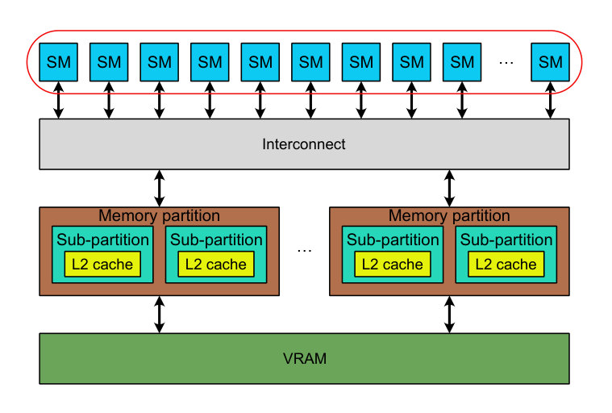
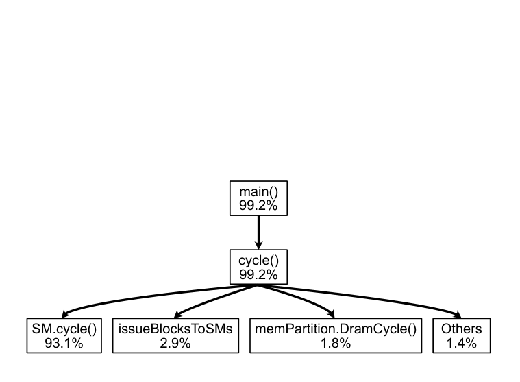
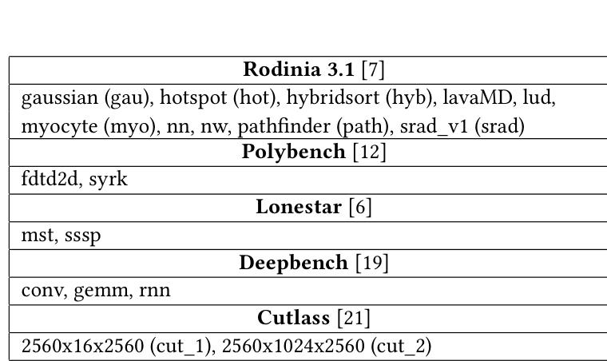
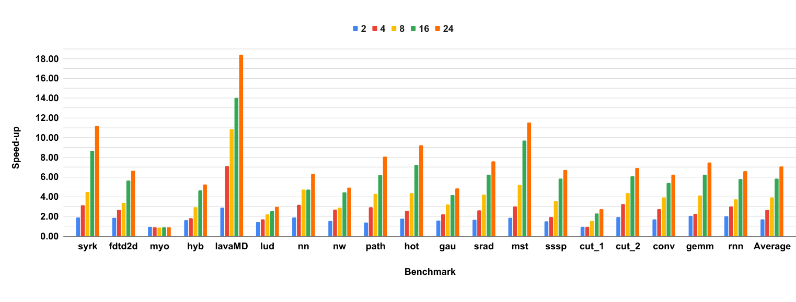
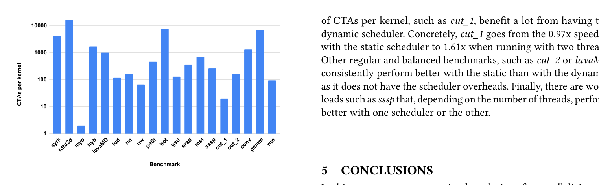

# Parallelizing a modern GPU simulator

<!-- Page 1 -->

Rodrigo Huerta rodrigo.huerta.ganan@upc.edu Universitat Politècnica de Catalunya Barcelona, Spain

ABSTRACT

Simulators are a primary tool in computer architecture research but are extremely computationally intensive. Simulating modern architectures with increased core counts and recent workloads can be challenging, even on modern hardware. This paper demonstrates that simulating some GPGPU workloads in a single-threaded state- of-the-art simulator such as Accel-sim can take more than five days. In this paper we present a simple approach to parallelize this simu- lator with minimal code changes by using OpenMP. Moreover, our parallelization technique is deterministic, so the simulator provides the same results for single-threaded and multi-threaded simulations. Compared to previous works, we achieve a higher speed-up, and, more importantly, the parallel simulation does not incur any inac- curacies. When we run the simulator with 16 threads, we achieve an average speed-up of 5.8x and reach 14x in some workloads. This allows researchers to simulate applications that take five days in less than 12 hours. By speeding up simulations, researchers can model larger systems, simulate bigger workloads, add more detail to the model, increase the efficiency of the hardware platform where the simulator is run, and obtain results sooner.

arXiv:2502.14691v2 [cs.DC] 26 May 2025

CCS CONCEPTS

• Computer systems organization →Parallel architectures; Single instruction, multiple data; Multicore architectures; • Computing methodologies →Modeling and simulation; Parallel computing methodologies.

KEYWORDS

GPU, GPGPU, microarchitecture, simulation, OpenMP, paralleliza- tion, GPGPU-Sim, Accel-sim

1 INTRODUCTION

Computer architects use simulators to design new microarchitec- tures, conduct research, and propose new designs or optimizations to existing ones. In GPGPUs, one of the most popular simulators is Accel-sim [14], based on GPGPUSim [5]. The Accel-sim framework can simulate modern NVIDIA GPU architectures such as Volta [20], Turing [22], Ampere [23], Ada [24], or Hopper[25]. Previous works have reported that simulating GPU systems can be 44,000x slower in Multi2Sim [29] and 480,000x slower in GPGPU-Sim [18]. The Accel-sim framework is single-threaded, and simulating some workloads requires an immense amount of time to complete. Figure 1 shows the time different applications take to be simulated in Accel-sim when executed in nodes with the specifications of Table 2. We can observe that many benchmarks require several hours to be simulated but some other applications such as mst, sssp, and lavaMD need much more time, close to three days (> 259200𝑠) for mst and sssp and more than five days (>

Antonio González antonio@ac.upc.edu Universitat Politècnica de Catalunya Barcelona, Spain

432000𝑠) for lavaMD. This long simulation runs compromise the amount of iterations in the typical research loop (propose a new feature, evaluate it) that can be performed and therefore, it limits the productivity of researchers.

In this paper, we propose to parallelize the Accel-sim simulator with a simple approach using OpenMP [10]. This achieves very important reductions in simulation time. For instance, using 16 threads, we achieve an 5.8x average speed-up and up to 14x in some workloads. Besides, the user can easily configure how many threads each simulated workload will use, which provides several benefits. The main one is improving the efficiency of the hardware platform where simulations run by reducing the time unused cores are al- located by cluster schedulers such as SLURM [31], which assigns cores to jobs when they demand a certain amount of RAM even if they do not perform any computation. Moreover, our proposal does not affect simulation accuracy, a very critical aspect, unlike previous works that parallelize GPGPU-Sim [15] [16]. As the modifications to execute the simulator in parallel are minimal and can be easily configured to be disabled and executed sequentially, debug tasks are as easy as in the vanilla simulator. In addition, our approach is compatible with other techniques that speed up simulation by using sampling [3], and others that reduce the detail of some components, such as NVAS [30]. By speeding up simulators, researchers can model GPU architec- tures in more detail, simulate larger workloads and simulate bigger GPUs/multi-GPUs. The rest of this paper is organized as follows. In section 2, we discuss previous works in the area. Section 3 analyses the code of Accel-sim and explains how its parallelization has been imple- mented. Then, we evaluate the benefits of parallelizing the simu- lator in section 4. Finally, we summarize the main conclusions in section 5.

2 RELATED WORK

Different GPU simulators have been developed to explore and pro- pose architectural changes to these architectures. Some of the most

---

<!-- Page 2 -->

popular ones are single-thread simulators, such as Multi2Sim [29] or GPGPU-Sim [5]. The former models the AMD Evergreen [1] architecture, while the latter models the NVIDIA Tesla [17]. Re- cently, GPGPU-Sim was updated and renamed as the Accel-sim framework [14] to include some major features introduced in the NVIDIA Volta [20] architecture. Some previous works have developed parallel GPU simulators. The first one is Barra [9], a GPU functional simulator focused on the NVIDIA Tesla architecture, which achieves a speed-up of 3.53x with 4 threads. However, this simulator models an old architecture and does not provide a timing model. Another work that models the NVIDIA Tesla architecture is GpuTejas [18], which includes a timing model and achieves a mean speed-up of 17.33x with 64 threads. Unfortunately, executing GpuTejas in parallel has an inde- terministic behavior, leading to accuracy simulation errors of up to 7.7% compared to the single-threaded execution. One of the most successful parallel simulators is MGPUSim [28], an event-driven simulator that includes functional and timing simulation targeting the AMD GCN3 [2]. MGPUSim follows a conservative parallel sim- ulation approach for parallelizing the different concurrent events during the simulation, preventing any deviation error from execut- ing the simulator in parallel. It achieves a mean speed-up of 2.5x when executed with 4 threads. Several works have parallelized the GPGPU-Sim simulator. MAFIA [13] can run different kernels concurrently in multiple threads but cannot parallelize single-kernel simulations. Lee et al. [15] [16] have proposed a simulator framework built on top of GPGPU-Sim. Their proposal needs at least three threads in order to run. Two threads are always dedicated to executing the Interconnect-Memory Sub- system and the Work Distribution and Control components. The rest of the threads are devoted to parallelizing the execution of the multiple SMs of the GPU. Lee et al. approach has an average 3% simulation error compared to the original sequential simula- tion, achieving an average speed-up of 5x and up to 8.9x in some benchmarks. Some simulators, such as NVAS [30], address the highly time- consuming problem of simulations by reducing the detail of some components. For example, modeling the GPU on-chip interconnects in low detail in NVAS reports a 2.13x speed-up and less than 1% benefit in mean absolute error compared to a high-fidelity model. Avalos et al. [3] rely on sampling techniques to simulate huge workloads. In contrast to previous works, we follow a simple approach to parallelize the Accel-sim framework simulator, the most modern academic GPU simulator used for research and capable of executing modern NVIDIA GPU architectures and workloads. Our proposal employs OpenMP [10] to implement a scalable implementation that allows parallelizing the simulator with a user-defined num- ber of threads. Moreover, our approach does not compromise the simulation accuracy and determinism when the simulator runs in parallel and provides the same results as the sequential version. Thus, it eases developing and debugging tasks. This makes our work more robust than the implementations of Lee et al. [15] [16], and GpuTejas [18], where the parallel version results differ from the single-threaded one. Moreover, our work is orthogonal to ap- proaches such as the ones followed by NVAS [30] and Avalos et al.

Huerta and González

[3], which reduce the detail of some components and use sampling to speed up simulations even more.

3 PARALLELIZING ACCEL-SIM

This section describes how we have parallelized the Accel-sim framework simulator. The principal components of the modeled GPUs in Accel-sim are shown in Figure 2. The GPU has a dedicated main memory (VRAM), usually GDDR or HBM. There are several memory par- titions, each with a channel to access the VRAM and the GPU’s on-chip interconnect network. Memory partitions are divided into two sub-partitions, each with a slice of the L2 cache. Finally, there are a number of SMs (GPU cores) in charge of executing the user kernel instructions.

Figure 3 shows the design of an SM. We can see that each core is divided into four sub-cores. They all have access to shared compo- nents such as an L1 instruction cache, the L1 Data Cache/Texture Cache/Shared memory, and shared execution units like FP64 for some architectures like Turing. Each sub-core is assigned a number of warps and executes them concurrently. The warp instruction fetcher requests one or several instructions from the L0 Instruction Cache every cycle. Once an instruction is received, it is decoded and stored in a buffer. An Issue Scheduler checks which warps have their oldest instruction ready and chooses one of them every cycle. Then, its operands are read from the register file, and finally, the instruction is usually executed in one of the different execution units of the sub-core (FP32, INT32, etc). Algorithm 1 shows the high-level structure of the simulator’s code to model the above-described architectures. We can see that the main function calls the cycle function while the simulation is still ongoing. The cycle function has different tasks to do. The first one processes all the interconnection network work; as we can see, this task is split into different code regions, lines 8-11, 16, and 19. It also models the main memory (lines 12-14) and the accesses to the L2 cache (line 16). Then, it continues by executing the work in each GPU’s SMs (lines 21-23), each with the different components found in Figure 3. Finally, the function increments the number of cycles that the GPU is active and tries to issue the remainder thread blocks to available SMs.

---

<!-- Page 3 -->

Algorithm 1 Simulator pseudo-code

1: function main

2: while !simulation.done() do

3: cycle()

4: end while

5: end function

6:

7: function Cycle

8: doIcntToSm()

9: for each memSubpartition ∈GPU_memSubpartition do

10: doMemSubpartitionToIcnt()

11: end for each

12: for each memPartition ∈GPU_Partition do

13: memPartition.DramCycle()

14: end for each

15: for each memSubpartition ∈GPU_memSubpartition do

16: doIcntToMemSubpartition()

17: memSubpartition.cacheCycle()

18: end for each

19: doIcntScheduling()

20:

21: for each SM ∈GPU_SMs do

22: SM.cycle()

23: end for each

24: gpuCycle++

25: issueBlocksToSMs()

26: end function

To find out which parts of the simulator are the more time- consuming ones, we have configured the Google Performance Tools

(Gperftools) [11] CPU profiler to be executed with the Accel-sim in a node with the specifications shown in Table 3. The simulator models an NVIDIA RTX 3080 TI GPU (Table 1) and simulates one of the benchmarks found in Table 2 (concretely, hotspot). Figure 4 depicts the output of the Gperftools profiler, which shows that over 93% of the execution time is spent executing the SM cycles. This makes sense due to two reasons. First, there are many more SMs than memory partitions. Second, an SM has many more components and details than memory partitions or DRAM. As a result, we have a clear target: parallelize the execution of all the SMs, which are circled in red in Figure 2. We have parallelized the simulator using OpenMP because it requires minimal changes. First, we have added the -fopenmp flag to the simulator compilation. Then, we added the clause of OpenMP to parallelize for-loops in line 20 (#pragma omp parallel for) of algorithm 1. Moreover, we had to fix the data races that appeared due to paral- lelizing the SMs loop. Although the different hardware components modeled in the SM were previously properly isolated, stats had data races. Most of the stats of the Accel-sim simulator are shared among all the SMs to report a unique stat for the GPU. Usually, stats are counters that are later used to compute percentages or ratios. Therefore, we have isolated all these stats to be calculated by SM instead of globally for the whole GPU. Once the kernel execution has finished, each of the stats reported by SM is gathered into a sin- gle GPU stat to report stats in the same way as the single-threaded simulator. Notice that this approach is much better than creating a critical section whenever we want to increase a stat counter because this kind of construct would damage performance due to frequent code serialization and lock management [26]. Even though counters are the most common stat, sometimes stats are represented by hash tables or sets. For example, suppose we want to discover how many different memory addresses are ac- cessed during simulation. In that case, we need a set (which does not contain duplicates) that tracks all the accessed addresses. However, maps or sets are not thread-safe structures in C++ [27], meaning they undermine behavior and can lead to segmentation fault errors. Therefore, there are three possible solutions to this problem. The first one is to make this structure thread-safe by ourselves. The second one is to have one of these structures per SM and then compute the union of all SM data structures at the end. The third one is to find a place where the simulator is executed sequentially and handle that stat there (e.g. making the different insert/erase operations). It is clear that the last option is the best one. However, it may not always be possible, and the simulator user will have to

---

<!-- Page 4 -->

choose between the first or the second option in those scenarios. The choice will depend on a trade-off between the performance drop of accessing a unique shared thread-safe structure shared by all SMs by employing critical sections or increasing memory consumption by having per-SM data structures.

4 EVALUATION

This section evaluates the performance benefits of parallelizing the Accel-sim framework simulator [14]. First, we describe our evaluation methodology to measure the speed-up of the parallel simulator. Then, we present a sensitive analysis of how the speed- up changes depending on the number of threads devoted to the execution. Finally, we analyze the impact of the for-loop OpenMP scheduler in the simulator.

4.1 Methodology

We have configured the simulator with the parameters shown in Table 1, which represent an NVIDIA RTX 3080 TI GPU based on the Ampere architecture. Table 2 lists the different benchmark suites that we have em- ployed to measure the efficacy of the parallelization. They represent a variety of very commonly used benchmarks that exhibit different degrees of parallelism. All the simulations have been executed in a cluster of homoge- neous nodes with the specifications shown in Table 3.

4.2 Parallel Speed-Up

This subsection analyzes how the speed-up evolves depending on the number of threads used by the simulator.

Figure 5 shows the speed-up obtained with 2, 4, 8, 16, and 24 threads, averaging 1.72x, 2.64x, 3.95x, 5.83x, and 7.08x, respectively, against the single-threaded simulator. Executing the simulator with more than eight threads is less efficient: the efficiency is 0.36 for 16 threads, and 0.3 for 24 threads. However, some specific benchmarks, such as lavaMD, significantly benefit from this high number of threads, reaching a speed-up of 14x and an efficiency of 0.88 with 16 threads. This speed-up reduces the simulation slowdown compared to real hardware from 10,748,031x of the single-threaded simulator to 766,423x of the parallel one. Moreover, this benchmark is one of the most benefited from parallelization as it achieves super speed- up with 2, 4, and 8 threads configurations. Other workloads, such as myocyte, which has a tiny number of CTAs (thread blocks) per kernel (2), do not benefit from paralleliza- tion, and it is penalized by running the OpenMP interface, resulting in minor slowdowns. To understand why, we need to know that CTAs are distributed in a round-robin fashion among the GPU SMs. As there are only two CTAs, only two SMs are active during the simulation. Therefore, parallelizing the execution of the rest of the SMs is useless. As shown in Figure 7, workloads usually have many more CTAs per kernel than myocyte, and more than the GPU’s number of SMs (80). Computing the correlation factor between the speed-up obtained with 16 threads and the time to execute a workload in a single- thread, reveals a strong positive correlation with a value of 0.78. This means that the more time the application needs to be simulated in a single-thread, the more benefit it gets from parallelizing the simulator.

4.3 OpenMP scheduler

Previous works [4] [8] analyzed the impact of the OpenMP for- loop scheduler. There are two main OpenMP schedulers: static and dynamic. In a static scheduler, the iterations of a for loop are distributed statically to threads. Therefore, it has little overhead and fits perfectly in regular and balanced applications. On the other hand, the dynamic scheduler assigns work to the threads when they are idle. Thus, it fits better in unbalanced environments. However, the dynamic scheduler has bigger overheads than the static one because it distributes the iterations of the loop at runtime, so it performs worse in balanced environments. Figure 6 shows how the OpenMP scheduler affects the benefits of parallelization depending on the number of threads in use. Both schedulers are configured with a granularity of one in the iteration distribution.

---

<!-- Page 5 -->

Parallelizing a modern GPU simulator

We can see that applications with a negligible number of CTAs per kernel, such as myocyte, perform similarly and do not benefit from parallelism. However, other workloads with a small number

In this paper, we propose a simple technique for parallelizing the Accel-sim framework simulator [14], which is one of the most popular tools for researching GPGPU architectures. We rely on the OpenMP [10] application programming interface based on the shared memory paradigm. OpenMP allows us to parallelize the simulator with minimal changes. Our approach is deterministic

---

<!-- Page 6 -->

and provides the same results when running the simulator single- threaded or multi-threaded. In other words, it does not incur simu- lation inaccuracies due to parallelization as some previous works do. When 16 threads are in use, we achieve an average speed-up of 5.8x and reach up to 14x in some workloads. Our approach al- lows researchers that use Accel-sim to have several benefits, such as modeling bigger systems, simulating larger workloads, adding more detail to the GPU model, increasing simulation hardware efficiency, and obtaining results sooner.

ACKNOWLEDGMENTS

This work has been supported by the CoCoUnit ERC Advanced Grant of the EU’s Horizon 2020 program (grant No 833057), the Spanish State Research Agency (MCIN/AEI) under grant PID2020- 113172RB-I00, the Catalan Agency for University and Research (AGAUR) under grant 2021SGR00383, and the ICREA Academia program. We also thank Aurora Tomás for suggesting some changes to the paper.

REFERENCES

[1] AMD. 2011. AMD Evergreen Family Instruction Set Arch. www.amd.com [2] AMD. 2016. Graphics Core Next Architecture, Generation 3, Reference Guide. www.amd.com [3] Cesar Avalos Baddouh, Mahmoud Khairy, Roland N. Green, Mathias Payer, and Timothy G. Rogers. 2021. Principal Kernel Analysis: A Tractable Methodology to Simulate Scaled GPU Workloads. In MICRO-54: 54th Annual IEEE/ACM In- ternational Symposium on Microarchitecture (Virtual Event, Greece) (MICRO ’21). Association for Computing Machinery, New York, NY, USA, 724–737. https://doi.org/10.1145/3466752.3480100 [4] Eduard Ayguadé, Bob Blainey, Alejandro Duran, Jesús Labarta, Francisco Martínez, Xavier Martorell, and Raúl Silvera. 2003. Is the Schedule Clause Really Necessary in OpenMP?. In OpenMP Shared Memory Parallel Programming, Michael J. Voss (Ed.). Springer Berlin Heidelberg, Berlin, Heidelberg, 147–159. [5] Ali Bakhoda, George L. Yuan, Wilson W. L. Fung, Henry Wong, and Tor M. Aamodt. 2009. Analyzing CUDA workloads using a detailed GPU simulator. In 2009 IEEE International Symposium on Performance Analysis of Systems and Software. 163–174. https://doi.org/10.1109/ISPASS.2009.4919648 [6] Martin Burtscher, Rupesh Nasre, and Keshav Pingali. 2012. A quantitative study of irregular programs on GPUs. In 2012 IEEE International Symposium on Workload Characterization (IISWC). 141–151. https://doi.org/10.1109/IISWC.2012.6402918 [7] Shuai Che, Michael Boyer, Jiayuan Meng, David Tarjan, Jeremy W. Sheaffer, Sang Ha Lee, and Kevin Skadron. 2009. Rodinia: A benchmark suite for hetero- geneous computing. In Proceedings of the 2009 IEEE International Symposium on Workload Characterization, IISWC 2009. 44–54. https://doi.org/10.1109/IISWC. 2009.5306797 [8] Florina M. Ciorba, Christian Iwainsky, and Patrick Buder. 2018. OpenMP Loop Scheduling Revisited: Making a Case for More Schedules. In Evolving OpenMP for Evolving Architectures, Bronis R. de Supinski, Pedro Valero-Lara, Xavier Martorell, Sergi Mateo Bellido, and Jesus Labarta (Eds.). Springer International Publishing, Cham, 21–36. [9] Caroline Collange, Marc Daumas, David Defour, and David Parello. 2010. Barra: A Parallel Functional Simulator for GPGPU. In 2010 IEEE International Symposium on Modeling, Analysis and Simulation of Computer and Telecommunication Systems. 351–360. https://doi.org/10.1109/MASCOTS.2010.43 [10] L. Dagum and R. Menon. 1998. OpenMP: an industry standard API for shared- memory programming. IEEE Computational Science and Engineering 5, 1 (1998), 46–55. https://doi.org/10.1109/99.660313 [11] Google. 2015. Google Performance Tools. https://github.com/gperftools/ gperftools [12] Scott Grauer-Gray, Lifan Xu, Robert Searles, Sudhee Ayalasomayajula, and John Cavazos. 2012. Auto-tuning a high-level language targeted to GPU codes. In 2012 Innovative Parallel Computing (InPar). 1–10. https://doi.org/10.1109/InPar. 2012.6339595 [13] Adwait Jog, Onur Kayiran, Tuba Kesten, Ashutosh Pattnaik, Evgeny Bolotin, Niladrish Chatterjee, Stephen W. Keckler, Mahmut T. Kandemir, and Chita R. Das. 2015. Anatomy of GPU Memory System for Multi-Application Execution. In Proceedings of the 2015 International Symposium on Memory Systems (Washington DC, DC, USA) (MEMSYS ’15). Association for Computing Machinery, New York, NY, USA, 223–234. https://doi.org/10.1145/2818950.2818979

Huerta and González

[14] Mahmoud Khairy, Zhesheng Shen, Tor M. Aamodt, and Timothy G. Rogers. 2020. Accel-Sim: An Extensible Simulation Framework for Validated GPU Modeling. In 2020 ACM/IEEE 47th Annual International Symposium on Computer Architecture (ISCA). 473–486. https://doi.org/10.1109/ISCA45697.2020.00047 [15] Sangpil Lee and Won Woo Ro. 2013. Parallel GPU architecture simulation framework exploiting work allocation unit parallelism. In 2013 IEEE International Symposium on Performance Analysis of Systems and Software (ISPASS). 107–117. https://doi.org/10.1109/ISPASS.2013.6557151 [16] Sangpil Lee and Won Woo Ro. 2016. Parallel GPU Architecture Simulation Frame- work Exploiting Architectural-Level Parallelism with Timing Error Prediction. IEEE Trans. Comput. 65, 4 (2016), 1253–1265. https://doi.org/10.1109/TC.2015. 2444848 [17] Erik Lindholm, John Nickolls, Stuart Oberman, and John Montrym. 2008. NVIDIA Tesla: A Unified Graphics and Computing Architecture. IEEE Micro 28, 2 (2008), 39–55. https://doi.org/10.1109/MM.2008.31 [18] Geetika Malhotra, Seep Goel, and Smruti R. Sarangi. 2014. GpuTejas: A parallel simulator for GPU architectures. In 2014 21st International Conference on High Performance Computing (HiPC). 1–10. https://doi.org/10.1109/HiPC.2014.7116897 [19] S. Narang and G. Diamos. 2016. DeepBench: Benchmarking Deep Learning oper- ations on different hardware. https://github.com/baidu-research/DeepBench [20] NVIDIA. 2017. NVIDIA Tesla V100 GPU architecture the world’s most advanced data center GPU. Technical Report. NVIDIA. [21] NVIDIA. 2018. CUTLASS: CUDA Templates for Linear Algebra Subroutines. https://github.com/NVIDIA/cutlass [22] NVIDIA. 2018. NVIDIA TURING GPU architecture Graphics Reinvented NVIDIA Turing GPU Architecture. Technical Report. NVIDIA. [23] NVIDIA. 2020. NVIDIA AMPERE GA102 GPU architecture Second-Generation RTX NVIDIA Ampere GA102 GPU Architecture. Technical Report. NVIDIA. [24] NVIDIA. 2022. NVIDIA ADA GPU architecture. Technical Report. NVIDIA. [25] NVIDIA. 2022. NVIDIA H100 Tensor Core GPU Architecture. Technical Report. NVIDIA. [26] Performance Optimisation and Productivity (PoP). 2020. Patterns of OpenMP critical section. https://co-design.pop-coe.eu/patterns/openmp-critical-section. html [27] Stack Overflow. 2009. Are C++ STL containers thread-safe? https://stackoverflow. com/questions/1362110/is-the-c-stdset-thread-safe [28] Yifan Sun, Trinayan Baruah, Saiful A. Mojumder, Shi Dong, Xiang Gong, Shane Treadway, Yuhui Bao, Spencer Hance, Carter McCardwell, Vincent Zhao, Harri- son Barclay, Amir Kavyan Ziabari, Zhongliang Chen, Rafael Ubal, José L. Abellán, John Kim, Ajay Joshi, and David Kaeli. 2019. MGPUSim: Enabling Multi-GPU Performance Modeling and Optimization. In 2019 ACM/IEEE 46th Annual Inter- national Symposium on Computer Architecture (ISCA). 197–209. [29] Rafael Ubal, Byunghyun Jang, Perhaad Mistry, Dana Schaa, and David Kaeli. 2012. Multi2Sim: A simulation framework for CPU-GPU computing. In 2012 21st International Conference on Parallel Architectures and Compilation Techniques (PACT). 335–344. [30] Oreste Villa, Daniel Lustig, Zi Yan, Evgeny Bolotin, Yaosheng Fu, Niladrish Chatterjee, Nan Jiang, and David Nellans. 2021. Need for Speed: Experiences Building a Trustworthy System-Level GPU Simulator. In 2021 IEEE International Symposium on High-Performance Computer Architecture (HPCA). 868–880. https: //doi.org/10.1109/HPCA51647.2021.00077 [31] Andy B. Yoo, Morris A. Jette, and Mark Grondona. 2003. SLURM: Simple Linux Utility for Resource Management. In Job Scheduling Strategies for Parallel Pro- cessing, Dror Feitelson, Larry Rudolph, and Uwe Schwiegelshohn (Eds.). Springer Berlin Heidelberg, Berlin, Heidelberg, 44–60.
