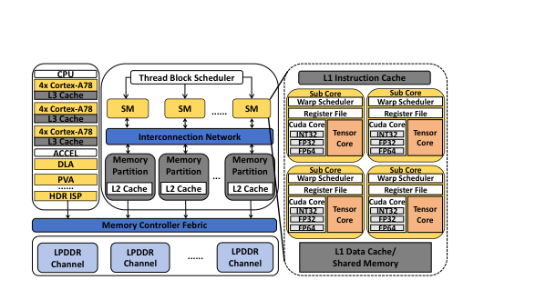
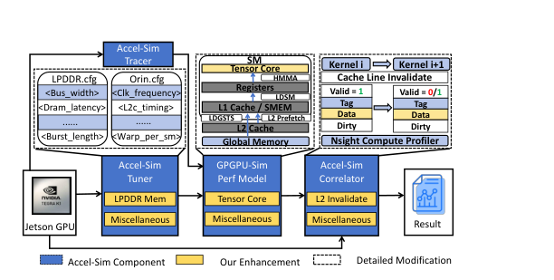
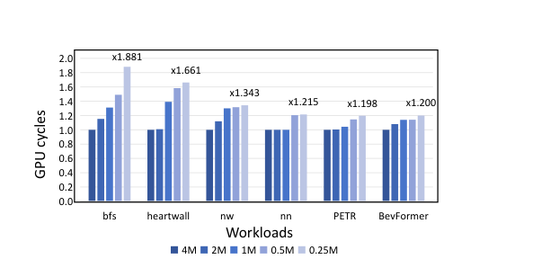

# Repurpose Accel-Sim for Next Generation NVIDIA Jetson GPU Architectural Design

**Source**: https://www.cs.sjtu.edu.cn/~lichao/publications/Repurpose_Accel-Sim_ISLPED-2025-Huang.pdf

<!-- Page 1 -->

Tianhao Huang1, Lingyu Sun1, Chao Li1, Xiaofeng Hou1, Yaqian Zhao2, Jingwen Leng1, Li Li1, Minyi Guo1 1 School of Computer Science, Shanghai Jiao Tong University, Shanghai, China 2 IEIT SYSTEMS Co., Ltd., China {hth 2003, sunlingyu}@sjtu.edu.cn, {lichao, hou-xf}@cs.sjtu.edu.cn, zhaoyaqian@ieisystem.com, leng-jw@cs.sjtu.edu.cn, lilijp@sjtu.edu.cn, guo-my@cs.sjtu.edu.cn

## Abstract

The growing adoption of NVIDIA Jetson devices in edge-AI applications highlights the need for accurate architecture simulation tools on their integrated GPUs. Existing cycle-accurate GPU simulators primarily target traditional discrete GPUs and exhibit significant inaccuracies when applied to Jetson integrated GPUs. While Accel-Sim serves as the most widely used academic simulator for NVIDIA GPU research, its lack of support for the latest Jetson integrated GPUs severely hinders architectural exploration for next generation edge-AI devices. We propose Accel-Sim-J, which bridges the gap by repurposing Accel-Sim simulation framework to NVIDIA Jetson GPUs. We refine three major Accel-Sim framework components by applying tuner modifications, GPGPU-Sim performance model enhancements, and correlator adjustments. These improvements enable precise Jetson GPU simulation support, reducing simulation cycle errors from 29.0% to 22.7% on the Rodinia benchmark and from 26.1% to 16.1% on a transformer block. Furthermore, our enhanced architectural support for Ampere GPUs achieves a considerable reduction in simulation error (from 140.1% to 50.2%) for GEMM kernels. Based on Accel-Sim-J, we conduct a case study investigating the architecture design difference between an edge GPU and a traditional one. Specifically, we compare the optimal Compute-to- Cache (C2C) ratio by changing the L2 cache size of Jetson AGX Orin and RTX 3090. We conclude that Jetson GPUs demonstrate a higher optimal C2C ratio than discrete GPUs for the same workloads. We suggest that designers reduce the on-chip area proportion of the L2 cache in the next generation Jetson GPU design for better performance and efficiency.

## Index Terms

Computer Simulation, Accelerator Architectures, Cache Memory

## I. INTRODUCTION

Edge-AI devices have gained widespread popularity in recent years due to burgeoning edge-AI applications such as autonomous driving and robotics, which demand stringent requirements on latency and energy efficiency [1]–[5]. The most widely used commodity edge-AI device goes to the NVIDIA Jetson series equipped with integrated GPUs. Such GPUs are much smaller than discrete ones with integrated memory. However, the lack of accurate architecture simulation tools for integrated GPUs severely hinders the design exploration of edge-AI devices. Previous studies have proposed many cycle-accurate or cycle-approximate simulators for discrete GPUs [6]–[8]. Unfortunately, none of them explicitly target integrated GPUs on NVIDIA Jetson series. They either lack support entirely or fail to maintain simulation accuracy when ported to integrated GPUs. This results in a significant vacancy in efficient and practical architectural design simulation tools for edge computing scenarios. Among all existing simulators, the open-sourced Accel- Sim [7] is the most widely used cycle-accurate simulator with superior accuracy on NVIDIA discrete GPUs. Accel-Sim is the official successor of GPGPU-Sim [9] with enhanced scalability and usability. It integrates GPGPU-Sim 4.0 as a component for GPU modeling. We reveal that Accel-Sim fails to model the latest Jetson integrated GPUs accurately due to deficiencies in three critical components. Firstly, it cannot provide the correct configuration for a Jetson device and its shared LPDDR memory. Secondly, its modeling of the Ampere GPU architecture is defective, resulting in significant accuracy degradation for GEMM operations utilizing the 3rd generation Tensor cores on a Jetson Orin device. Thirdly, its statistics correlation tool does not faithfully capture hardware counters on a Jetson device to calibrate the simulator. To address these issues, we propose Accel-Sim-J (Jetson) by refining three basic components of Accel-Sim for the simulation of NVIDIA Jetson GPUs. For the tuner, we provide precise configurations for Jetson GPUs and introduce an LPDDR memory model. For the GPGPU-Sim performance model, we enhance the modeling ability on Ampere architecture by providing support for the 3rd generation Tensor core operations including asynchronous copy and L2 cache prefetch. In the correlator part, to ensure simulation results align with hardware counters obtained from the Nsight Compute (NCU) tool, we modify the simulator to support L2 cache invalidation, matching the profiling behavior of NCU on NVIDIA Jetson GPUs. All our modifications maintain compatibility with Accel-Watch [10] and can be further used in energy efficiency analysis for edge AI applications. We conduct simulation experiments on the latest Jetson AGX Orin device to evaluate Accel-Sim-J. We reduce the simulation cycle error from 29.0% to 22.7% on the Rodinia benchmark and from 26.1% to 16.1% on a transformer block. Especially, we achieve a remarkable improvement on the L2 cache read hit count simulation, reducing the error from 59.8% to 3.3% on the Rodinia benchmark. Furthermore, we reduce the maximum kernel cycle simulation error in the

---

<!-- Page 2 -->

transformer block from 140.1% to 50.2%, which is attributed to our fine-grained modeling of the Tensor core behavior under the Ampere architecture. We successfully demonstrate that our repurposed simulator achieves a simulation accuracy comparable to that of the original Accel-Sim, which was validated for the previous generation Volta discrete GPUs. To show that Accel-Sim-J can facilitate the architectural design of edge-AI devices, we conduct a case study by adjusting the L2 cache size of Jetson AGX Orin and examine the resulting performance variations across diverse cacheintensive workloads. Our findings reveal redundancy in the current L2 cache size of the Orin GPU. To quantify the optimal balance between the number of SMs and L2 cache size for a specific GPU architecture under a given workload, we introduce the workload-specific Compute-to-Cache Ratio (C2C ratio). By comparing the C2C ratio of Jetson AGX Orin against RTX 3090, we demonstrate that the performance optimization opportunity of enlarging the L2 cache, as discovered in [11], is not as significant for Jetson GPUs. Consequently, we recommend allocating a larger proportion of on-chip area to SMs, thereby increasing the C2C ratio, in future Jetson series GPU designs to achieve enhanced performance. Our contributions are as follows: • To the best of our knowledge, we are the first to conduct an in-depth study and enhance the simulation accuracy on the integrated GPU of NVIDIA Jetson devices. • We improve the simulation accuracy for Jetson GPUs by decreasing the average cycle error from 26.1% to 16.1% and the max cycle error from 140.1% to 50.2%. • We conduct a case study on Jetson AGX Orin by exploring the optimal C2C ratio for 6 selected cache-intensive workloads. Our analysis reveals that the Orin exhibits a lower optimal C2C ratio compared to the RTX 3090.

## II. BACKGROUND AND RELATED WORKS

### A. GPU Hardware Architecture

We present a concise overview of the NVIDIA integrated GPU architecture, as exemplified by Jetson AGX Orin in Fig. 1. For completeness, the CPU and various on-board accelerators is shown on the left, and the Ampere GPU is shown on the right. The GPU comprises an array of SMs, functioning as the core computational units optimized for parallel processing. Each SM integrates four sub-cores, each equipped with a warp scheduler paired with Arithmetic Logic Unit (ALU) modules for fundamental computations and Tensor cores for specialized matrix operations [12]. These sub-cores operate independently, utilizing private L1 caches for data storage and shared memory for inter-core communication. All SMs access a unified L2 cache via a high-bandwidth interconnect network. On the Jetson Orin platform, these on-chip components are interfaced with the integrated LPDDR5 memory, which is shared with the CPU and other accelerators. The GPU’s L2 cache is the Last Level Cache (LLC). It adopts a partitioned, banked, and sectored design to enhance memory throughput in multi-channel DRAM systems [13]. Thread Block Scheduler SM SM SM ...... Interconnection Network Memory Partition L2 Cache LPDDR Channel L1 Instruction Cache L1 Data Cache/ Shared Memory Memory Partition L2 Cache Memory Partition L2 Cache LPDDR Channel ... ...... LPDDR Channel Memory Controller Febric Sub Core Warp Scheduler Tensor Core Cuda Core INT32 FP32 FP64 Register File DLA PVA HDR ISP CPU ACCEL ...... 4x Cortex-A78 L3 Cache 4x Cortex-A78 L3 Cache 4x Cortex-A78 L3 Cache Sub Core Warp Scheduler Tensor Core Cuda Core INT32 FP32 FP64 Register File Sub Core Warp Scheduler Tensor Core Cuda Core INT32 FP32 FP64 Register File Sub Core Warp Scheduler Tensor Core Cuda Core INT32 FP32 FP64 Register File

This design mitigates partition camping, a bandwidth contention issue arising from concentrated accesses to identical cache partitions. This issue is particularly pronounced in memory architectures with a higher number (≥8) of channel organizations. Correspondingly, GPU L2 cache incorporates an irreducible polynomial (IPOLY) hashing mechanism to reindex cache banks through Galois field-based bitwise operations [14], effectively transforming clustered access patterns into uniformly distributed requests across all available DRAM channels and maximizing the effective memory bandwidth. Our Work: We customize the configuration files for Jetson GPUs and their LPDDR memory for the tuner of Accel-Sim, thus enabling Accel-Sim with simulation capabilities for the Jetson series devices.

### B. GPU Simulator

Existing research has proposed several cycle-accurate GPU simulators like Accel-Sim [7] and NVArchSim [8], and cycleapproximate simulators like PPT-GPU [15] and HyFiSS [6]. Cycle-approximate simulators often trade off simulation accuracy for speed, hindering high-fidelity simulations for accurate architecture design. Among all the cycle-accurate simulators, Accel-Sim [7] is the most widely adopted for its superior simulation accuracy on NVIDIA GPUs. The Accel-Sim simulation framework comprises four main components: 1) Tracer, a tool built on top of NVbit [16] that extracts NVIDIA SASS assembly instruction trace of GPU applications through dynamic binary instrumentation; 2) Tuner, a characterization module that utilizes a minimal set of user-provided hardware definitions and an automated microbenchmark suite to discover nonpublic GPU hardware parameters for simulation; 3) GPGPU- Sim performance model, a cycle-accurate simulation engine that executes traced workloads using the calibrated configs from tuner; and 4) Correlator, a validation tool that calibrates the simulator through statistical correlation analysis between simulated results and profiled hardware performance counters. However, the Accel-Sim framework primarily targets the simulation of discrete GPUs. Its limitation for Jetson GPU arises from the lack of correct hardware configuration, insufficiently refined performance modeling, and an erroneous correlator. Additionally, Accel-Sim was originally proposed for the previous generation Volta V100 GPU and later extended to give limited support to Ampere GPUs. It lacks

---

<!-- Page 3 -->

accurate support for certain behaviors associated with the newly introduced 3rd generation Tensor cores in the Ampere architecture, including asynchronous copy, L2 prefetch, etc [17], [18]. Given that the widely adopted Jetson AGX Orin platform is based on the Ampere architecture, these shortcomings significantly affect Accel-Sim’s accuracy when simulating this contemporary hardware device. Our Work: We address the critical gap in Jetson GPU simulation by repurposing the Accel-Sim comprehensively, including providing support for the Jetson GPU tuning, Ampere architecture modeling and results calibration.

### C. Compute-to-Cache Ratio Issue

Previous research suggests that the capacity of the L2 cache plays a critical role in GPU performance, with particularly pronounced effects observed for memory-intensive workloads [19]. Similarly, Orojenesis [20] quantifies cache capacity’s critical role in roofline model optimization, establishing a parametric relationship between cache provisioning and computational intensity. These findings emphasize the significance of the L2 cache, or LLC, on GPU performance. A recent architectural investigation on discrete GPU RTX 3080 has identified significant performance gains when enlarging the L2 cache [11] on memory-intensive workloads (about 1.57x acceleration at 4x L2 increase). To demonstrate the practical value of Accel-Sim-J, we study the effect of L2 cache size resizing for Jetson AGX Orin performance. Our experimental results do not exhibit significant performance outcomes as on RTX 3080, indicating that the current L2 cache size of Jetson AGX Orin might be redundant. Our Work: We conduct a case study on the AGX Orin GPU to evaluate the impact of resizing the L2 cache and further explore the workload-specific optimal C2C ratio, thus facilitating the architectural design for the next generation of Jetson series GPUs.

## III. METHODOLOGY

Our architectural simulation framework, as illustrated in Fig. 2, enhances Accel-Sim’s capabilities for NVIDIA Jetson GPU modeling through the modification of three main components. The tracer component of Accel-Sim utilizes the NVbit tracing tool and requires no modification. Consequently, we make enhancements to the tuner, GPGPU-Sim performance model, and correlator: • Tuner modification. We provide LPDDR memory configurations and relevant hardware details of the Jetson GPUs, such as L1/L2 cache parameters, clock frequency, memory bandwidth and other critical system components. • GPGPU-Sim performance model enhancement. We provide enhancements for simulating Ampere GPU instructions, including asynchronous copy and L2 cache prefetch support of the 3rd generation Tensor cores. • Correlator adjustment. We adjust the correlator to align with hardware performance counters obtained through the Nsight Compute profiler, which forcibly conducts cache invalidation after each kernel execution on Jetson GPUs. Jetson GPU Accel-Sim Correlator Accel-Sim Tracer GPGPU-Sim Perf Model Accel-Sim Tuner Miscellaneous LPDDR Mem Tensor Core Accel-Sim Component Our Enhancement L2 Invalidate Result Miscellaneous Miscellaneous LPDDR.cfg <Bus_width> <Dram_latency> <Burst_length> ...... Global Memory L2 Cache SM L1 Cache / SMEM Registers LDSM L2 Prefetch Kernel i Kernel i+1 Nsight Compute Profiler Valid = 1 LDGSTS Detailed Modification Orin.cfg <Clk_frequency> <L2c_timing> <Warp_per_sm> ...... HMMA Tensor Core Tag Data Dirty Valid = 0/1 Tag Data Dirty Cache Line Invalidate

These modifications address the fundamental mismatch between NVIDIA discrete GPUs and Jetson GPUs, as validated by our evaluation in Section IV. The enhancement details of each component are elaborated from Section III-A to Section III-C respectively.

### A. Tuner modification

1) LPDDR Memory Model: The tuner integrated within the Accel-Sim framework lacks support for LPDDR memory modeling. To address this limitation, we extend the memory configuration for LPDDR support by providing detailed parameters derived from a specialized DRAM simulator [21]. Additionally, we supplement the necessary parameters related to memory channels, chip counts and channel indexing when integrating the LPDDR memory model with Accel-Sim. In LPDDR5 configuration for Jetson Orin, we set the memory channel number to 16 and the chip number of each memory channel to 1. Each memory chip has a 16-bit data width, and the total data width of the LPDDR5 memory is 256 bits. In this configuration, the LPDDR5 memory operates at a data rate of 6400 Mbps, providing a total bandwidth of 204.8 GB/s. 2) Miscellaneous: We find that the automated microbenchmarks provided by original Accel-Sim fail to report correct information on certain hardware parameters. Thus, we supplement the configuration files for Jetson GPUs by consulting NVIDIA documentations and inspecting built-in information. We find the GPU frequency measured via the original tuner inaccurate and adjust it to the correct value shown from online documents and the built-in jtop tool. Similarly, we also rectify the memory frequency, the partitioning options for shared memory, the L2 slice number and the L2 MSHR size. In detail, we set the L2 slice number connected to each memory channel to 1 and increase the L2 MSHR from 4 to 32 (KB).

### B. GPGPU-Sim Enhancement

1) Tensor Core Enhancement: We identify critical modeling inaccuracies in the current Accel-Sim performance model, primarily due to its simplified implementation of 3rd generation Tensor core instructions introduced in the Ampere architecture. Specifically, the instructions LDGSTS (Load from Global Memory and Store to Shared Memory), LDSM (Load from Shared Memory in Matrix Format) and HMMA (Matrix Multiply and Accumulate) are inaccurately modeled.

---

<!-- Page 4 -->

8 910k 10k Original(Corr=0.94, MAPE=29.0%) Ours(Corr=0.94, MAPE=22.7%) Perfect Simulation Hardware Cycles Simulation Cycles (a) Rodinia, cycle count 5 10 2 5 100 2 5 10k 2 10k Original(Corr=0.09, NRMSE=59.8%) Ours(Corr=0.97, NRMSE=3.3%) Perfect Simulation Hardware L2 Read Hits Simulation L2 Read Hits (b) Rodinia, L2 read hit count

cutlass gemm kernel (140.12%) (92.42%) (50.18%） (22.00%) (c) PETR, cycle count 1000 2 5 10k 5 100k 2 5 1M 10k 100k 1M Original(Corr=0.78, NRMSE=19.1%) Ours(Corr=0.86, NRMSE=14.9%) Perfect Simulation Hardware L2 Read Hits Simulation L2 Read Hits (d) PETR, L2 read hit count

LDGSTS. The Ampere architecture introduces LDGSTS instruction to support asynchronous copy. It facilitates direct, non-blocking data transfers from global memory to shared memory, bypassing both the SMs and the register file staging [17]. LDGSTS should be used together with the existing DEPBAR instruction for synchronization. We fix the problem in the original Accel-Sim that the DEPBAR is handled incorrectly when there are no LDGSTS instructions. Furthermore, Ampere supports L2 cache-level prefetching in LDGSTS and LDG if used with indicator LTC64B or LTC128B. This feature enables prefetching half or a whole 128B cacheline when accessing a 32B sector of data to optimize data loading efficiency. We implement this feature to improve the accuracy of cycle count and L2 access hit during simulation. LDSM. The Ampere architecture also adds another instruction LDSM to support loading data from shared memory to registers in specialized matrix format [17]. This instruction loads data in units of 16B and accesses shared memory four times without bank conflict. This extends the traditional shared memory access pattern with a 4B unit. We incorporate this difference to enable correct shared memory simulation. HMMA. HMMA instruction drives the Tensor core units to perform matrix multiplication. The Volta architecture supports only one HMMA instruction HMMA.884.F16.F16 at SASS level, and the original Accel-Sim models it with fixed cycles. However, in Ampere architecture, HMMA instruction is much extended to more shapes including 1688 and 16816 with different data types including FP16, FP64, INT1, INT4, INT8, TF32 and TF64. Correspondingly, we extend Accel-Sim to assign different execution cycles to different HMMA instructions. 2) Miscellaneous: Besides, we extend the Ipoly hash implementation to incorporate memory channel configurations of 4, 8, 128, and 256, thereby enhancing the performance model’s capability to support a broader range of memory system architectures with improved accuracy and versatility.

### C. Correlator Adjustment

1) L2 Cache Invalidate: During correlation analysis between hardware counters from NCU profiling tool and Accel- Sim simulation outputs, we identify significant discrepancies in L2 cache hit metrics (average error of 59.8% on the Rodinia 2.0 benchmark). After detailed investigation, we discovered that the root cause of this problem lies in NCU 2022.2.1 tool on the Jetson platform. Specifically, an important flag indicating whether the L2 cache is invalidated after each kernel during NCU profiling is non-functional, defaulting to always invalidating. Additionally, we also observe that the initial GPU kernel execution does not automatically fill the L2 cache with data from CudaMemcpy, as the NVIDIA discrete GPU does. To address these two issues, we implement a new cache invalidate mechanism triggered after each kernel execution and set the gpgpu perf sim memcpy flag in original Accel-Sim to 0. This L2 cache invalidation policy reduces L2 cache hit rate simulation error to merely 1.83%, greatly facilitates simulator calibration against hardware counters. 2) Miscellaneous: Besides, we conduct comprehensive bug fixes and address potential errors that could arise when using the correlator on the Jetson Orin platform, thereby significantly enhancing its usability.

## IV. EVALUATION

### A. Experimental Setup

Our experimental platform is a Jetson AGX Orin equipped with 12 Arm Cortex-A78AE CPUs, an NVIDIA Ampere GPU with 4M L2 cache, and a 32 GB LPDDR5 shared memory. The detailed configuration is shown in Table I. We employ the Rodinia 2.0 benchmark suite [22] as the foundational test set to validate the basic modeling capabilities of our simulation tool for the Orin platform. Furthermore, we extract a transformer block from a representative model PETR [23] as a supplementary benchmark. The query size is (900, 1, 256) while the key and value size is (4224, 1, 256).

---

<!-- Page 5 -->

TABLE I: NVIDIA Jetson AGX Orin GPU configuration. Parameter Config Parameter Config GPU architecture Ampere GPU frequency 1.3 GHz CUDA cores Tensor cores SMs Warp schedulers per SM L1/SMEM per SM 128 KB L2 cache 4 MB LPDDR5 size 32 GB Memory bandwidth 204.8 GB/s We compare Accel-Sim-J against the original version both in SASS mode. We assess the simulation’s fidelity by quantifying the correlation and error between the simulated values and the NCU measured ground truth of each GPU kernel on the Jetson AGX Orin, shown in Fig. 3.

### B. Simulation Accuracy

Accel-Sim can provide diverse simulation metrics to evaluate simulation accuracy. In this study, we focus on two critical metrics: GPU cycle count and L2 cache hit count. As the GPU cycle metric is non-zero, we adopt the mean absolute percentage error (MAPE) to quantify its simulation accuracy. For the L2 cache hit metric (which may contain zero values), the normalized root mean square error (NRMSE) is employed. We employ the Pearson’s correlation coefficient (Corr.) value to further reflect the similarity between simulated and measured metrics. Fig. 3 compares the simulation accuracy between our repurposed Accel-Sim and the original Accel-Sim for GPU cycle count and L2 cache hit count across the Rodinia benchmark and PETR transformer block. As shown in Fig. 3a and Fig. 3b, the GPU cycle simulation error decreases from 29.0% to 22.7% on the Rodinia benchmark, while the L2 read hit error reduces from 59.8% to 3.3%. These improvements primarily stem from our calibration of LPDDR memory model parameters and internal GPU parameters of the Jetson AGX Orin in the tuner, along with correlator optimizations for Nsight Compute compatibility through cycle-level L2 cache invalidation. Given the original Accel-Sim’s reported 15% GPU cycle simulation accuracy for V100 GPU [7], our simulator achieves comparable accuracy levels. This demonstrates the effectiveness of our repurposed simulator when simulating traditional GPU compute workloads. Fig. 3c and Fig. 3d present simulation results for the PETR transformer block. To address the extensive use of NVIDIA Ampere GPU innovations in transformer computations, we enhance simulation accuracy by optimizing the GPGPU-Sim performance model for Ampere architecture. This optimization reduces GPU cycle errors from 26.1% to 16.1% and L2 cache hit errors from 19.1% to 14.9%. Notably, the CUTLASSoptimized GEMM kernel shows substantial improvement, with cycle errors decreasing from 140.1% to 50.2% and 92.4% to 22.0% (Fig. 3c). These enhancements primarily result from improved modeling of Ampere architecture’s Tensor core instructions (e.g. LDSM, LDGSTS, HMMA), validating our instruction-level optimizations. This demonstrates the effectiveness of our repurposed simulator when simulating emerging next-generation AI workloads. x1.881 x1.661 x1.343 x1.215 x1.198 x1.200 0.0 0.2 0.4 0.6 0.8 1.0 1.2 1.4 1.6 1.8 2.0 bfs heartwall nw nn PETR BevFormer GPU cycles Workloads 4M 2M 1M 0.5M 0.25M

100.0 100.0 100.0 100.0 57.4 85.0 24.2 17.4 8.2 1.0 22.3 15.0 0.0 20.0 40.0 60.0 80.0 100.0 120.0 bfs heartwall nw nn PETR BevFormer L2 cache hit rate Workloads 4M 2M 1M 0.5M 0.25M

## V. CASE STUDY

### A. Performance with Different L2 Cache Size

Accel-Sim-J can facilitate the architectural design of edge- AI devices. This case study aims to investigate the optimal L2 cache size of Jetson AGX Orin across various cache-intensive workloads. We select six cache-intensive workloads, including bfs, heartwall, nw, and nn from the Rodinia benchmark, a transformer block from PETR and the deformable attention from BevFormer, both of which are popular in the autonomous driving field and are deployed on Orin (detailed configurations in Table II). By progressively reducing the native 4 MB L2 cache configuration, we analyze its impact on GPU cycles and L2 cache hit rates, as shown in Fig. 4 and Fig. 5. For heartwell, nn and PETR, halving the L2 cache capacity demonstrates no measurable performance impact both on GPU cycles and L2 cache hit rate. And for the rest, results show marginal performance degradation (< 15% cycle increase). Specifically for emerging attention-based AI applications PERT and BevFormer, we observe that variations in L2 cache have a negligible impact on their performance. It can be attributed to the effective optimization of memory-computation overlapping in the existing GPU architecture. This phenomenon implies that the current L2 cache on Orin might be redundant for some emerging AI workloads. These findings provide insights for GPU cache provisioning strategy for edge-AI systems, proposing that we can achieve comparable performance on Jetson AGX Orin with 50-75% less L2 resources for most emerging edge-AI applications.

---

<!-- Page 6 -->

TABLE II: Cache-intensive workloads for 6 applications. Applications Trace Size GPU cycles Description bfs [22] 119M 216.8k Graph algorithm heartwall [22] 9.1M 11.5k Bioinformatics nw [22] 27M 406.5k Data compression / mining nn [22] 173M 286.9k Physics simulation PETR [23] (transformer block) 7.2G 5926.4k Data compression / mining BevFormer [24] (deformable attention) 12G 8841.6k Autonomous driving Algorithm 1 Finding optimal C2C ratio Input: NSM, L2existing ▷Basic configuration Input: Cyclemin ▷Obtained by traversing L2 size Output: C2Coptimal 1: for i ∈{0.125, 0.25, 0.5, 1, 2, 4, 8} do 2: L2size ←i · L2existing; 3: if Cycle(NSM, L2size) ≤1.1 · Cyclemin then 4: C2Coptimal ← NSM L2size ; break;

### B. C2C Ratio between Jetson AGX Orin and RTX 3090

Furthermore, we compare the optimal C2C ratio under different workloads on a Jetson integrated GPU and a discrete GPU. To be precise, we define the optimal C2C ratio as the ratio of SM count to minimum L2 cache size, where the cycle count achieved is less than 110% of the minimal cycle count. We follow Algorithm 1 to obtain the optimal C2C ratio. We select the Jetson AGX Orin and RTX 3090 as examples of a Jetson GPU and a discrete GPU. The optimal C2C ratio for 6 selected workloads is illustrated in Fig. 6. The original C2C ratio of the existing Orin and RTX 3090 is 4 (16:4) and 14.3 (86:6), respectively. In Morpheus [11], it is revealed that doubling or quadrupling the L2 cache size significantly enhances the performance of cache-intensive workloads on RTX 3080. This aligns with our experimental findings on RTX 3090. Based on evaluation results, we determine that the optimal ratio for the 3090 is approximately 3.5 (86:24) for most workloads. For the Jetson AGX Orin, the optimal ratio is consistently higher across the selected workloads, about 8 (16:2) or 16 (16:1). These findings indicate that, given the lower computational capability of Jetson GPUs at the edge, they do not require an L2 cache size proportionally equivalent to that of discrete GPUs. This insight provides valuable guidance for the design of the SM number and L2 cache size in the next generation of Jetson GPUs.

## VI. CONCLUSION

Our work addresses the critical gap in cycle-accurate simulation between NVIDIA Jetson integrated GPUs and discrete GPUs by repurposing the Accel-Sim framework with Jetsonspecific optimizations. We implement extensive improvements across three main components of Accel-Sim, achieving considerable improvement in simulation accuracy for Jetson GPUs. Utilizing the enhanced simulator, we evaluate the adequacy of the current on-chip L2 cache size design in the AGX Orin. Our 4.0 8.0 4.0 16.0 8.0 8.0 3.5 7.2 3.5 7.2 3.5 7.0 0.0 5.0 10.0 15.0 20.0 bfs heartwall nw nn PETR BevFormer C2C ratio (SM / L2) Workloads Optimal RTX 3090 Optimal Orin 4.0 Existing RTX 3090 Existing Orin 14.3 Reduce L2 Increase L2

research offers significant insights and foundational principles for the architectural design of next generation Jetson GPUs. Software availability: The implementation of this work is available as open-source software at [GitHub repository: https://github.com/sjtu-SAIL-lab/accel-sim-framework]. ACKNOWLEDGEMENT We sincerely thank all the anonymous reviewers for their valuable comments that helped us to improve the paper. This work is supported by the STCSM International S&T Cooperation Project (23510713200) and it is also supported in part by the National Natural Science Foundation of China (No.U24A20234). The corresponding author is Chao Li. REFERENCES [1] P. SK, S. A. Kesanapalli, and Y. Simmhan, “Characterizing the performance of accelerated jetson edge devices for training deep learning models,” Proceedings of the ACM on Measurement and Analysis of Computing Systems, vol. 6, no. 3, pp. 1–26, 2022. [2] X. Hou, C. Xu, C. Li, J. Liu, X. Tang, K.-t. Cheng, and M. Guo, “Improving efficiency in multi-modal autonomous embedded systems through adaptive gating,” in IEEE Transactions on Computers, 2024. [3] X. Hou, X. Tang, J. Liu, C. Li, L. Liang, and K.-t. Cheng, “Wasp: Efficient power management enabling workload-aware, self-powered aiot devices,” in IEEE Transactions on Parallel and Distributed Systems, 2024. [4] X. Hou, P. Tang, C. Li, J. Liu, C. Xu, K.-T. Cheng, and M. Guo, “Smg: A system-level modality gating facility for fast and energy-efficient multimodal computing,” in IEEE Real-Time Systems Symposium, 2023. [5] X. Hou, J. Liu, X. Tang, C. Li, J. Chen, L. Liang, K.-T. Cheng, and M. Guo, “Architecting efficient multi-modal aiot systems,” in Proceedings of the 50th Annual International Symposium on Computer Architecture, 2023. [6] J. Yang, M. Wen, D. Chen, Z. Chen, Z. Xue, Y. Li, J. Shen, and Y. Shi, “Hyfiss: A hybrid fidelity stall-aware simulator for gpgpus,” in 2024 57th IEEE/ACM International Symposium on Microarchitecture (MICRO). IEEE, 2024, pp. 168–185. [7] M. Khairy, Z. Shen, T. M. Aamodt, and T. G. Rogers, “Accel-sim: An extensible simulation framework for validated gpu modeling,” in 2020 ACM/IEEE 47th Annual International Symposium on Computer Architecture (ISCA). IEEE, 2020, pp. 473–486. [8] O. Villa, D. Lustig, Z. Yan, E. Bolotin, Y. Fu, N. Chatterjee, N. Jiang, and D. Nellans, “Need for speed: Experiences building a trustworthy system-level gpu simulator,” in 2021 IEEE International Symposium on High-Performance Computer Architecture (HPCA). IEEE, 2021, pp. 868–880. [9] A. Bakhoda, G. L. Yuan, W. W. Fung, H. Wong, and T. M. Aamodt, “Analyzing cuda workloads using a detailed gpu simulator,” in 2009 IEEE international symposium on performance analysis of systems and software. IEEE, 2009, pp. 163–174.

---

<!-- Page 7 -->

[10] V. Kandiah, S. Peverelle, M. Khairy, J. Pan, A. Manjunath, T. G. Rogers,

### T. M. Aamodt, and N. Hardavellas, “Accelwattch: A power modeling

framework for modern gpus,” in MICRO-54: 54th Annual IEEE/ACM International symposium on microarchitecture, 2021, pp. 738–753. [11] S. Darabi, M. Sadrosadati, N. Akbarzadeh, J. Lindegger, M. Hosseini,

### J. Park, J. G´omez-Luna, O. Mutlu, and H. Sarbazi-Azad, “Morpheus:

Extending the last level cache capacity in gpu systems using idle gpu core resources,” in 2022 55th IEEE/ACM International Symposium on Microarchitecture (MICRO). IEEE, 2022, pp. 228–244. [12] L. S. Karumbunathan, “Nvidia jetson agx orin series,” Online at https://www.nvidia.com/content/dam/en-zz/Solutions/gtcf21/jetsonorin/nvidia-jetson-agx-orin-technical-brief. pdf, 2022. [13] A. Seznec, “Decoupled sectored caches: conciliating low tag implementation cost,” in Proceedings of the 21st annual international symposium on Computer architecture, 1994, pp. 384–393. [14] B. R. Rau, “Pseudo-randomly interleaved memory,” in Proceedings of the 18th Annual International Symposium on Computer Architecture, 1991, pp. 74–83. [15] Y. Arafa, A.-H. Badawy, A. ElWazir, A. Barai, A. Eker, G. Chennupati,

### N. Santhi, and S. Eidenbenz, “Hybrid, scalable, trace-driven performance

modeling of gpgpus,” in Proceedings of the International Conference for High Performance Computing, Networking, Storage and Analysis, 2021, pp. 1–15. [16] O. Villa, M. Stephenson, D. Nellans, and S. W. Keckler, “Nvbit: A dynamic binary instrumentation framework for nvidia gpus,” in Proceedings of the 52nd Annual IEEE/ACM International Symposium on Microarchitecture, 2019, pp. 372–383. [17] H. Abdelkhalik, Y. Arafa, N. Santhi, and A.-H. A. Badawy, “Demystifying the nvidia ampere architecture through microbenchmarking and instruction-level analysis,” in 2022 IEEE High Performance Extreme Computing Conference (HPEC). IEEE, 2022, pp. 1–8. [18] Y. Deng, S. Chen, Z. Hong, and B. Tang, “How does software prefetching work on gpu query processing?” in Proceedings of the 20th International Workshop on Data Management on New Hardware, 2024, pp. 1–9. [19] X. Chen, L.-W. Chang, C. I. Rodrigues, J. Lv, Z. Wang, and W.-M. Hwu, “Adaptive cache management for energy-efficient gpu computing,” in 2014 47th Annual IEEE/ACM international symposium on microarchitecture. IEEE, 2014, pp. 343–355. [20] Q. Huang, P.-A. Tsai, J. S. Emer, and A. Parashar, “Mind the gap: Attainable data movement and operational intensity bounds for tensor algorithms,” in 2024 ACM/IEEE 51st Annual International Symposium on Computer Architecture (ISCA). IEEE, 2024, pp. 150–166. [21] S. Ghose, T. Li, N. Hajinazar, D. S. Cali, and O. Mutlu, “Demystifying complex workload-dram interactions: An experimental study,” Proceedings of the ACM on Measurement and Analysis of Computing Systems, vol. 3, no. 3, pp. 1–50, 2019. [22] S. Che, M. Boyer, J. Meng, D. Tarjan, J. W. Sheaffer, S.-H. Lee, and

### K. Skadron, “Rodinia: A benchmark suite for heterogeneous computing,”

in 2009 IEEE international symposium on workload characterization (IISWC). Ieee, 2009, pp. 44–54. [23] Y. Liu, T. Wang, X. Zhang, and J. Sun, “Petr: Position embedding transformation for multi-view 3d object detection,” in European conference on computer vision. Springer, 2022, pp. 531–548. [24] Z. Li, W. Wang, H. Li, E. Xie, C. Sima, T. Lu, Q. Yu, and J. Dai, “Bevformer: learning bird’s-eye-view representation from lidar-camera via spatiotemporal transformers,” IEEE Transactions on Pattern Analysis and Machine Intelligence, 2024.

---
